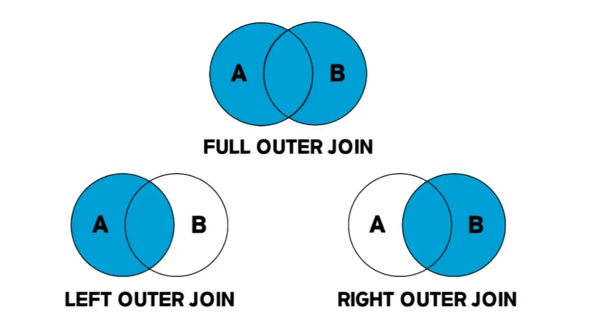

## 🧩 DB Join 이란?

- **두 개 이상의 테이블을 서로 연결해서 하나의 결과를 만들어 내는 것**
- 관계형 데이터베이스는 보통 데이터를 정규화해서 여러 테이블에 나누어 저장함.
- 하지만 실제 조회할 때는 여러 테이블의 데이터가 합쳐져야 의미가 있는 경우가 있어서, 공통된 컬럼을 기준으로 테이블을 결합하는 작업임.
- INNER JOIN, OUTER JOIN, CROSS JOIN, SELF JOIN 네 가지 종류의 Join이 있음.

## ‼️ INNER JOIN

- 내부 조인.
- 두 테이블을 연결할 때 가장 많이 사용하는 조인.
- **NATURAL JOIN : 내부 조인의 한 종류. 조인 조건을 따로 명시하지 않고, 두 테이블에 같은 이름의 컬럼이 있으면 자동으로 그 컬럼을 기준으로 내부 조인이 수행된다.**

```sql
SELECT <열 목록>
FROM <첫 번째 테이블>
		INNER JOIN <두 번째 테이블>
		ON <조인 조건>
[WHERE 검색 조건]

#여기서 INNER JOIN을 JOIN이라고 작성해도 INNER JOIN으로 인식함.
```


## ‼️ OUTER JOIN

- 외부 조인.
- 내부 조인은 두 테이블에 모두 데이터가 있어야 결과가 나오지만, 외부 조인은 어느 한쪽에만 있는 데이터도 결과에 포함됨.
```sql
SELECT <열 목록>
FROM <첫 번째 테이블(LEFT 테이블)>
		<LEFT | RIGHT | FULL> OUTER JOIN <두 번째 테이블(RIGHT 테이블)>
		ON <조인 조건>
[WHERE 검색 조건]

#LEFT OUTER JOIN: 왼쪽 테이블의 모든 값이 출력되는 조인
#RIGHT OUTER JOIN: 오른쪽 테이블의 모든 값이 출력되는 조인
#FULL OUTER JOIN: 왼쪽 외부 조인과 오른쪽 외부 조인이 합쳐진 것
```

## ‼️ CROSS JOIN

- 상호 조인. CARTESIAN PRODUCT
- 한쪽 테이블의 모든 행과 다른 쪽 테이블의 모든 행을 조인시키는 기능.
- 상호 조인 결과의 전체 행 개수는 두 테이블의 각 행의 개수를 곱한 수만큼 됩니다.
```sql
SELECT *
FROM <첫 번째 테이블>
		CROSS JOIN <두 번째 테이블>
```
## ‼️ SELF JOIN

- 자체 조인
- 자기 자신과 조인하므로 1개의 테이블만 사용함.
- 별도의 문법이 있는 것은 아니고 1개로 조인하면 자체 조인이 됨.
- 계층 구조 데이터를 표현하거나 같은 집합 내 비교 연산이 필요할 경우 사용됨.
```sql
SELECT <열 목록>
FROM <테이블> 별칭A
		INNER JOIN <테이블> 별칭B
[WHERE 검색 조건]
```
## 💭 데이터베이스 트랜잭션이란?

- **트랜잭션 = DB의 상태를 변경시키는 작업의 단위**
- 한꺼번에 수행되어야만 하는 연산들을 모아놓은 것.
- 하나의 트랜잭션 안에 있는 연산들을 모두 처리하지 못 한 경우에는 원 상태로 복구함.
- 즉, 작업의 일부만 적용되는 현상이 발생하지 않음.
- 사용자의 입장에서는 작업의 논리적 단위이고, 시스템의 입장에선 데이터들을 접근 또는 변경하는 프로그램의 단위가 됨.

## 💭 트랜잭션의 4가지 특징: ACID

- **Atomicity (원자성)**
    - 트랜잭션이 DB에 모두 반영되거나, 혹은 전혀 반영되지 않아야 된다. (ALL or NOTHING)
- **Consistency (일관성)**
    - 모든 트랜잭션은 일관성 있는 데이터베이스 상태를 유지해야 한다.
    - 시스템이 가지고 있는 고정 요소는 트랜잭션 수행 전과 수행 후의 사태가 같아야 한다.
    - DB의 제약조건을 위배하는 작업을 트랜잭션 과정에서 수행할 수 없음을 나타낸다.
- **Isolation (독립성)**
    - 둘 이상의 트랜잭션이 동시에 병행 실행되고 있을 때, 어떤 트랜잭션도 다른 트랜잭션 연산에 끼어들 수 없다.
- **Durability (지속성)**
    - 트랜잭션이 성공적으로 완료되었으면, 결과는 영구적으로 반영되어야 한다.

## 💭 트랜잭션제어 연산

1. **BEGIN / START TRANSACTION 연산**
    - 트랜잭션 시작 연산.
    - 트랜잭션 시작 연산을 사용하면 DBMS의 자동 커밋 모드가 암묵적으로 비활성화 되고, 트랜잭션이 끝나면 다시 자동 커밋 모드가 켜진다. (MySQL 기준)
2. **COMMIT 연산**
    - 트랜잭션이 성공적으로 수행되었음을 선언하는 연산.
    - COMMIT 연산의 실행을 통해 트랜잭션의 수행이 성공적으로 완료되었음을 선언하고, 그 결과를 최종 DB에 반영한다.
    - Partially Committed → 트랜잭션의 COMMIT 명령이 도착한 상태. 트랜잭션의 이전 SQL문이 수행되고, COMMIT만 남은 상태를 말한다.
    - Committed → 트랜잭션 완료 상태. COMMIT을 정상적으로 완료한 상태를 말한다.
3. **ROLLBACK 연산**
    - 트랜잭션 수행이 실패했음을 선언하고 작업을 취소하는 연산.
    - 트랜잭션이 수행되는 도중 일부 연산이 처리되지 못한 상황이라면, ROLLBACK 연산을 실행하여 DB를 트랜잭션 수행 전과 일관된 상태로 되돌린다.
4. **SAVEPOINT 연산**
    - SAVEPOINT를 지정하면, ROLLBACK시 해당 지정 위치로 복원이 가능하다.
    - SAVEPOINT 명령어로 지점을 저장하고, ROLLBACK 명령어로 복원한다.
```sql
COMMIT;
SELECT * FROM test_table;

UPDATE test_table set data1 = '새로운 문자열', data2 = 44 WHERE data3 = 1;
SAVEPOINT aa;
DELETE FROM test_table WHERE data3 = 2;
SELECT * FROM test_table;
ROLLBACK TO aa;
SELECT * test_table;

# ROLLBACK이 COMMIT 시점이 아니라, SAVEPOINT aa를 선언한 시점이 된다.
# 따라서 UPDATE문은 적용이 되어있고, DELETE문은 ROLLBACK된다.
```
## 💭 MySQL의 AutoCommit

- autocommit은 MySQL에서 DML(INSERT, UPDATE, DELETE) 명령을 실행할 때 자동으로 COMMIT을 수행할 지 여부를 결정하는 설정 값이다.
- 트랜잭션 시작 연산을 사용하면, 해당 트랜잭션은 암묵적으로 autocommit이 비활성화 된다.
- autocommit = 1 : 기본 값. 각 SQL 실행 시마다 자동으로 COMMIT 된다.
- autocommit = 0 : 트랜잭션을 수동으로 제어. COMMIT 또는 ROLLBACK을 명시적으로 호출해야 한다.
```sql
SET autocommit = 0; -- 수동 트랜잭션 모드
SET autocommit = 1; -- 자동 커밋 모드 (기본값)

# autocommit = 0을 설정해야만 START TRANSACTION, COMMIT, ROLLBACK, SAVEPOINT 등이 의미 있게 작동하게 된다.
```
## 💦 JOIN ON vs WHERE

### ❔ JOIN ON

- JOIN을 수행할 때, 조건을 설정하여 해당 조건에 만족하는 행만 JOIN을 수행한다.
- JOIN전에, 조건을 필터링한다.
- OUTER JOIN에서, 매칭되지 않으면 NULL을 유지한다.

 

### ❔ WHERE

- JOIN이 끝난 결과 집합에서 조건을 필터링한다.
- 추가적인 조건을 줄 때에 사용하기도 한다.
- WHERE에서 조건이 주어지면 NULL이 걸러져서 사실상 INNER JOIN처럼 동작한다.
