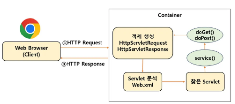

### SOLID
**객체 지향적 설계 원칙**

SRP(Single Responsibility Principle): **단일 책임 원칙**, 클래스는 단 하나의 책임을 가져야 하며 클래스를 변경하는 이유는 단 하나의 이유여야 한다. 

OCP(Open-Closed Principle): **개방 폐쇄 원칙**, 확장에는 열려 있어야 하고, 변경에는 닫혀 있어야 한다.

LSP(Liskov Substitution Principle): **리스코프 치환 원칙**, 상위 타입의 객체를 하위 타입의 객체로 치환해도 상위 타입을 사용하는 프로그램은 정상적으로 동작해야 한다. -> 부모가 할 수 있는 일은 자식도 똑같이 할 수 있어야 한다  
ex) 상황: "새를 하늘에 날려줘!"
- 부모: 새 -> 날수있음. 
- 자식1: 독수리 -> 날 수 있음.
- 자식2: 펭귄 -> 날 수 없음!!!   

문제점: 펭귄은 새지만 날 수 없어서 부탁을 수행할 수 없음 .. 


ISP(Interface Segregation Principle) : **인터페이스 분리 원칙**, 행위에 대한 인터페이스는 서로 분리되어야 한다. ex) 핸드폰으로 전화하는데 핸드폰 카메라가 방해가 되면 안된다.
``` java
// ex)
interface SmartPhone{
    void call();
    void sendMessage();
    void playMusic;
    ~~~
} 

//단순한 전화기 만들고 싶은데 ...
class SimplePhone implements SmartPhone{
    public void call(){ }
    
    //다른 기능들 필요 없는데 강제로 구현해야돼 !!! 
}
```
DIP(Dependency Injection Principle): **의존성 역전 원칙**, 상위 클래스가 하위 클래스에 의존하면 안된다. (구체적인 것보다 추상적인 것에 의존하기. 인터페이스 활용! )

### DI
- **DI**

  Dependency Injection의 약자로, 객체를 직접 생성하는게 아니라 외부에서 생성한 후 주입받는 방식이다. → 결합도를 느슨하게 만드는 것이다.

  Why?

  DI를 사용하지 않는 경우를 보자. (직접 생성)

    ```java
    //나쁜 예시
    public class Car{
    	private Engine engine; 
    	
    	public Car(){
    		//여기서 직접 Engine을 "만들고" 있음
    		this.engine = new GasolineEngine();
    	}
    }
    ```

  강결합이고 확장에 닫혀있다(OCP 위반). 만약 이 경우, 차의 엔진을 만약 갈고싶다면? 그럼 차를 아예 바꿔야하나? → 놉!

    ```java
    //1단계: 인터페이스 정의
    public interface Engine{
    	void start();
    }
    
    public class GasolineEngine implements Engine{
    	public void start(){
    		System.out.println("가솔린 엔진 시동!");
    		}
    }
    
    public class ElectricEngine implements Engine{
    	public void start(){
    		System.out.println("전기 모터 시동!");
    		}
    }
    
    //2단계: Car클래스는 구체적인 엔진을 직접 만들지 않음
    public class Car{
    	private Engine engine;
    	
    	//생성자를 통한 주입
    	public Car(Engine engine){
    		this.engine = engine; //외부에서 받은 것을 사용
    	}
    	
    	public void drive(){
    		engine.start();
    		System.out.println("자동차 출발!");
    	}
    }
    
    // 3단계: 외부에서 의존성을 결정하고 주입
    public class Main {
        public static void main(String[] args) {
            // 어떤 엔진을 사용할지는 외부에서 결정
            Engine engine = new GasolineEngine();
            Car car = new Car(engine);  // 주입!
            
            car.drive();
            
            // 나중에 전기차로 바꾸고 싶다면?
            Engine electricEngine = new ElectricEngine();
            Car electricCar = new Car(electricEngine);  // 주입!
            
            electricCar.drive();
        }
    }
    ```

    - Car는 Engine 인터페이스만 알고, 구체적인 엔진 종류는 모른다.
    - main이 어떤 engine을 사용할지 결정한다.
    - 생성자 매개변수를 통해 엔진 객체를 받아서 사용한다.
### IoC
Inversion of Control의 약자로 제어의 역전을 의미한다.

프로그램 제어 흐름을 개발자가 제어하는 것이 아닌, 외부에서 관리하는 것이다. 여기서 외부는 IoC Container이다.

일반적으로 개발자가 객체 생성, 설정, 초기화, 호출, 소멸까지 라이프사이클을 관리하지만, 이에 대한 관리를 프레임워크에 위임한 것이다.

**IoC 장점**

- 낮은 결합도

    ```java
    @Service
    class Service{
    	private final Repository repository;
    	@Autowired 
    	public Service(Repository repository){
    		this.repository = repository;
    	}
    }
    @Repository
    class Repository{
    	public void saveDate(){
    	}
    }
    ```

  Service 클래스는 Repository 클래스의 구체적인 구현에 대해 알 필요가 없다. Repository 구현이 변경되어도 Service 클래스에 영향을 주지 않는다.

- 코드 재사용성

  각 서비스는 필요한 의존성만 주입받아 사용하면 되므로 코드의 재사용성이 높아진다.

- 유지보수 용이성

  예를 들어 Repository 클래스의 로직이 어떤 데이터베이스에 저장하냐에 따라 다르다고 하더라도, 이를 사용하는 서비스 코드를 바꿀 필요가 없기에 유지 보수하기 좋아진다.

### 생성자 주입 vs 수정자, 필드 주입 차이
- 생성자 주입: 의존성을 주입받는 클래스의 생성자를 통해 의존성을 주입하는 방법. 객체가 생성될 때 의존성을 한번에 주입받기 때문에 의존성 주입 후 변경이 불가능하다는 점에서 불변성을 확보할 수 있다.
- 필드 주입: 의존성을 주입받는 클래스의 필드에 직접 의존성을 주입하는 방법이다. 이 방법은 코드가 간결하다는 장점이 있지만, 의존성이 변경될 가능성이 있다는 단점이 있다.(불변성 보장 X)
- 세터 주입: 의존성을 주입받는 클래스의 세터 메서드를 통해 주입하는 방법이다. 필드 주입과 마찬가지로 불변성을 보장하지 못하며 객체 생성 후 의존성을 변경할 수 있다는 단점이 있다.

**생성자 주입 방식은 필드 주입,세터 주입과는 빈을 주입하는 순서가 다르다.**

필드 주입과 세터주입은 먼저 빈을 생성한 후, 주입하려는 빈을 찾아 주입한다.

하지만, 생성자 주입은 빈을 생성하지 않고 주입하려는 빈을 먼저 찾는다.

→ 따라서 생성자 주입 방식을 사용하면 순환 참조가 발생하면서 오류를 찾을 수 있다. 객체 생성 시점에 빈을 주입하기에 서로 참조하는 객체가 생성되지 않은 상태에서 그 빈을 참조하기에 오류가 발생하는 것이다. 그래서 **사전에 순환참조를 방지**하기 위해서는 생성자 주입을 사용하는 것이 좋다.

순환 참조의 예)

```java
@Service
public class AService{
		//순환 참조
		@Autowired
		private BService bService;
}

@Service public class BService{
		//순환 참조
		@Autowired 
		private AService aService;
}
// -> 생성자 주입 방식을 쓰면 컴파일타임에 오류 알 수 있음. 
//-> 생성자 주입 방식 -> BeanCurrentlyInCreationException 발생
// -> but, 필드 주입,세터 주입 방식은 이 순환참조 오류를 알 수가 없음 
```

세터주입, 필드주입 동작 순서:

1. AService 빈 생성 (bService = null)
2. BService 빈 생성 (aService = null)
3. @Autowired로 의존성 주입
4. 애플리케이션 **시작 성공**
5. 실제 메서드 호출 시 순환 참조 문제 발생

생성자 주입 동작 순서:

1. AService 생성 시도 → BService가 먼저 필요
2. BService 생성 시도 → AService가 먼저 필요
3. 순환 참조 감지 → BeanCurrentlyInCreationException 발생
4. 애플리케이션 **시작 실패**

### AOP
Aspect Oriented Programming의 약자로 관점 지향 프로그래밍이라고 불린다. 주로 반복되는 코드와 관심사를 분리하는 데 초점을 맞추고 있다.

Spring Boot는 애플리케이션을 빠르고 효율적으로 개발할 수 있는 환경을 제공하지만, 복잡한 애플리케이션에서는 반복되는 코드가 많아질 수 있다. AOP를 사용하면 이러한 반복 코드를 효과적으로 관리할 수 있다.

**AOP의 주요 용어**

- Advice: AOP에서 특정 조인 포인트에서 실행되는 코드 조각을 말한다. 예를 들어, 메서드 호출 전에 실행되는 로직이나, 메서드 실행 후에 처리되는 로직 등이 여기에 해당한다.
  - 어드바이스 유형
    - Before Advice: 메서드 실행 전에 특정 작업을 수행. 예를 들어, 로깅이나 인증 체크 등이 있다.
    - After Returning Advice: 메서드가 성공적으로 실행된 후 실행되는 로직. 주로 결과 데이터의 후처리나 로깅에 사용된다.
    - After Throwing Advice: 메서드 실행 중 예외가 발생했을 때 실행되는 로직. 주로 예외 처리 로직에 활용된다.
    - After Advice: 메서드 실행 후, 성공/실패 여부에 관계없이 항상 수행되는 작업이다.
    - Around Advice: 메서드 실행 전후 및 예외 발생 시 로직을 수행. 주로 성능 모니터링 할 때 사용된다.

    ```java
    @Aspect
    @Component
    public class LoggingAspect {
    
           // 메소드 실행 전에 로그를 남기는 어드바이스
            @Before("execution(* com.example.service.*.*(..))")
            public void logBefore(JoinPoint joinPoint) {
                System.out.println("Before: " + joinPoint.getSignature().getName());
            }
    
            // 메소드 실행 후에 로그를 남기는 어드바이스
            @After("execution(* com.example.service.*.*(..))")
            public void logAfter(JoinPoint joinPoint) {
                System.out.println("After: " + joinPoint.getSignature().getName());
            }
    
    }
    ```


- Join Point: Join Point는 AOP의 advice가 적용될 수 있는 애플리케이션의 실행 지점을 말한다. 주로 메서드 호출이 이에 속한다. 위의 예시 코드에서 JoinPoint객체를 사용해 현재 실행 중인 메서드의 정보를 가져오고 있다. ( = AOP가 끼어들 수 있는 지점, JoinPoint 객체 = 현재 실행 중인 지점의 상세 정보를 담은 객체)

- Pointcut: 포인트컷은 어떤 조인 포인트에 어드바이스를 적용할지를 정의하는 표현식이다. 위 예시의 @Before 과 @After 애노테이션에 사용된   "execution(* com.example.service.*.*(..) 부분이 포인트컷 표현식이다. 이 표현식은 com.excample.service 패키지 안의 모든 클래스의 모든 메서드에 어드바이스를 적용하라는 의미이다.

- Aspect: Aspect는 여러 advice와 pointcut을 하나의 모듈로 모아놓은 것이다. 즉 “언제, 어디서, 무엇을” 한 곳에 모아놓은 것이다.
  - 언제: 어드바이스 ( 메서드 실행 전? 후? 예외 발생 시?)
  - 어디서: 포인트컷 (어떤 메서드들에 적용할지?)
  - 무엇을: 어드바이스의 실제 실행 코드 (로깅? 보안? 트랜잭션?)

  LoggingAspect는 이런 정보들을 담고 있다.

  - 어디서: com.example.service 패키지의 모든 메서드
  - 언제: 메서드 실행 전 후
  - 무엇을: 메서드 이름 로그 출력하기

  이 모든 정보가 하나의 클래스(Aspect)에 모여있어서 로깅이라는 횡단관심사를 깔끔하게 관리할 수 있다.


**AOP의 장점과 사용 시나리오**

- 장점
  - 중복 코드 감소: 공통 기능을 한 곳에 정의하여 여러 곳에서 재사용 가능하다.
  - 모듈성 향상: 비즈니스 로직에서 부가적인 관심사를 분리함으로써 코드의 가독성과 유지보수성을 높일 수 있다.
  - 유연한 개발: 새로운 어드바이스 추가나 기존 어드바이스 변경이 용이해져, 유연한 개발이 가능하다.
- AOP는 다음 시나리오에서 유용하다.
  - 로깅: 메서드 실행 시 로그를 남기는 경우
  - 보안 검사: 메서드 호출 전에 사용자 인증이나 권한 검사를 수행
  - 트랜잭션 관리: 비즈니스 로직의 실행을 트랜잭션으로 관리

    아래 예시는 @Transactional 어노테이션이 붙은 메서드에 자동으로 트랜잭션 관리 로직을 적용하는 예시이다.

      ```java
      @Aspect
      @Component
      public class TransactionAspect {
      
          @Around("@annotation(org.springframework.transaction.annotation.Transactional)")
          public Object manageTransaction(ProceedingJoinPoint joinPoint) throws Throwable {
              try {
                  // 트랜잭션 시작
                  Object result = joinPoint.proceed(); // 메소드 실행
                  // 트랜잭션 커밋
                  return result;
              } catch (Exception e) {
                  // 트랜잭션 롤백
                  throw e;
              }
          }
      }
      ```
### 서블릿 
서블릿은 웹페이지를 동적으로 생성하는 서버 측 '프로그램'이다.  

기존의 서버는 정적인 자료만을 주고 받았었는데, 다양한 기능이 요구되면서 사용자 요구에 맞춘 동적인 페이지를 만들 필요가 생겼는데 이를 위해 만들어진 것이 바로 서블릿이다.


사용자가 로그인을 시도하는 상황이라고 가정해보자.

**1. 사용자가 로그인 시도**  
```
사용자가 브라우저에서 입력:  
- 아이디: parkkong   
- 비밀번호: password
- 로그인 버튼 클릭 !! 
```

**2. Request(요청)**
```
Web Browser -> Web Server(WS)
"POST /login HTTP/ 1.1 ~~~~ "
```
브라우저가 웹서버에 "로그인 정보 확인해줘!"라고 요청

**3. 웹서버가 Servlet Container에게 전달**  
웹서버: "어? 이건 동적 처리가 필요한 로그인이네. WAS야, 너가 처리해!! "

**4. 서블릿 컨테이너가 서블릿 실행**
``` java
// LoginServlet이 실행됨
@WebServlet("/login")
public class LoginServlet extends HttpServlet {
    protected void doPost(HttpServletRequest request, HttpServletResponse response) {
        String id = request.getParameter("id");        // "hong123"
        String password = request.getParameter("password"); // "mypass456"
        
        // 데이터베이스에서 확인
        if (userService.isValidUser(id, password)) {
            // 성공 페이지 생성
            response.getWriter().println("<h1>환영합니다, " + id + "님!</h1>");
            response.getWriter().println("<p>로그인이 성공했습니다.</p>");
        } else {
            // 실패 페이지 생성
            response.getWriter().println("<h1>로그인 실패</h1>");
        }
    }
}
```

**5. Response(응답)**
```
Web Server -> Web Browser 
"HTTP/1.1 200 OK" ~~ 

<html>
~~
</html>
```

### 핵심 포인트 
1. 웹서버는 단순히 요청을 받아서 전달하는 우체부 역할 
2. WAS는 실제로 로직을 처리하는 공장
3. 서블릿은 공장 안에서 실제 일하는 작업자
4. 각 요청마다 적절한 서블릿이 실행되어 맞춤형 응답을 만들어줌.(동적)  

**정적파일(HTML, 이미지)는 웹서버가 바로 처리하지만, 동적 처리(로그인, 검색 등)는 WAS의 서블릿이 담당하는 것이다.**




사용자가 http://localhost:8080/login을 입력했다고 가정해보자.

**1. HTTP Request 전송 (Web Browser -> Container)**  
브라우저: "야 서버야, /login 페이지 줘!! "
-> Container로 요청이 들어옴

**2. 객체 생성**
``` java
// Container가 자동으로 이 두 객체를 만듦
HttpServletRequest request = new HttpServletRequest();   // 요청 정보 담는 상자*
HttpServletResponse response = new HttpServletResponse(); // 응답 정보 담을 상자*`
```
비유: 편지(요청)를 받은 받은편지함과 답장을 쓸 보낼편지함을 준비 

**3. web.xml에서 어느 서블릿인지 찾기**
``` xml
<!-- web.xml 파일 -->
<servlet>
    <servlet-name>LoginServlet</servlet-name>
    <servlet-class>com.example.LoginServlet</servlet-class>
</servlet>
<servlet-mapping>
    <servlet-name>LoginServlet</servlet-name>
    <url-pattern>/login</url-pattern>  <!-- 이거다! -->
</servlet-mapping>
```
Container: 아!! /login 요청은 LoginServlet이 처리하는구나 ~ 

**4. service() -> doGet() 또는 doPost()호출**
``` java
// Container가 자동으로 호출
public class LoginServlet extends HttpServlet {
    
    // Container가 먼저 이걸 호출
    protected void service(HttpServletRequest req, HttpServletResponse resp) {
        String method = req.getMethod(); // "GET" 또는 "POST"
        
        if (method.equals("GET")) {
            doGet(req, resp);    // GET이면 doGet() 호출
        } else if (method.equals("POST")) {
            doPost(req, resp);   // POST면 doPost() 호출
        }
    }
    
    // 실제 작업하는 메서드
    protected void doGet(HttpServletRequest request, HttpServletResponse response) {
        // 여기서 실제 로직 수행
    }
}
```
**5. 동적 페이지 생성 & 응답**  
**6. 객체 소멸(컨테이너가 자동으로 처리)** 

하지만 이처럼 각 기능마다 개별 서블릿을 만들고 web.xml에 서블릿을 매핑하여 사용하는 것은 구형 방식에 가깝다.

신형 방식은 하나의 DispatcherServlet이 모든 요청을 받아서 Controller로 분배하는 방식이다. 


### DispatcherServlet 매핑 방식
전통적인 web.xml 방식은 위에서 봤듯이, 각 서블릿을 매핑해주었다. 
하지만 Spring Boot 방식은 아래처럼 자동설정이다.
``` java
@SpringBootApplication
public class MyApplication {
    public static void main(String[] args) {
        SpringApplication.run(MyApplication.class, args);
        // DispatcherServlet이 자동으로 등록됨!
    }
}
```

### DispatcherServlet vs 일반 Servlet 
**일반 Servlet(개별 매핑)**
``` xml
<!-- 각각 다른 URL 패턴 -->
<servlet-mapping>
    <servlet-name>LoginServlet</servlet-name>
    <url-pattern>/login</url-pattern>
</servlet-mapping>

<servlet-mapping>
    <servlet-name>UserServlet</servlet-name>
    <url-pattern>/user/*</url-pattern>
</servlet-mapping>
```

**DispatcherServlet(모든 요청 받음)**
``` xml
<servlet-mapping>
    <servlet-name>dispatcher</servlet-name>
    <url-pattern>/</url-pattern>  *<!-- 모든 요청! -->*
</servlet-mapping>

```

### Optional 클래스
Optional은 값이 없는 경우를 표현하기 위한 클래스이다.  
Optional 클래스는 어떤 타입의 객체도 감싸서 담을 수 있다.  
Optional 객체는 값이 존재할 수도 없을 수도 있다. -> 이는 NullPointerException 예외를 방지할 수 있고,
코드의 안정성을 높이며 가독성을 향상시킨다.

null을 참조하려면 런타임에 NullPointerException이 발생한다.  
이를 방지하기 위해 기존에는 아래와 같이 null확인 코드를 작성해야했다.   
아래와 같이 작성하는 경우, 
중첩된 if가 추가되면서 코드 들여쓰기 수준이 증가하여 반복 패턴의 코드를 작성하게 된다.
```java
public String getCarInsuranceName(Person person) {
  if(person != null) {
    Car car = person.getCar();
    if(car != null) {
      // ...
    }
  }
}
```
-> Optional을 사용하면 보다 간편하게 null체크 문제를 해결할 수 있다.

**Optional 생성 방법**
``` java
Optional<String> empty = Optional.empty(); // 값이 비어있는 Optional을 생성방법
Optional<String> opt = Optional.of(“Hello”); // “Hello”란 값이 담겨있는 Optional을 생성
String temp = null;
Optional<String> opt = Optional.ofNullable(temp) // 인자(temp)가 null일 수도 있는 상황에서 사용

```

**Optional이 제공하는 메서드와 사용방법**
- isPresent(): Optional의 값이 존재하면 true, 해당 값이 없으면 false 리턴
- isEmtpy(): isPresent() 메서드와 반대로 체크하는 메서드로, Optional의 값이 비어있으면 true, 해당 값이 존재하면 false 리턴
- get(): Optional이 감싸고 있는 실제 값을 얻기 위해서 사용하며, 만일 Optional의 값이 비어있는 경우 
, NoSuchElementException이 발생. 그러므로 Optional의 값이 항상 있다고 판단되지 않는다면 isPresent() 또는 isEmpty()로 값의 존재 여부 체크한 뒤, get()메서드 사용
  ```java
  Optional<String> optionalString = Optional.of("Hello");

  if (optionalString.isPresent()) {    // 값이 존재하는지 확인

    System.out.println("Optional contains a value: " + optionalString.get());

  } else {
    System.out.println("Optional is empty");
  }
  ```
- ifPresent(),ifPresentOrElse(): ifPresent() 메서드를 이용해 값이 있는 경우 처리, ifPresentOrElse()를 사용해 값이 있는 경우와 없는 경우를 동시에 처리.
- orElse(), orElseGet(), orElseThrow: 
  - orElse(): 값이 없으면 미리 계산된 기본값 반환
  - orElseGet(): 값이 없으면 함수를 실행해서 기본값 반환
  - orElseThrow(): 값이 없으면 예외 발생 
- map(): Optional의 값을 변환해서 사용해야 하는 경우, map()을 이용해 기존 값을 변환하여 값을 가져옴  

**Optional 사용 시 주의사항**
1. Optional 변수에 null을 할당하지 않는다.
    -> Optional은 null을 사용하지 않기 위해서 만들어진 클래스인데, Optional을 null로 초기화하면 Optional의 사용 의도와 맞지 않게 된다.
      빈값으로 Optional을 만들려면 Optional.empty()를 사용해 객체를 생성한다.
2. Optional을 필드 타입으로 사용하지 않는다. -> Optional은 메서드의 리턴 타입으로 사용하기 위한 용도로 설계되었기 때문에, Optional을 클래스의 필드로 선언하는 것은 잘못된 사용 방식이며, 필드 타입은 객체를 그대로 사용하는 것이 올바른 사용 방식이다.
    ``` 
   // 잘못된 사용
    public class User {
    private Optional<String> name; // 권장하지 않음
    }

    // 올바른 사용
    public class User {
    private String name; // null 허용

    public Optional<String> getName() {
        return Optional.ofNullable(name);
      }
    }
    ```
### Stream API 
리스트나 배열 같은 데이터 모음을 쉽고 간단하게 처리할 수 있게 해주는 도구이다.  
기존에 for문이나 while문으로 복잡하게 작성했던 코드를 한 줄로 간단하게 만들 수 있어서, 코드를 읽기 쉽고 유지보수하기 편하게 만들어준다.

**기존 방식(복잡함)**
```java
List<String> names = Arrays.asList("김철수", "이영희", "박민수", "최영수");
List<String> result = new ArrayList<>();

for (String name : names) {
    if (name.startsWith("김")) {
        result.add(name.toUpperCase());
    }
}
```
**Stream API 사용(간단함)**
```java
List<String> result = names.stream()
    .filter(name -> name.startsWith("김"))  // "김"으로 시작하는 이름만
    .map(String::toUpperCase)              // 대문자로 변환
    .collect(Collectors.toList());         // 리스트로 수집
```

**Stream의 특징**
1. Stream은 원본의 데이터를 변경하지 않는다. -> 원본 데이터를 조회하여 별도의 Stream 객체로 생성한다.
2. Stream은 재사용이 불가능하여 일회용으로 사용된다.

**Stream의 과정**
Stream 객체를 구성하고자 할 때 "Stream 생성 > 중간 연산 > 최종 연산"의 세 단계의 과정을 통하여 처리가 이루어진다. 
```java
//객체의 Stream을 생성하고 중간 연산을 수행하고 최종 연산하여 결과값을 얻는다.
객체.Stream생성().중간연산.최종연산()
```
- 중간 연산(여러 개 연결 가능)
  - filter() - 조건에 맞는 요소 선별
  - map() - 요소 변환
  - sorted() - 정렬
  - distinct() - 중복 제거
  - limit() - 개수 제한
- 최종 연산(한 번만 사용)
  - collect() - 결과를 컬렉션으로 수집
  - forEach() - 각 요소에 대해 작업 수행
  - count() - 개수 세기
  - findFirst() - 첫 번째 요소 찾기
  - anyMatch() - 조건에 맞는 요소 존재 여부
  