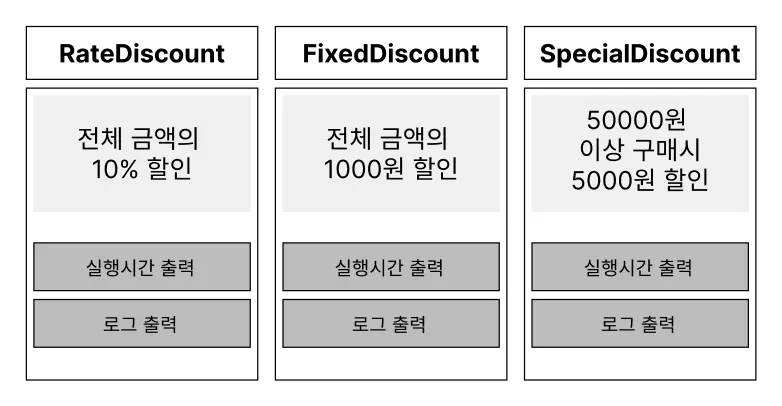
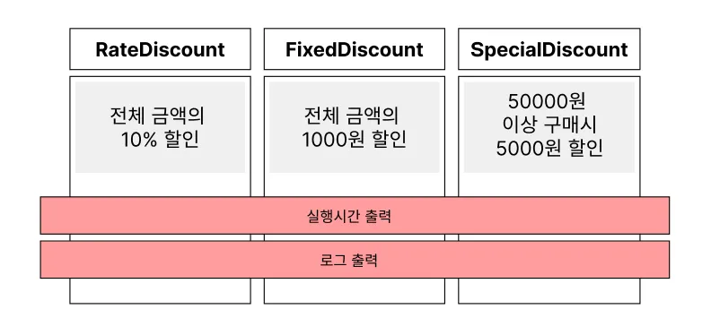

### AOP란?

Aspect Oriented Programming은 **횡단 관심사(Cross-Cutting Concern)의 분리**를 허용함으로써 **모듈성을 높이는 것을 목적으로 하는 프로그래밍 패러다임**입니다!

여러 객체에 공통적으로 적용되는 기능(예: 로깅, 보안, 트랜잭션 관리 등)을 핵심 로직에서 분리하여 별도의 모듈(Aspect)로 관리하게 되죠 이를 통해 개발자는 반복적인 공통 기능을 매번 구현할 필요가 없어지고, **핵심 비즈니스 로직 개발에 집중**할 수 있어요!

이렇게 설명을 들으면 이해가 안될거 같아서 예시 요구 사항을 준비했습니다. 

여러 할인 정책이 있고, 오류 추적을 위해 로깅을 추가했다고 합시다.



처음엔 `FixedDiscountPolicy`에 단순히 `System.out.println`을 위·아래로 넣어 처리했다.

```java
public class FixedDiscountPolicy implements DiscountPolicy {
    @Override
    public int discount(int price) {
        System.out.println("[LOG] Fixed 할인 시작 price=" + price);
        int amount = 1000;
        System.out.println("[LOG] Fixed 할인 결과 amount=" + amount);
        return amount;
    }
}
```

하지만 새로운 정책(`RateDiscountPolicy`)이 생길 때마다 **또 로깅을 복붙**해야 한다.

```java
public class RateDiscountPolicy implements DiscountPolicy {
    @Override
    public int discount(int price) {
        System.out.println("[LOG] Rate 할인 시작 price=" + price);
        int amount = (int) (price * 0.1);
        System.out.println("[LOG] Rate 할인 결과 amount=" + amount);
        return amount;
    }
}
```

더 나아가 로그 포맷을 바꾸고 싶다면 **모든 구현체를 동시에 수정**해야 되겠죠?

즉, **중복과 산재(Scattering)** 가 발생합니다!

이 문제는 **프록시(데코레이터)** 를 통해 해결할 수 있어요!

핵심 정책은 **할인 계산만** 담당하고, 로깅은 **프록시 한 곳**에서 일괄 처리한다.

---

### 프록시란?

프록시는 **클라이언트가 사용하려는 실제 대상(Real Subject) 대신 요청을 받아주는 대리 객체**를 말한다. 겉보기에는 진짜 객체처럼 보이지만, 실제로는 **중간에서 요청을 가로채거나 추가적인 처리를 수행하는 가짜 객체**다.

이 프록시를 어떻게 이용하느냐에 따라 2가지 패턴으로 분류할 수 있다. 

> **프록시 패턴 (Proxy Pattern)**

클라이언트가 **타깃에 접근하는 방법 자체를 제어**하기 위한 프록시.

예: 데이터베이스 커넥션을 직접 만들지 않고 프록시를 통해 필요할 때만 생성.

> **데코레이터 패턴 (Decorator Pattern)**

클라이언트의 요청은 그대로 타깃에게 전달하지만, **추가 기능을 덧붙이는 목적**으로 사용하는 프록시.

예: 출력 기능에 “로깅”을 덧붙여 기록을 남김.

---

자 이제 프록시를 이용한 데코레이터 패턴을 통해 위의 상황을 리팩토링 해보겠습니다!

핵심 정책은 **할인 계산만** 담당하고, 로깅은 **프록시 한 곳**에서 일괄 처리할거에요



```java
public class FixedDiscountPolicy implements DiscountPolicy {
    @Override
    public int discount(int price) {
        int amount = 1000;
        return amount;
    }
}

public class RateDiscountPolicy implements DiscountPolicy {
    @Override
    public int discount(int price) {
        int amount = (int) (price * 0.1);
        return amount;
    }
}

public class SpecialDiscountPolicy implements DiscountPolicy {
    @Override
    public int discount(int price) {
        return (price >= 50000) ? 5000 : 0; // 5만원 이상 5000원 할인
    }
}
```

```java
public class LoggingDiscountPolicyProxy implements DiscountPolicy {
    private final DiscountPolicy target;

		// DI: 생성자 주입
    public LoggingDiscountPolicyProxy(DiscountPolicy target) {
        this.target = target;
    }

    @Override
    public int discount(int price) {
        long start = System.currentTimeMillis();
        System.out.println("[LOG] " + target.getClass().getSimpleName() + " 시작 price=" + price);
        try {
            int amount = target.discount(price); //핵심 로직 실행
            System.out.println("[LOG] 결과 amount=" + amount);
            return amount;
        } finally {
            long end = System.currentTimeMillis();
            System.out.println("[LOG] 실행 시간=" + (end - start) + "ms");
        }
    }
}
```

클라이언트가 할인을 요청하면 **프록시**가 가장 먼저 요청을 받아 **시작 로그**를 남긴다.

그다음 **실제 할인 정책(핵심 로직)** 을 호출해 할인 금액을 계산하고, 다시 프록시가 제어를 넘겨받아 **종료 로그**를 남기며 **실행 시간**을 계산한다.

즉, **핵심 로직은 각 정책 구현체에서 수행**하고, 그 외의 **로그 출력과 실행 시간 계산은 프록시가 담당**한다. 이런 방식이 바로 앞에서 설명한 **AOP의 개념**이다.