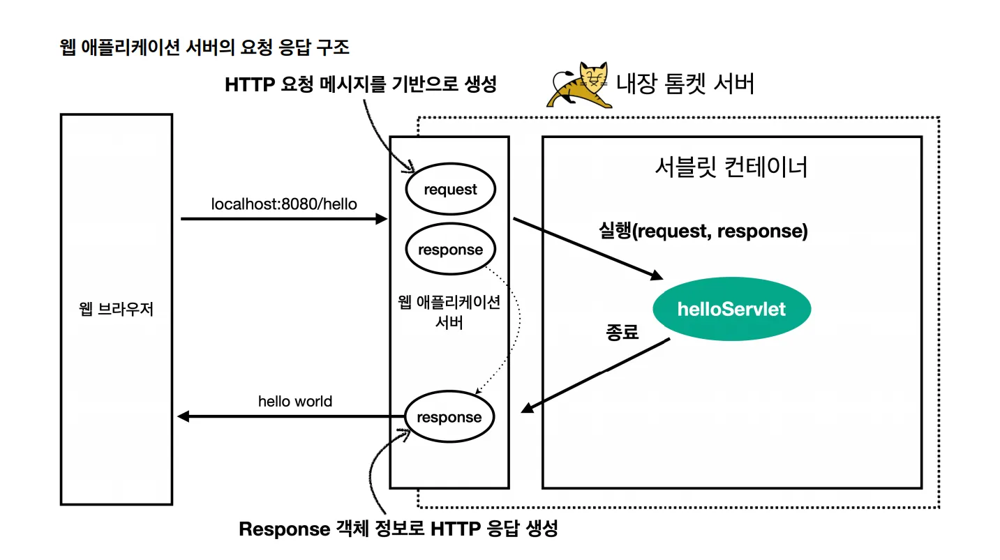

## 서블릿이란?

**서블릿(Servlet)은 자바로 만든 서버 프로그램으로, 클라이언트의 요청(HTTP Request)을 받아 처리하고 응답(HTTP Response)을 생성하는 서버 측 컴포넌트다.**

클라이언트와 서버는 HTTP 메시지로 소통한다. 사실 서버 입장에서는 이 메시지가 단순한 문자열일 뿐이다. 하지만 대부분의 서버 프레임워크는 객체지향 언어로 만들어져 있기 때문에, 문자열을 그대로 다루기보다는 객체로 변환해 두어야 추가 작업을 하기에 훨씬 용이하다.

문제는, 개발자가 매번 HTTP 요청 메시지를 직접 파싱하고 객체로 변환하는 건 너무 번거롭고 비효율적이라는 점이다. 서블릿은 이 불편함을 해결하기 위해 등장했다. 서블릿 컨테이너(WAS)는 요청 메시지를 대신 파싱해 `HttpServletRequest` 객체에 담아주고, 개발자는 이 객체를 사용해 편리하게 요청을 처리할 수 있다.

서블릿 컨테이너는 스프링에서만 존재하는 게 아니라, **WAS(Web Application Server)** 자체에서 제공하는 기능이다. 우리가 스프링 부트를 사용하면 내장 WAS가 자동으로 실행되는데, 흔히 말하는 **Tomcat**이 바로 그 예다.



클라이언트가 서버에 요청을 보내면, HTTP 메시지 형태로 전달된다. WAS는 이 요청을 받아서 **`HttpServletRequest` 객체로 변환**하고, 이를 서블릿 컨테이너로 넘긴다. 서블릿 컨테이너는 `HttpServletRequest` 안의 URL, 메서드 등의 정보를 확인해, 해당 요청을 처리할 서블릿을 찾아 매핑하고 실행한다.

## 자바에서 서블릿 사용하기

```java
@WebServlet(name = "requestHeaderServlet", urlPatterns = "/request-header")
public class RequestHeaderServlet extends HttpServlet {

    @Override
    protected void service(HttpServletRequest request, HttpServletResponse response)
            throws ServletException, IOException {

        printStartLine(request);   // 요청 라인 정보(GET, URL, 프로토콜 등)
        printHeaders(request);     // 헤더 전체 출력
        printHeaderUtils(request); // 헤더 편의 메서드 활용
        printEtc(request);         // 기타 정보 (로컬 주소, 세션 등)

        response.getWriter().write("ok"); // 응답 본문에 "ok" 반환
    }
}
```

### 서블릿 작성

자바에서 서블릿을 사용하려면, 우선 `HttpServlet`을 상속받은 클래스를 만들어야 한다. 그리고 그 안에서 `service()`, `doGet()`, `doPost()` 같은 메서드를 오버라이딩하여 요청을 처리하는 로직을 작성한다. 이 메서드의 파라미터로는 항상 `HttpServletRequest`와 `HttpServletResponse` 객체가 전달된다.

### 서블릿 등록

작성한 서블릿 클래스에는 `@WebServlet` 어노테이션을 붙여 URL 패턴(`urlPatterns`)과 이름(`name`)을 지정한다.

위에서 정리한 흐름을 적용해보자!

<aside>

1. 클라이언트가 요청을 보내면, WAS가 HTTP 메시지를 파싱해 `HttpServletRequest` 객체를 만든다.
2. 이 객체 안의 요청 URL을 확인했을 때 `/request-header` 을 확인
3. 서블릿 컨테이너는 미리 등록된 URL 패턴 매핑 테이블에서 `/request-header`를 처리할 서블릿을 찾는다.
4. 매핑된 서블릿은 `RequestHeaderServlet`이고, WAS는 그 안의 `service()` 메서드를 호출해 로직을 실행한다.
</aside>

### **HttpServlet 코드 보기**

맨 위의 예시에서는 `HttpServlet`을 상속받아 새로운 서블릿을 만들고, `service()` 메서드를 오버라이딩했다. `service()`는 해당 서블릿의 주소로 어떤 요청이 들어와도 가장 먼저 실행되는 메서드다. 즉, 클라이언트 요청이 들어오면 일단 `service()`가 호출되고, 이 메서드가 요청의 성격(HTTP 메서드 종류)에 따라 `doGet()`, `doPost()`와 같은 메서드로 분기하게 된다.

```java
protected void service(HttpServletRequest req, HttpServletResponse resp) throws ServletException, IOException {
        String method = req.getMethod();
        long lastModified;
        if (method.equals("GET")) {
            lastModified = this.getLastModified(req);
            if (lastModified == -1L) {
                this.doGet(req, resp);
            } else {
                long ifModifiedSince;
                try {
                    ifModifiedSince = req.getDateHeader("If-Modified-Since");
                } catch (IllegalArgumentException var9) {
                    ifModifiedSince = -1L;
                }

                if (ifModifiedSince < lastModified / 1000L * 1000L) {
                    this.maybeSetLastModified(resp, lastModified);
                    this.doGet(req, resp);
                } else {
                    resp.setStatus(304);
                }
            }
        } else if (method.equals("HEAD")) {
            lastModified = this.getLastModified(req);
            this.maybeSetLastModified(resp, lastModified);
            this.doHead(req, resp);
        } else if (method.equals("POST")) {
            this.doPost(req, resp);
        } else if (method.equals("PUT")) {
            this.doPut(req, resp);
        } else if (method.equals("DELETE")) {
            this.doDelete(req, resp);
        } else if (method.equals("OPTIONS")) {
            this.doOptions(req, resp);
        } else if (method.equals("TRACE")) {
            this.doTrace(req, resp);
        } else {
            String errMsg = lStrings.getString("http.method_not_implemented");
            Object[] errArgs = new Object[]{method};
            errMsg = MessageFormat.format(errMsg, errArgs);
            resp.sendError(501, errMsg);
        }

    }
```

`HttpServlet`의 원래 코드를 보면, HTTP 메서드에 따라 요청을 분기하는 것을 알 수 있다. 예를 들어, `POST` 요청이면 `doPost()`, `GET` 요청이면 `doGet()`이 호출된다.

정리하면, `service()`는 서블릿이 요청을 받으면 가장 먼저 실행되는 메서드이고, 여기서 `HttpServletRequest`에 담긴 HTTP 메서드 정보를 확인한 뒤 해당하는 메서드(`doGet()`, `doPost()` 등)를 실행한다. 개발자는 이 메서드 안에 비즈니스 로직을 작성함으로써 클라이언트의 요청을 처리할 수 있게 된다.

앞의 예시를 보면 얼핏 “`service()`에서 바로 로직을 작성하면 되지 않을까?”라는 생각이 들 수 있다. 하지만 실제로는 이런 방식은 잘 사용되지 않는다. `service()`는 서블릿에 들어온 요청의 **진입점이자 HTTP 메서드별로 분기해주는 역할**을 담당하기 때문이다. 따라서 실질적인 로직은 `doPost()`, `doGet()` 같은 메서드를 오버라이딩해서 구현하는 것이 바람직하며, `service()` 자체는 건드리지 않는 것이 좋다.