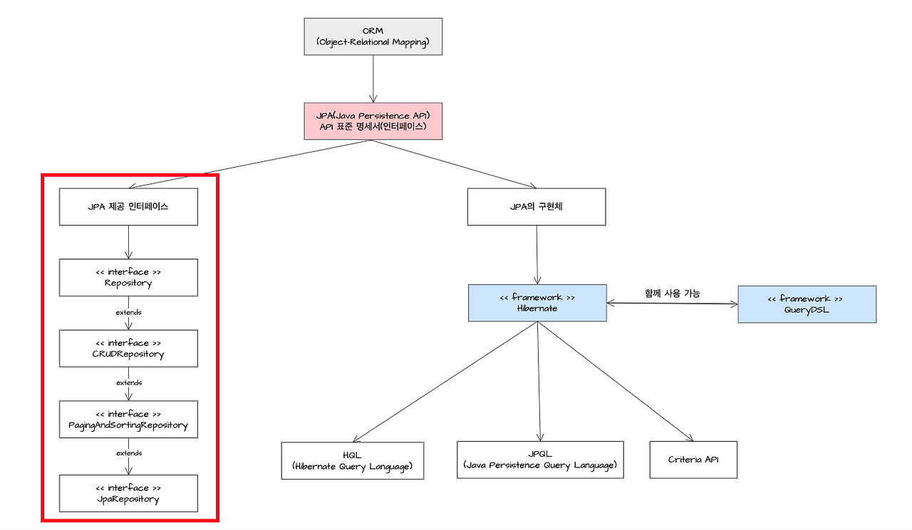

## 계층형 구조 vs 도메인형 구조
<hr>

### 계층형 구조
프로젝트를 기능에 따라 계층적으로 나눈다, MVC 패턴

(controller 파일 모두 controller 디렉토리에, service 파일 모두 service 디렉토리에 넣는 방식)

```
controller
	⎿ ProductController
	⎿ MemberController
	⎿ CartController

service
	⎿ ProductService
	⎿ MemberService
	⎿ CartService

dao
	⎿ ProductDao
	⎿ MemberDao
	⎿ CartDao
   
domain
	⎿ Product
	⎿ Member
	⎿ Cart
```

[계층형 구조 장점]

1. 프로젝트 전반적인 이해도가 낮아도, 패키지 구조만 보고 전체적인 구조를 파악할 수 있다.
2. 계층별 응집도가 높아진다.
3. 역할 분리가 명확하여 설계 및 구현이 용이하다.
4. 표준화된 아키텍처로, 익숙한 방식으로 개발할 수 있다.

[계층형 구조 단점]

1. 도메인별 응집도가 낮다. (패키지로 애플리케이션의 기능을 구분짓지 못한다)
2. 도메인과 관련된 기능이 변경되었을 때 변경 범위가 크다.
3. 하나의 도메인 흐름을 파악하고 싶을 때 모든 계층을 파악해야 하고 하나의 패키지 안의 여러 도메인이 섞여있다.

### 도메인형 구조

도메인을 기준으로 패키지를 나눈 구조

<도메인> : 인터넷 주소를 사람이 기억하기 쉽게 문자로 표현한 것이며, IP주소를 대신해 웹사이트를 식별하는 고유한 이름.

```
product
	⎿ controller
	⎿ service
    ...

member
	⎿ controller
	⎿ service
    ...
```

[도메인형 구조 장점]

1. 모듈 단위로 분리하기 용이함
2. 도메인별 응집도가 높아짐
    - 특정 도메인의 로직 확인하고 싶을 떄 하나의 패키지만 확인하면 됨
    - 도메인 관련 수정 사항이 발생했을 떄 변경 범위가 적음
3. 유스 케이스별로 세분화해서 표현 가능
    - 상품 등록 유스 케이스, 상품 검색 유스 케이스
    - 도메인별로 패키지가 나뉘기 때문에 네이밍으로 분리가 가능해짐

[도메인형 구조 단점]

1. 애플리케이션의 전반적인 흐름을 한눈에 파악하기 어려움
2. 어떤 도메인 패키지에 위치시킬지 명확하지 않을 경우 개발자별로 도메인을 구분하는 기준이 다를 수 있음
3. 패키지 간에 순환 참조가 발생할 수 있음

[계층형 vs 도메인형]

- 계층형 구조를 선택하는 경우
    - 규모가 작고 도메인의 개수가 적은 경우
    - 제공하는 기능을 명확하게 분리하기 어려운 경우
    - 모듈별로 분리할 일이 없는 작은 규모의 프로젝트일 경우

- 도메인형 구조를 선택하는 경우
    - 규모가 크고 도메인의 개수가 많은 경우
    - 제공하는 기능을 명확한 기준으로 분리할 수 있는 경우
    - 모듈별로 별도 서비스로 나눠질 가능성이 있는 규모의 프로젝트일 경우

## JPA

### JPA

데이터베이스를 쉽게 다루기 위한 ‘데이터 액세스 기술’로 ORM 기법을 사용하여 자바 애플리케이션에서 사용하는 객체와 관계형 데이터베이스 사이의 매핑을 관리하는 ORM 기술에 대한 API 표준 인터페이스

→ 표준화된 API를 제공함으로써, 다양한 ORM 프레임워크와의 호환성을 보장해 개발자가 특정 ORM 프레임워크에 종속되지 않고 필요에 따라 다른 프레임워크로 쉽게 전환 가능하다.

ORM : 객체와 관계형 데이터베이스의 데이터를 매핑하여 ‘객체 지향적인 코드’를 작성 가능하게 하는 기술을 의미 → ORM을 사용해서 개발자는 SQL 쿼리를 직접 작성하는 대신 자바 객체를 사용하여 데이터베이스의 레코드를 쉽게 생성, 조회, 수정, 삭제할 수 있다.

[JPA 인터페이스 구조]


## N+1 문제

### N+1 문제

하나의 엔티티를 조회할 때 해당 엔티티와 연관된 엔티티에 접근할 때 지연 로딩 전략에 따라서 추가적인 쿼리가 N번(처음 조회된 엔티티의 개수)만큼 나가는 것

[지연 로딩]

: 지연 로딩 전략은 특정 엔티티를 조회할 때 연관된 엔티티를 즉시 조회하지 않고 필요할 때 조회하는 전략. 지연 로딩을 사용하지 않는다면 특정 엔티티와 연관된 모든 정보들이 조회되면서 불필요한 비용이 추가적으로 발생하게 된다.

[예시]

축구 팀이 3개가 있고 각 팀마다 회원이 2명씩 있다고 한다

처음에 팀을 조회하는 쿼리가 날아가고 이후에 3개의 팀에 대해서 각각 회원에 대한 쿼리 날아간다

(팀 전체 조회) 1 + (팀의 개수) 3 번의 쿼리가 나가고, 첫번째 조회 쿼리의 결과 개수를 N이라고 하면 1 + N개의 쿼리가 나간다.

[예시에 대한 문제]

N+1 문제가 발생하면 처음의 조회 결과만큼의 추가 쿼리가 발생하게 된다. 위의 예시에서는 팀과 연관된 클래스가 회원밖에 없었기 떄문에 N번밖에 발생하지 않았지만 연관된 엔티티가 많을수록 N * M번의 쿼리가 발생할 수 있고 이렇게 쿼리가 많아지면 DB와의 통신이 발생하기 때문에 성능에 악영향을 줄 수밖에 없다.

[N+1 문제를 해결하는 방법]

1. fetch join 사용
- inner join과 outer join으로 테스트

```
select t from Team t join fetch t.members // INNER JOIN

select t from Team t left join fetch t.members // OUTER JOIN
```
```
public interface TeamRepository extends JpaRepository<Team, Long> {

    @Query("select t from Team t join fetch t.members")
    List<Team> findAllWithInnerFetchJoin();
    
    @Query("select t from Team t left join fetch t.members")
    List<Team> findAllWithOuterFetchJoin();
}
```
```
@Test
@DisplayName("페치 조인으로 모든 팀 조회 시 쿼리를 관찰한다.")
void inspect_query_fetch_join_findAll() {
    teamRepository.findAllWithInnerFetchJoin();
    teamRepository.findAllWithOuterFetchJoin();
}
```
→ 두 경우 모두 Team 엔티티를 가져올 때 Member를 join해서 가져오기 때문에 추가 조회 쿼리가 발생하지 않는다. 이렇게 N+1 문제를 해결할 수 있다.

2. EntityGraph 사용
    - 가져올 엔티티를 지정한 EntityGraph를 생성하고, 해당 EntityGraph를 조회하는 메소드에 파라미터로 넘겨서 조회할 때 함께 가져오도록 한다.

```
    EntityGraph<Team> entityGraph = em.createEntityGraph(Team.class);
    entityGraph.addSubgraph("members");
    em.find(Team.class, teamId, Map.of(SpecHints.HINT_SPEC_LOAD_GRAPH, entityGraph));
```

```
    public interface TeamRepository extends JpaRepository<Team, Long> {
    
        @Query("select t from Team t")
        @EntityGraph(attributePaths = "members")
        List<Team> findAllWithEntityGraph();
    }
   ```

```
    @Test
    @DisplayName("EntityGraph로 모든 팀 조회 시 쿼리를 관찰한다.")
    void inspect_query_EntityGraph_findAll() {
        teamRepository.findAllWithEntityGraph();
    }
```

→ 1번 경우와 동일하게 Team Entity를 가져올 때 Member를 join해서 가져오기 때문에 추가 조회 커리 발생하지 않음.

3-1. batch fetching (@BatchSize)

- 설정을 통해 배치 사이즈를 조절하여 추가 조회 쿼리를 줄이는 해결 방법

```
    @Entity
    public class Team {
    
        ...
    
        @OneToMany(mappedBy = "team", fetch = FetchType.EAGER)
        @BatchSize(size = 3)
        private List<Member> members = new ArrayList<>();
    	
        ...
    }
```

   → 조회되는 엔티티 위에 @BatchSize를 추가한 뒤 Member 엔티티가 조회될 때 IN절을 통해 한번에 조회 가능하다.

3-2. subselect fetching (@BatchSize)

- 설정을 통해 추가 조회 쿼리를 서브 쿼리로 줄이는 방법

```
    @Entity
    public class Team {
        ...
    
        @OneToMany(mappedBy = "team", fetch = FetchType.EAGER)
        @Fetch(value = FetchMode.SUBSELECT)
        private List<Member> members = new ArrayList<>();
    
        ...
    }
```

   → Member 엔티티 위에 @Fetch를 사용하면 엔티티가 조회될 때 IN절과 서브 쿼리를 사용하여 한번에 조회 가능.

## 기본 키 생성 전략

JPA가 제공하는 기본 키 할당 방법은 직접 할당 방식과 자동 생성 방식이 있다

직접 할당 방법 : 애플리케이션에서 기본 키를 직접 할당하는 방식

→ @id 어노테이션만 사용하여 기본키를 정하고 값을 직접 할당하는 방법

```
@Entity
public class Member {

	@Id
    private Long id;
    
    /** 생략 **/
	// getter, setter ~~
}

/** 생략 **/
Member member = new Member();
member.setId(1); // 기본키 직접 할당
em.persist(member);
/** 생략 **/
```

자동 생성 방식 : DB에 할당을 위임 하거나 기본 키를 생성해주는 별도의 수단을 통해 할당하는 것

→ @GeneratedValue를 사용하여 생성 전략을 선택하고 기본키를 자동으로 생성

1. IDENTITY : 기본키 생성을 데이터베이스에 위임하는 생성 전략
- JPA는 보통 트랜잭션 커밋 시점에 INSERT SQL을 실행하는데 이 전략은 DB에 먼저 INSERT SQL을 실행해야 기본키를 알 수 있어서 em.persist() 시점에 즉시 INSERT SQL을 실행하고 DB에서 식별자를 조회

```
@Entity
public class Member {

	@Id
    @GeneratedValue(strategy = GenerationType.IDENTITY)
    private Long id;

}
```

2. SEQUENCE : 데이터베이스 시퀀스를 사용한다.

<시퀀스> : 시퀀스는 유일한 값을 순서대로 생성하는 데이터베이스의 특별한 오브젝트

```
@Entity
@SequenceGenerator(
        name = "MEMBER_SEQ_GENERATOR"
        , sequenceName = "MEMBER_SEQ" // 매핑할 시퀀스명
        , initialValue = 1
        , allocationSize = 1
	    )
public class Member {
	
    @Id
    @GeneratedValue(
    					  strategy = GenerationType.SEQUENCE
                        , generator = "MEMBER_SEQ_GENERATOR"
    			   )
    private Long id;
    
}
```

- @SequenceGenerator 사용해서 "MEMBER_SEQ_GENERATOR" 시퀀스 생성기 등록했고, JPA는 이 시퀀스 생성기를 실제 DB의 “MEMBER_SEQ” 시퀀스와 매핑
- 시퀀스 전략은 em.persist()를 호출할 때 먼저 DB 시퀀스를 사용해서 식별자를 조회함. 그리고 조회한 식별자를 엔티티에 할당한 후 엔티티를 영속성 컨텍스트에 저장한다. 이후 트랜잭션을 커밋해서 플러시가 일어나면 엔티티를 DB에 저장한다.

3. TABLE : 키 생성용 테이블을 사용한다, 기본키 생성 전용 테이블을 하나 만들어서 DB 시퀀스를 흉내내는 전략

```
create table MY_SEQUENCE (
	sequence_name varchar(255) not null,
    next_val bigint,
    primary key(sequence_name)
)
```

```
@Entity
@TableGenerator(
        name = "MEMBER_SEQ_GENERATOR"
        , table = "MY_SEQUENCE"
        , pkColumnValue = "MEMBER_SEQ"
        , allocationSize = 1
	    )
public class Member {
	
    @Id
    @GeneratedValue(
            strategy = GenerationType.TABLE
            , generator = "MEMBER_SEQ_GENERATOR"
    	    )
    private Long id;
    
}
```

- @TableGenerator로 테이블 키 생성기를 등록하고 생성한 MY_SEQUENCE 테이블을 키 생성용 테이블로 매핑하고 @GeneratedValue의 gnerator 속성으로 만든 테이블 키 생성기 지정
- Id 식별자가 밧은 MEMBER_SEQ_GENERATOR 테이블 키 생성기가 할당됨
- 시퀀스를 조회하기 위해 SELECT 쿼리 후, 값을 증가시키려고 UPDATE 쿼리를 한번 더 사용
- SEQUENCE 전략보다 한번 더 DB와 통신하기 때문에 성능이 좋지 않다


4. AUTO : 데이터베이스 방언에 따라 위 세가지의 전략 중 하나를 자동으로 선택한다.

```
@Entity
public class Member {

	@Id
    @GeneratedValue
    private Long id;

}
```