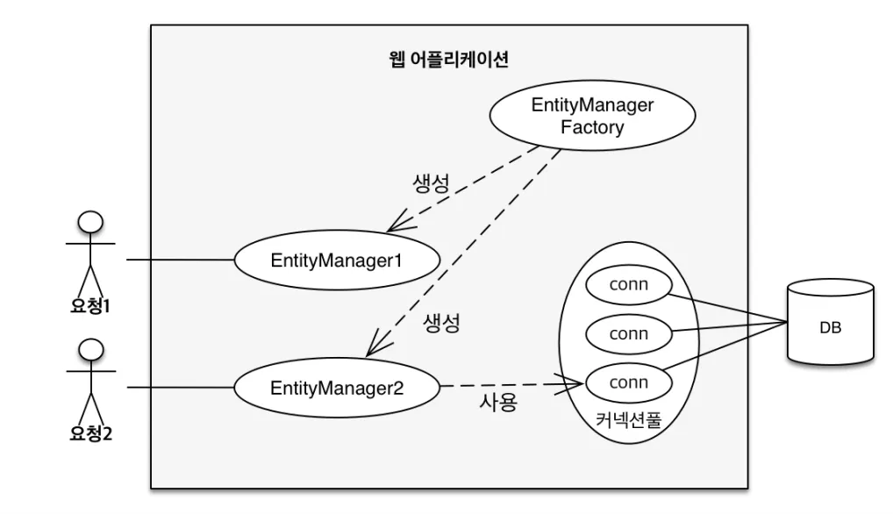
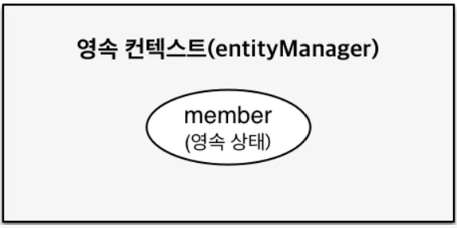
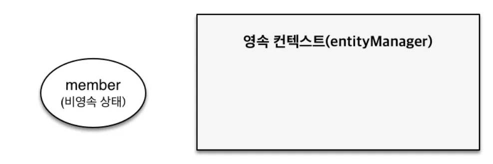

# JPA

JPA(Java Persistence API)는 **자바 객체와 관계형 데이터베이스 간의 매핑(ORM: Object Relational Mapping)** 을 표준화한 **자바의 영속성(Persistence) 프레임워크**이다.

즉, 자바 클래스와 DB 테이블을 1:1로 매핑시켜 **SQL 없이 객체 지향적으로 데이터베이스를 다루게 해주는 기술**이다.

**J**PA를 이해하기 위해서는 가장 먼저 엔티티 매니저를 알아야 한다. **엔티티 매니저(EntityManager)**는 엔티티와 관련된 모든 작업을 수행하는 객체이다. 말 그대로 *엔티티를 관리하는 관리자*라고 이해하면 된다. 개발자의 입장에서는 엔티티를 저장하는 *가상의 데이터베이스*처럼 생각해도 무방하다.

JPA에서 실제로 데이터를 다루기 위해서는 먼저 **엔티티 매니저 팩토리(EntityManagerFactory)**를 생성해야 한다. 이는 엔티티 매니저를 생성하는 *공장*과 같은 역할을 한다. 

```java
EntityManagerFactory emf = Persistence.createEntityManagerFactory("jpabook");
```

이 엔티티 매니저 팩토리는 생성 비용이 크기 때문에 애플리케이션 실행 시 한 번만 생성하여 전체에서 공유해서 사용해야 한다. 반면, 이 팩토리에서 생성되는 **엔티티 매니저(EntityManager)**는 생성 비용이 크지 않아 필요할 때마다 여러 개 생성하여 사용할 수 있다.

중요한 점은 **엔티티 매니저 팩토리는 여러 스레드에서 동시에 접근해도 안전**하도록 설계되어 있지만, **엔티티 매니저 자체는 스레드 간에 공유하면 안 된다**는 것이다. 하나의 엔티티 매니저를 여러 스레드에서 동시에 사용하면 동시성 문제가 발생할 수 있으므로, 각 스레드는 자신만의 엔티티 매니저를 사용해야 한다.



이 그림에서 보듯이, **`EntityManagerFactory`는 애플리케이션 전체에 하나만 존재**하지만, **요청마다 새로운 `EntityManager`가 생성**된다. 예를 들어 클라이언트의 요청이 들어오면 그 요청에 대응하는 `EntityManager`가 하나씩 만들어지는 식이다.

하지만 예를 들어 `EntityManager2`가 **DB에 접근해야 하는 상황**이라면 어떻게 될까? 이때 JPA의 구현체, 예컨대 Hibernate는 `EntityManagerFactory`를 생성할 때 **미리 커넥션 풀을 구성**해 둔다.

그리고 `EntityManager`가 트랜잭션을 시작하는 시점에, 이 커넥션 풀에서 **데이터베이스 커넥션 하나를 할당받아 사용**하게 된다. 즉, `EntityManager`는 평상시에는 커넥션을 갖고 있지 않다가 **트랜잭션이 시작되면 커넥션을 얻고**, 트랜잭션이 종료되면 커넥션을 반환하는 방식이다.

이러한 구조 덕분에 `EntityManagerFactory`는 비용이 큰 대신 하나만 생성해서 재사용하고, `EntityManager`는 가볍게 여러 개 생성하면서도 효율적으로 커넥션 풀을 활용할 수 있다.

# 영속성 컨텍스트란?

JPA를 이해하는 데 있어 가장 핵심적인 개념은 '**영속성 컨텍스트(Persistence Context)**'이다. 말 그대로 **엔티티를 영구적으로 저장하는 환경**이라는 의미이다.

JPA에서 **`EntityManager`는 이 영속성 컨텍스트를 관리하는 도구**다. 즉, `EntityManager`는 엔티티를 데이터베이스에 직접 저장하는 것이 아니라, 먼저 **영속성 컨텍스트에 보관**하는 역할을 한다.

지금까지 우리가 “엔티티를 저장했다”고 표현한 것은, 실제로는 `EntityManager`를 통해 **엔티티를 영속성 컨텍스트에 등록했다**는 뜻이다. 

```java
em.persist(member);
```

이 코드는 `EntityManager`가 `member`라는 객체를 **영속성 컨텍스트에 저장(등록)**하는 동작이다. 이때 `member`는 '**영속 상태**'가 되며, 이후부터 JPA는 이 객체를 추적하고 관리할 수 있게 된다.

즉, 영속성 컨텍스트는 **JPA가 엔티티의 상태를 추적하고, 변경 내용을 데이터베이스와 동기화하기 위한 핵심 메커니즘**이라 할 수 있다.

---

# 엔티티의 생명주기

엔티티는 **영속성 컨텍스트에 존재하는지 여부에 따라 4가지 상태**로 분류할 수 있다.

## 1. 영속

먼저 **영속 상태**란, **엔티티가 `EntityManager`를 통해 영속성 컨텍스트에 저장된 상태**를 말한다. 위에서 설명한 것처럼, `persist()` 메서드를 호출하면 `member` 엔티티는 **영속성 컨텍스트에 저장**되며, 이때부터 JPA는 해당 엔티티를 **자동으로 추적하고 관리**한다.

즉, **단순히 저장된 것이 아니라**, 엔티티의 필드 값이 바뀌면 이를 감지하여 **트랜잭션 커밋 시점에 자동으로 데이터베이스에 반영**하는 등 다양한 관리 기능이 함께 작동한다. 이를 통해 **변경 감지(Dirty Checking)**, **1차 캐시**, **지연 로딩(Lazy Loading)** 같은 JPA의 핵심 기능들이 가능해진다.



## 2. 비영속

이름에서 알 수 있듯이, **비영속 상태**란 **영속성 컨텍스트에 등록되지 않은 상태**를 의미한다.

JPA 입장에서 볼 때, 엔티티도 결국은 **단순한 자바 객체(POJO)**일 뿐이다. 따라서 단순히 엔티티 객체를 생성했지만, `EntityManager`를 통해 `persist()` 등 아무런 후속 작업도 하지 않았다면, 이 객체는 **JPA와 아무 관련이 없는 상태**, 즉 **비영속 상태**에 해당한다.



```java
Member member = new Member(); // 아직 영속성 컨텍스트에 등록되지 않음
member.setName("hello");
```

이 시점에서 `member`는 단순한 객체일 뿐이며, **영속성 컨텍스트는 이 객체를 전혀 인식하지 못한다**. 따라서 JPA의 관리 기능(변경 감지, 자동 저장 등)이 적용되지 않는다.

## 3. 준영속

**준영속 상태**란, **원래 영속성 컨텍스트에 등록되어 있었던 엔티티가 더 이상 관리되지 않는 상태**를 말한다. 즉, **영속 → 준영속**으로 상태가 바뀌는 것이다.

엔티티를 준영속 상태로 만들기 위해서는 다음과 같은 방법들이 있다.

- `em.detach(entity)`: 특정 엔티티만 영속성 컨텍스트에서 분리함
- `em.clear()`: 현재 영속성 컨텍스트에 있는 모든 엔티티를 준영속 상태로 만듦 (초기화)
- `em.close()`: 영속성 컨텍스트 자체를 종료하며, 모든 엔티티가 준영속 상태가 됨

준영속 상태가 된 엔티티는 더 이상 JPA가 변경을 감지하거나 관리하지 않기 때문에, 값을 수정해도 트랜잭션 커밋 시 데이터베이스에 반영되지 않는다.

## 4. 삭제

**삭제 상태**는 **엔티티가 영속성 컨텍스트와 데이터베이스 양쪽에서 삭제되기로 예약된 상태**를 의미한다. 즉, 해당 엔티티는 더 이상 JPA가 관리하지 않을 뿐만 아니라, **트랜잭션을 커밋하는 순간 실제 데이터베이스에서도 삭제**된다.

삭제 상태로 만들기 위해서는 `EntityManager`의 `remove()` 메서드를 사용한다.

### 준영속과 삭제

**준영속 상태는 단순히 엔티티에 대한 관리를 중단한 것일 뿐, 실제 데이터베이스에서 삭제된 것은 아니다.** 영속성 컨텍스트가 더 이상 해당 엔티티를 추적하지 않기 때문에, 그 엔티티에 대한 변경 사항이나 작업은 **트랜잭션 커밋 시점에 데이터베이스에 반영되지 않는다.**

반면, **삭제 상태는 관리도 중단하고, 실제 데이터베이스에서도 삭제되도록 예약된 상태**를 의미한다.

트랜잭션이 커밋되면 해당 엔티티는 DB에서도 `DELETE` 쿼리로 제거된다.

이쯤에서 다음과 같은 의문이 들 수 있다.

> **"준영속 상태의 객체에서 remove()를 호출하면 어떻게 될까? “**
> 

> **“관리하지 않으니까 DB에서도 삭제되지 않는 건 아닐까?"**
> 

사실은 그보다 더 엄격하다.

**애초에 `remove()`의 대상이 될 수 있는 것은 영속 상태의 엔티티뿐이다.** 따라서 **준영속 상태의 엔티티에서 `remove()`를 호출하면 `IllegalArgumentException` 예외가 발생**한다. 왜냐하면 JPA는 해당 엔티티가 어떤 상태인지 추적할 수 없기 때문에, 안전하게 삭제 쿼리를 생성할 수 없기 때문이다. 결국, **준영속 상태의 엔티티를 삭제하고 싶다면, 먼저 `merge()`를 통해 다시 영속 상태로 만든 후 `remove()`를 호출해야 한다.**

---

# 영속성 컨텍스트의 특징

> **영속성 컨텍스트에 등록되는 엔티티는 반드시 식별자 값(@Id)이 필요하다.**
> 

이는 **영속성 컨텍스트가 엔티티를 식별자 기준으로 구분하고 관리**하기 때문이다. 따라서 `@Id`가 없는 엔티티는 JPA가 어떤 객체인지 식별할 수 없어, **영속 상태로 만들 수 없다.**

> 영속성 컨텍스트에서 저장한 엔티티는 트랜잭션을 커밋하는 순간 데이터베이스로 반영된다.
> 

> JPA는 이러한 영속성 컨텍스트의 기능을 통해 많은 이점을 제공한다.
> 
- **1차 캐시**: 같은 식별자를 가진 엔티티는 한 번만 조회되어 메모리에 캐싱됨
- **동일성 보장**: 같은 식별자를 가진 엔티티는 항상 동일한 객체(==)로 유지됨
- **트랜잭션을 지원하는 쓰기 지연**: DB에 즉시 반영하지 않고 커밋 시점에 일괄 반영
- **변경 감지(Dirty Checking)**: 엔티티 값이 바뀌면 자동으로 변경 사항을 추적하여 DB에 반영
- **지연 로딩(Lazy Loading)**: 연관된 엔티티를 실제 사용할 때까지 DB 접근을 미룸

---