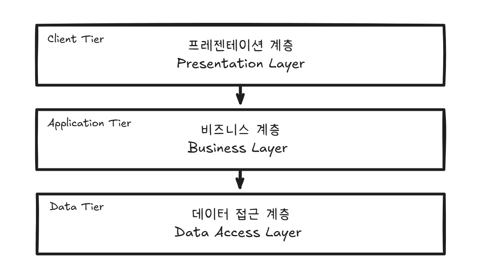
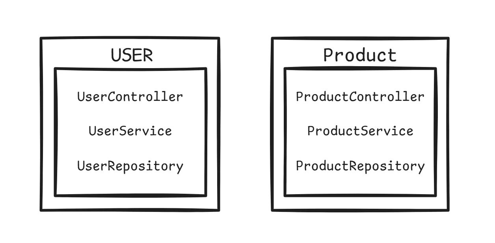

# 계층형 구조 vs 도메인형 구조

# 계층형 구조

계층형 구조는 기술적인 역할이나 기능에 따라 코드를 구성하는 방식입니다. 가장 일반적인 웹 애플리케이션의 3계층 구조(3-Tier Architecture)를 생각하면 이해하기 쉽습니다.



- **Presentation Layer (표현 계층):** 사용자의 요청을 받고 응답을 보내는 UI(User Interface) 관련 처리를 담당합니다. (예: Spring의 `@RestController`)
- **Business Layer (비즈니스 계층):** 핵심 비즈니스 로직을 처리하고, 애플리케이션의 실제 기능을 담당합니다. (예: `@Service`)
- **Data Access Layer (데이터 접근 계층):** 데이터베이스와의 통신을 담당하며, 데이터의 영속성(Persistence)을 처리합니다. (예: `@Repository`)

```java
com.example.project
├── controller
│   ├── UserController.java
│   └── ProductController.java
├── service
│   ├── UserService.java
│   └── ProductService.java
└── repository
    ├── UserRepository.java
    └── ProductRepository.java
```

이 구조에서는 각 계층이 명확하게 분리되어 있으며, 보통 상위 계층이 하위 계층에만 의존하는 형태를 가집니다.

계층형 구조는 **단순하고 명확한 구조** 덕분에 프로젝트의 전체적인 흐름을 빠르게 파악할 수 있다는 장점이 있습니다. 각 계층의 역할이 명확히 구분되어 있어 개발자들이 자신의 담당 영역에 집중하기 좋으며, 많은 개발자에게 익숙한 전통적인 방식이기 때문에 팀에 새로운 멤버가 합류하더라도 쉽게 적응할 수 있습니다.

하지만 단점도 존재합니다. 하나의 비즈니스 기능을 수정하려면 `controller`, `service`, `repository` 등 여러 패키지를 넘나들어야 하므로 **응집도가 낮고 코드 추적이 어렵습니다**. 또한 프로젝트가 커질수록 계층 간 의존성이 복잡해져 **결합도가 높아지고**, 한 계층의 변경이 다른 계층에 영향을 미칠 위험이 있습니다. 마지막으로, 동일한 도메인(예: 사용자)과 관련된 코드가 여러 계층에 흩어져 있기 때문에 **비즈니스 로직이 분산**되어 전체적인 로직을 한눈에 파악하기 어렵다는 한계가 있습니다.

---

# 도메인형 구조

도메인형 구조는 **비즈니스 도메인(기능 단위)**을 중심으로 코드를 구성하는 방식입니다. 관련된 기능들이 하나의 패키지 안에 모여 있어 응집도가 높은 것이 특징입니다.



예를 들어 '사용자(User)'와 관련된 모든 기능(Controller, Service, Repository 등)은 `user` 패키지 안에, '상품(Product)' 관련 기능은 `product` 패키지 안에 모두 포함됩니다.

```java
com.example.project
├── user
│   ├── UserController.java
│   ├── UserService.java
│   └── UserRepository.java
└── product
    ├── ProductController.java
    ├── ProductService.java
    └── ProductRepository.java
```

장점으로는 **높은 응집도**를 들 수 있습니다. 특정 기능을 개발하거나 수정할 때 한 패키지 내에서 대부분의 작업이 완료되므로 생산성이 높고 코드 파악이 쉽습니다. 또한 **낮은 결합도**를 가지기 때문에 도메인별로 코드가 분리되어 있어 다른 도메인에 미치는 영향이 적습니다. 이는 독립적인 개발과 테스트를 용이하게 합니다. 마지막으로 **비즈니스 중심 설계**가 가능하여, 코드가 비즈니스 로직 중심으로 구성되고 도메인의 복잡한 규칙과 요구사항을 더 잘 반영할 수 있습니다.

반면 단점도 존재합니다. 먼저 **초기 학습 곡선이 높습니다.** 계층형 구조에 익숙한 개발자에게는 다소 생소할 수 있으며, 전체적인 프로젝트 구조를 파악하는 데 시간이 걸릴 수 있습니다. 또한 **도메인 간 협력이 필요한 기능**을 구현할 때 구조가 복잡해질 수 있습니다. 마지막으로, **소규모 프로젝트에는 부적합**할 수 있으며, 기능이 많지 않은 경우 오히려 구조가 불필요하게 복잡해 보일 수 있습니다.

| 구분 | 계층형 구조 (Layered) | 도메인형 구조 (Domain-Driven) |
| --- | --- | --- |
| **구성 기준** | 기술 역할 (Controller, Service...) | 비즈니스 도메인 (User, Product...) |
| **응집도** | 낮음 (기능이 여러 패키지에 분산) | **높음** (관련 기능이 한 패키지에 집중) |
| **결합도** | 높음 (계층 간 의존성) | **낮음** (도메인 간 독립성) |
| **적합한 프로젝트** | 소규모, 간단한 CRUD 중심의 프로젝트 | **중대규모, 복잡한 비즈니스 로직을 가진 프로젝트** |
| **장점** | 빠른 개발 속도, 쉬운 이해 | 유지보수 용이, 높은 재사용성 |
| **단점** | 유지보수 어려움, 코드 추적의 번거로움 | 초기 설계의 어려움, 학습 곡선 |

**결론적으로,** 어떤 구조가 절대적으로 우월하다고 말하기는 어렵습니다. 프로젝트의 **규모, 복잡성, 팀의 숙련도** 등을 종합적으로 고려하여 적합한 아키텍처를 선택하는 것이 중요합니다.

최근에는 애플리케이션의 복잡도가 증가함에 따라, 비즈니스 로직을 효과적으로 관리하고 유지보수성을 높이기 위해 **도메인형 구조**를 채택하는 경향이 늘어나고 있습니다.

저 같은 경우에는 도메인형 구조 + 도메인 안에서 계층형 구조를 적용하곤 합니다!