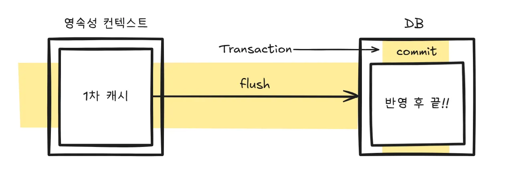

## Commit VS Flush
> commit과 flush는 둘 다 데이터베이스에 적용하기 위한 과정이지만, 동작 시점과 목적이 다르다.
> 

`commit`은 트랜잭션을 완전히 확정하는 단계다. 

DB의 트랜잭션 로그가 실제로 반영되어 **데이터가 확정**된다.

`flush`는 JPA의 영속성 컨텍스트(1차 캐시)에 쌓여 있던 변경 내용을 SQL로 변환해 DB에 전달(전송)하는 단계다. 하지만 **트랜잭션은 아직 커밋되지 않았으므로**, DB에는 “잠시 반영된 상태”일 뿐, 아직 확정(commit)된 것은 아니다.

쉽게말하면 commit은 실제 트랜잭션을 반영하고 끝!
flush는 영속성 컨텍스트에 모아둔 SQL문을 실제 DB에 전송하기!