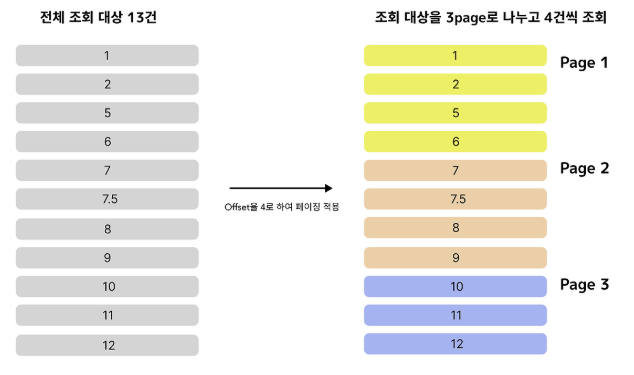
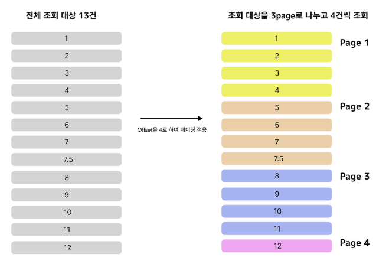

# QueryDSL에서 FetchJoin 하는 법

  **일반적인 조인(join, left join, right joi) 메서드를 호출한 바로 뒤에 .Fetch Join() 메서드를 연결**

  ### 1. 일반조인

    - 일반적인 join()은 주로 WHERE 절에서 연관 엔티티의 필드에 조건을 걸거나 두 테이블의 데이터를 projection 할 때 사용 → Member 엔티티만 로드되고, N+1 문제 발생

  ```
    // QueryDSL 코드
    
    // QMember, QTeam은 QueryDSL Q-타입입니다.
    Member findMember = queryFactory
        .selectFrom(member)
        .join(member.team, team) // 일반 INNER JOIN
        .where(member.username.eq("member1"))
        .fetchOne();
  ```

  ```
    // SQL 쿼리는 Member 엔티티의 컬럼만 선택
    
    SELECT
        member0_.member_id AS member_i1_0_,
        member0_.age AS age2_0_,
        member0_.team_id AS team_id4_0_,
        member0_.username AS username3_0_
    FROM
        member member0_
    INNER JOIN
        team team1_ ON member0_.team_id = team1_.team_id
    WHERE
        member0_.username = 'member1'
  ```

  ### 2. Fetch Join 사용

  - 일반 조인 구문 뒤에 .fetchjoin()을 붙여 JPA에게 연관딘 엔티티를 주 엔티티와 함께 한번에 영속성 컨텍스트에 로드하라고 지시하면서 지연 로딩 설정을 무시하고 즉시 로딩을 강제시킨다. → Member 엔티티와 연관된 Team 엔티티 모두 로드되고, 쿼리 최적화를 통해 N+1 해결

  ```
    // QueryDSL 코드
    
    Member findMember = queryFactory
        .selectFrom(member)
        .join(member.team, team)
        .fetchJoin() // <--- Fetch Join 적용
        .where(member.username.eq("member1"))
        .fetchOne();
  ```

  ```
    // SELECT 절에 조인 대상 엔티티(Team)의 모든 컬럼이 함께 포함
    
    SELECT
        member0_.member_id AS member_i1_0_0_,
        team1_.team_id AS team_id1_1_1_,
        member0_.age AS age2_0_0_,
        member0_.team_id AS team_id4_0_0_,
        member0_.username AS username3_0_0_,
        team1_.name AS name2_1_1_   // <-- Team 엔티티의 컬럼들이 추가됨
    FROM
        member member0_
    INNER JOIN
        team team1_ ON member0_.team_id = team1_.team_id
    WHERE
        member0_.username = 'member1'
  ```

  | **구분** | **일반 조인 (.join(..)만)** | **페치 조인 (.join(..).fetchJoin())** |
      | --- | --- | --- |
  | **SQL SELECT 절** | 주 엔티티 컬럼만 선택 (Projection 시에만 연관 컬럼 포함) | **주 엔티티와 연관 엔티티의 모든 컬럼을 함께 선택** |
  | **목적** | 1. `WHERE` 조건 적용 2. DTO/Tuple Projection | **연관 엔티티 즉시 로딩 및 N+1 문제 회피** |
  | **Lazy/Eager** | 엔티티의 Lazy/Eager 설정 **유지** | 엔티티의 Lazy 설정을 **무시하고 Eager 로딩** |
  | **추가 쿼리** | 연관 엔티티 접근 시 **추가 쿼리 발생** (N+1) | 연관 엔티티 접근 시 **추가 쿼리 없음** |

# DTO 매핑 방식 (+DTO안에 DTO)

  **DTO(Data Transfer Object)** : 엔티티를 그대로 노출하지 않고 필요한 데이터만 옮기기 위한 객체

  - 주로 Controller ↔ Service ↔ Repository 계층 사이에서 데이터 전달에 사용
  
  
  - [DTO 매핑 방식]
      1. 생성자 기반 매핑(Constructor)
          - DTO의 생성자를 직접 호출해서 데이터를 매핑하는 방식

          ```
          List<Member> members = memberRepository.findAll();
            
          List<MemberDTO> result = members.stream()
              .map(m -> new MemberDTO(
                  m.getUsername(),
                  m.getAge(),
                  m.getTeam().getName()
              ))
              .collect(Collectors.toList());
            
          ```

          - 컴파일 시점에 오류를 잡을 수 있음
          - 코드 의도가 명확함
          - 필드가 많아지면 코드가 복잡해진다

      1. Setter 기반 매핑(Property Access Mapping)
          - 기본 생성자로 객체를 만든 뒤 Setter를 이용해 값 주입하는 방식

          ```
          List<Member> members = memberRepository.findAll();
            
          List<MemberDTO> result = members.stream()
              .map(m -> {
                  MemberDTO dto = new MemberDTO();
                  dto.setUsername(m.getUsername());
                  dto.setAge(m.getAge());
                  dto.setTeamName(m.getTeam().getName());
                  return dto;
              })
              .collect(Collectors.toList());
            
          ```

          - 유연하고 간단하다
          - 필드 일부만 매핑 가능하다
          - Setter 누락 시 런타임에서 문제가 생긴다

      2. 라이브리러 기반 매핑 (자동 매퍼)
          - DTO와 Entity의 필드명이 일치한다면 자동으로 변환해주는 라이브러리 사용 가능
          - 런타임 기반의 **ModelMapper**와 컴파일 타임 코드 생성 기반의 **MapStruct**


  [ModelMapper]

          ```
          import org.modelmapper.ModelMapper;
            
          ModelMapper modelMapper = new ModelMapper();
            
          List<MemberDTO> result = members.stream()
              .map(m -> {
                  MemberDTO dto = modelMapper.map(m, MemberDTO.class);
                  dto.setTeamName(m.getTeam().getName()); // 연관 엔티티는 수동 처리
                  return dto;
              })
              .collect(Collectors.toList());
            
          ```

  [MapStruct] : 컴파일 시점에 MemberMapperImpl 클래스 자동으로 생성

          ```
          // Mapper 인터페이스 작성하고
            
          @Mapper(componentModel = "spring")
          public interface MemberMapper {
              @Mapping(source = "team.name", target = "teamName")
              MemberDTO toDTO(Member member);
          }
            
          @Autowired
          private MemberMapper memberMapper;
            
          List<MemberDTO> result = members.stream()
              .map(memberMapper::toDTO)
              .collect(Collectors.toList());
            
          ```

  - 반복 코드를 제거할 수 있다
  - @Mapping으로 세밀한 제어 가능하다
  - 외부 라이브러리의 의존성 추가해야 한다.


3. DTO 안에 DTO를 매핑하는 방법 (Nested DTO)
       - DTO가 다른 DTO를 포함하는 계층적 구조를 가질 때 매핑 방식 처리
           - 예시 OrderDTO 안에 MemberDTO 있는 경우

   1. 수동 매핑에서의 처리

          ```
          public static OrderDTO toOrderDTO(Order order) {
              OrderDTO dto = new OrderDTO();
              dto.setOrderId(order.getId());
                
              // 포함된 Member 엔티티를 MemberDTO로 변환하여 설정 (재귀적 호출)
              dto.setMember(MemberMapper.toDTO(order.getMember())); 
                
              return dto;
          }
          ```

   2. 자동 매핑에서의 처리(MapStruct)

       ```
       @Mapper(componentModel = "spring")
       public interface OrderMapper {
            
           // MemberMapper가 존재하면, member 엔티티를 memberDTO로 자동 변환
           OrderDTO toDto(Order order); 
                
           // MemberMapper 내부의 toDto 메서드가 자동으로 호출됨
       }
       ```

      [비교]

      | 구분 | 방식 | 장점 | 단점 | 활용 예 |
                  | --- | --- | --- | --- | --- |
      | **1. 생성자 기반** | `new DTO(entity.getX(), ...)` | 명시적, 타입 안정성 높음 | 코드 길어짐 | 단순 매핑, 테스트 코드 |
      | **2. Setter 기반** | `dto.setX(...)` | 유연함, 부분 매핑 가능 | 누락 가능, 불변객체 불가 | 일부 필드만 필요할 때 |
      | **3. 자동 매퍼 기반** | `MapStruct`, `ModelMapper` | 반복 코드 제거, 생산성 높음 | 의존성 추가 | 대규모 서비스, API 응답 변환 |
   
- QueryDSL에서의 DTO 매핑
   1. Projections.bean() - setter 기반
    - DTO의 setter를 사용한다
    - 필드명이 정확히 일치해야 한다

    ```
    List<MemberDTO> result = queryFactory
        .select(Projections.bean(MemberDTO.class,
            member.name,
            Projections.bean(TeamDTO.class, team.name).as("team")
        ))
        .from(member)
        .join(member.team, team)
        .fetch();
            
    ```


   2. Projections.fields() - 필드 직접 접근
            - 필드 이름이 일치하면 setter 없이 직접 주입한다
            
            ```
            List<MemberDTO> result = queryFactory
                .select(Projections.fields(MemberDTO.class,
                    member.name,
                    Projections.fields(TeamDTO.class, team.name).as("team")
                ))
                .from(member)
                .join(member.team, team)
                .fetch();
            
            ```
            
        
   3. Projections.constructor() - 생성자 기반
            - DTO에 맞는 생성자가 있어야 한다
            - 컴파일 타임에 타입을 체크할 없다(런타일 오류 발생 가능)
            
            ```java
            List<MemberDTO> result = queryFactory
                .select(Projections.constructor(MemberDTO.class,
                    member.name,
                    Projections.constructor(TeamDTO.class, team.name)
                ))
                .from(member)
                .join(member.team, team)
                .fetch();
            
            ```
            
   4. @QueryProjection
      - Q타입 생성하고, 컴파일 시점에 검증한다
                
                   ```
                   @Getter
                   public class MemberDTO {
                       private String name;
                       private TeamDTO team;
                
                       @QueryProjection
                       public MemberDTO(String name, TeamDTO team) {
                           this.name = name;
                           this.team = team;
                       }
                   }
                   // 빌드 시 QMemberDTo 클래스가 자동 생성된다
                   ```
                
                   ```
                   List<MemberDTO> result = queryFactory
                       .select(new QMemberDTO(
                           member.name,
                           new QTeamDTO(team.name)
                       ))
                       .from(member)
                       .join(member.team, team)
                       .fetch();
                
                   ```
# 커스텀 페이지네이션

  **Pagination :** 검색 결과를 조회할 때 데이터를 한 번에 가져오는 것이 아니라 나눠서 일부만 조회하는 방법

  ### Offset-Based Pagination (ex. 네이버 웹툰)

- 페이지를 기반으로 데이터를 나눠서 요청하는 방식. 요청을 보낼 때 몇 번재 페이지에서 몇 개의 데이터를 조회할 지 명시하고, 클라이언트에서 페이지를 선택하면 그 페이지를 통해 데이터 조회 요청을 보낸다
        - 조회하려는 데이터의 개수와 페이지 수만 요청하면 쉽게 구현할 수 있다
        - offset은 sql에서 조회를 시작할 기준점, limit은 조회할 결과의 개수

    ```
        SELECT *
        FROM board
        LIMIT 10
        OFFSET 5000;
        
        // 5000번 째 행부터 10개의 행을 읽겠다
    ```

    ```
        // 예시: 2페이지 (offset: 20), 페이지 크기 10으로 가정
        int page = 2;
        int pageSize = 10;
        long offset = (long) (page - 1) * pageSize;
        
        List<Member> members = queryFactory
            .selectFrom(member)
            .orderBy(member.id.desc()) // 정렬 기준 필수
            .offset(offset)            // 건너뛸 데이터 수
            .limit(pageSize)           // 가져올 데이터 수
            .fetch();
    ```

[단점]

예시) 12건의 데이터가 있다고 가정하고 offset을 4로 설정하고 요청하면 조회 대상을 3page로 나누고 4건씩 조회


1. **중복 문제 발생**
   - 페이지네이션으로 데이터를 조회하던 도중 세로운 데이터가 추가되거나 기존의 데이터가 삭제되는 경우에 데이터가 중복될 가능석 있다. 만약 조회하는 과정에서 7,8 사이에 7.5라는 새로운 값이 들어오게 되면 page 2에서 조회한 8이라는 값을 page 3에서 중복 조회할 수도 있다.

        


2. **누락 문제 발생**
   - page 1에서 page 2로 넘기려고 하는 상황에서 3,4번 데이터를 삭제하게 되면 5,6번 데이터가 자연스럽게 page 1로 이동하게 되면서 page 2에서 5,6번 데이터를 볼 수 없게 되면서 누락 발생
            
        
            
        
3. **느린 속도 문제 발생**
              - offset 방식으로 데이터를 조회하게 되면 뒤로 갈수록 앞에서 읽었던 행을 계속해서 다시 읽어야하기 때문에 페이지가 뒤로 갈수록 느려진다.
        

### Cusor-Based Pagination(No Offset / 무한 스크롤 방식, ex. 인스타 피드)
        
- 이전에 조회된 마지막 데이터의 기준 값(cursor)을 사용하여 그 다음 데이터부터 조회하는 방식
            
→ n개의 row 다음 것부터 10개를 조회해주세요라는 요청
            
- 데이터가 많아져도 offset 연산이 없어 성능 저하가 거의 없다
- 중간에 데이터가 추가 및 삭제 되어도 현재 보고 있는 목록에 영향을 주지 않아 누락이나 중복이 발생할 위험 적다
        
```
              API: GET /api/board
        
              request: {
               cursor: 123,
               page_size: 10
              }
```

```
              // 커서가 되는 마지막 id값을 WHERE 절에 비교 조건으로 사용하여 구현
        
              // 예시: 이전 페이지의 마지막 ID가 100이었다고 가정 (다음 페이지를 요청)
              Long lastId = 100L; 
              int pageSize = 10;
        
              List<Member> members = queryFactory
                  .selectFrom(member)
                  .where(member.id.lt(lastId)) // <--- Cursor 조건: ID가 lastId보다 작은(이전) 데이터 조회
                  .orderBy(member.id.desc())  // ID가 감소하는 순서로 정렬
                  .limit(pageSize)
                  .fetch();
            
           
                // 오름차순 이었다면 .asc , gt() 사용
```
        
[단점]
        
1. **특정 페이지 이동 불가** : 페이지 번호가 없으므로 사용자가 임의의 위치로 바로 이동 할 수 없다
2. **정렬 기준 필수 :** 반드시 고유하고 정렬 가능한 기준으로 데이터를 정렬해야 한다

# transform - groupBy
- **QueryDSL은 조회 결과를 사용자 정의하는 두 가지 방법을 제공한다**

1. 행 기반 변환을 위한 FactoryExpressions(com.mysema.query.types.Projections 클래스)
   - projections : QueryDSL을 이용해 entity 전체를 가져오는 것이 아닌 조회 대사을 지정해 원하는 값만 조회하는 것
   - 기본값(tuple), Projections.Bean, Projections.fields, .constructor 등
2. 집계를 위한 ResultTransformer(com.mysema.query.group.GroupBy 클래스)


**QueryDSL의 transform() : groupBy 결과를 구조적으로 묶어서 DTO나 컬렉션 형태로 반환**
    
- 메모리에서 조인된 결과를 그룹화하여 계층적 데이터 구조로 변환하는데 사용
- 일반적인 fetch()는 단순히 row 단위의 리스트를 반환하지만 transform()은 계층적 데이터를 DTO, Map 형태로 묶어준다.

```
        // 엔티티 구조
        @Entity
        public class Team {
            @Id @GeneratedValue
            private Long id;
            private String name;
        
            @OneToMany(mappedBy = "team")
            private List<Member> members = new ArrayList<>();
        }
        
        @Entity
        public class Member {
            @Id @GeneratedValue
            private Long id;
            private String name;
        
            @ManyToOne(fetch = FetchType.LAZY)
            private Team team;
        }
        
        Map<String, List<String>> result = queryFactory
            .from(team)
            .leftJoin(team.members, member)
            .transform(
                groupBy(team.name).as(list(member.name))
            );
            
        // 결과
        
        {
          "TeamA": ["member1", "member2"],
          "TeamB": ["member3"]
        } 
```
        
[용어 정리]
        
- groupBy(기준) : 어떤 필드로 그룹화할지 지정
- .as(), .list() : 그룹화된 데이터의 결과 형태 지정
- .transform() : 변환 로직 실행(결과 Map 또는 List 생성)
- fetch()와 함께 사용하지 않는다
- 반환형태는 Map<K, V> 또는 List<DTO>

# order by null

  ### [SQL]

  Order By : 정렬 기준을 지정하는 절이고 NULL 값이 포함되는 경우에는 DBMS(데이터베이스 관리 시스템)에 따라 다르게 처리

  ```
    SELECT * 
    FROM employee
    ORDER BY salary ASC;
    // 오름차순일 떄는 작은 값 -> 큰 값, 내림차순일 때는 큰 값 -> 작은 값
  ```

  DBMS별 NULL 처리

  | DBMS | ASC일 때 NULL | DESC일 때 NULL |
      | --- | --- | --- |
  | **Oracle** | 맨 마지막 | 맨 처음 |
  | **PostgreSQL** | 맨 마지막 | 맨 처음 |
  | **MySQL** | 맨 처음 | 맨 마지막 |
  | **SQL Server** | 맨 처음 | 맨 마지막 |

  NULL의 정렬 위치 지정(NULLS FIRST / NULLS LAST)

  → 대부분의 SQL은 ORDER BY 뒤에 NULLS FIRST or NULLS LAST 옵션 가능

  ```
    -- salary 오름차순 정렬, NULL은 맨 뒤로
    SELECT *
    FROM employee
    ORDER BY salary ASC NULLS LAST;
    
    -- salary 내림차순 정렬, NULL은 맨 앞으로
    SELECT *
    FROM employee
    ORDER BY salary DESC NULLS FIRST;
  ```

  ✅ 하지만 mysql은 지원하지 않기 때문에 case문이나 is null 사용해야 한다 (명시적인 NULL 순서 지정)

  ```
    // 1. is null 사용, null이면 1 반환, 아니면 0 반환
    // null인 행이 뒤로 정렬
    -- NULL을 맨 뒤로 보내기
    SELECT *
    FROM employee
    ORDER BY (salary IS NULL), salary ASC;
    
    // 2. case when 사용
    
    SELECT *
    FROM employee
    ORDER BY CASE WHEN salary IS NULL THEN 1 ELSE 0 END, salary ASC;
  ```

  ### [QueryDSL]

  QueryDSL에서는 order by() 메서드에 정렬 조건을 넣어서 사용한다

  ```
    List<Member> result = queryFactory
        .selectFrom(member)
        .orderBy(member.age.asc(), member.username.desc())
        .fetch();
    // 여러 조건을 쉼표로 나열 가능하다
  ```

  NULL 처리

  → SQL과 마찬가지로 DBMS마다 정렬 위치가 다르다.

  → QueryDSL은 JPAQueryFactory → JPQL → DB로 변환되므로 DB가 NULL을 어떻게 처리하는지가 그대로 반영된다 ⇒ Oracle에서는 ASC(오름차순)일 때 NULL이 맨 마지막, MySQL에서는 ASC일 때 NULL이 맨 처음

  ✅ SQL과 다르게 QueryDSL에서는 NULLS FIRST / LAST 기능 사용 불가.

  따라서 우회 방법을 사용한다

  1. Expressions.cases() 사용 - 권장!!

  ```
    import static com.querydsl.core.types.dsl.Expressions.*;
    
    List<Member> result = queryFactory
        .selectFrom(member)
        .orderBy(
            // NULL 값을 뒤로 보내기
            new CaseBuilder()
                .when(member.age.isNull()).then(1)
                .otherwise(0)
                .asc(),
            member.age.asc()
        )
        .fetch();
    
    // NULL이면 1, 아니면 0 반환 -> NULL이면 뒤로 밀린다
    
    // 결과 SQL
    ORDER BY (CASE WHEN age IS NULL THEN 1 ELSE 0 END) ASC, age ASC
    
  ```

2. Expressions.numberTemplate() 활용

    ```
    import static com.querydsl.core.types.dsl.Expressions.*;
    
    List<Member> result = queryFactory
        .selectFrom(member)
        .orderBy(
            numberTemplate(Integer.class, "CASE WHEN {0} IS NULL THEN 1 ELSE 0 END", member.age).asc(),
            member.age.asc()
        )
        .fetch();
    
    ```