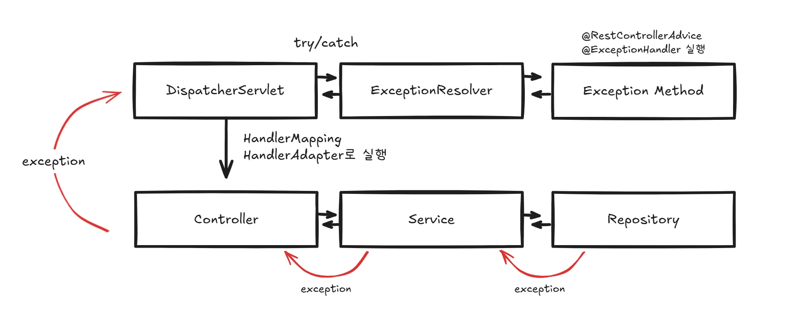

# RestControllerAdvice

`@RestControllerAdvice` 는 Spring에서 **전역적으로 예외를 처리하거나, 바인딩/검증 오류를 다루고, 컨트롤러에서 공통적으로 처리해야 할 로직을 분리**하기 위해 사용하는 어노테이션입니다.

쉽게 말해, **API 레이어의 에러 핸들러 + 공통 처리자**입니다.

## SpringMVC에서 Exception 처리하는 법!



### 1. 요청 처리 시작

클라이언트 요청은 먼저 `DispatcherServlet`으로 들어온다.

`DispatcherServlet`은 `HandlerMapping`과 `HandlerAdapter`를 사용해

적절한 Controller 메서드를 호출한다.

### 2. 비즈니스 로직 중 예외 발생

Controller → Service → Repository 단계 중 어디에서든 예외가 발생할 수 있다.

예외가 발생하면 예외는 호출 스택을 타고 위로 전파된다.

```
Repository → Service → Controller → DispatcherServlet
```

### 3. DispatcherServlet이 예외를 잡는다 (try/catch)

예외가 Controller 밖으로 던져지면

`DispatcherServlet`이 그 예외를 `try/catch`로 잡아서 예외가 Spring MVC 밖으로 튀어나가지 않게 한다.

### 4. ExceptionResolver에게 위임

예외를 잡은 `DispatcherServlet`은 예외를 처리하기 위해 `HandlerExceptionResolver` 목록을 실행한다.

**Spring 기본 제공 Resolver 예시:**

- `ExceptionHandlerExceptionResolver` → `@ExceptionHandler` / `@RestControllerAdvice`
- `ResponseStatusExceptionResolver`
- `DefaultHandlerExceptionResolver`

### 5. ExceptionResolver가 @ExceptionHandler 메서드 탐색

`ExceptionHandlerExceptionResolver`는 다음 순서로 예외 핸들러를 찾는다.

1. 해당 Controller 내부의 `@ExceptionHandler` 
2. `@RestControllerAdvice`에 정의된 전역 `@ExceptionHandler`

`RestControllerAdvice`는 예외 처리기 **저장소** 역할을 하고, Resolver가 맞는 메서드를 찾아 **직접 호출**한다.

### 6. 예외 핸들러 실행 → 응답 반환

찾은 `@ExceptionHandler` 메서드가 실행되고 JSON 형태의 오류 응답을 생성해 반환한다.

```java
@RestControllerAdvice
public class GlobalExceptionHandler {

    @ExceptionHandler(IllegalArgumentException.class)
    public ResponseEntity<String> handleIllegal(IllegalArgumentException e) {
        return ResponseEntity.badRequest().body("전역 에러: " + e.getMessage());
    }
}
```

## 간단 사용법

핸들러 클래스에 `@RestControllerAdvice`를 붙여 전역 예외 처리 클래스를 만든다.

그리고 그 클래스 안에 예외를 처리할 메서드를 정의하고,

`@ExceptionHandler`에 처리할 예외 타입을 지정해주면 해당 예외가 발생했을 때 그 메서드가 호출된다.

### 전역 예외 처리하기

```java
@RestControllerAdvice
public class GlobalExceptionHandler {

    @ExceptionHandler(Exception.class)
    public ResponseEntity<String> handleException(Exception e) {
        return ResponseEntity.status(HttpStatus.INTERNAL_SERVER_ERROR)
                .body("서버 에러 발생: " + e.getMessage());
    }
}
```

`Exception`은 모든 예외의 최상위 클래스이기 때문에 이렇게 작성하면 **프로젝트 내에서 발생하는 모든 예외를 한 곳에서 처리**할 수 있다.

즉, 어떤 예외가 발생하든 위 메서드를 통해 일관된 응답을 반환할 수 있게 된다.

### 예외 타입 별 처리

```java
@RestControllerAdvice
public class GlobalExceptionHandler {

    @ExceptionHandler(IllegalArgumentException.class)
    public ResponseEntity<String> handleIllegalArgument(IllegalArgumentException e) {
        return ResponseEntity.badRequest().body(e.getMessage());
    }

    @ExceptionHandler(NullPointerException.class)
    public ResponseEntity<String> handleNPE(NullPointerException e) {
        return ResponseEntity.status(HttpStatus.INTERNAL_SERVER_ERROR)
                .body("NPE 발생: " + e.getMessage());
    }
}
```

이처럼 `@ExceptionHandler`에 특정 예외 타입을 지정하면 해당 예외가 발생했을 때만 그 메서드가 실행된다.

예를 들어, `IllegalArgumentException`은 잘못된 인자가 전달되었을 때 발생하므로, API 요청 값 검증에서 자주 사용되는 예외 중 하나이다.

예외 타입별로 각각 다른 응답을 보내며 클라이언트가 문제 상황을 더 정확히 이해할 수 있도록 할 수 있다.


## 예외 처리를 한다는게 뭘까..?

그냥 직역하면 예외가 발생했을 때 그 상황을 처리한다는 의미인데, 

일반 프로그램이라면 예외가 발생했을 때 해당 예외를 해결하거나, 

프로그램이 비정상 종료되지 않도록 흐름을 제어하는 데 목적이 있을 것이다.

하지만 **웹 애플리케이션**에서는 상황이 조금 다르다.

잘못된 입력이나 예상하지 못한 오류가 발생했을 때, 그걸 단순히 서버 내부에서만 처리하고 끝낼 수는 없다.

사용자(클라이언트)에게도 해당 오류 상황을 알려주어야 하고, 그 오류가 어떤 성격인지, 왜 발생했는지, 앞으로 어떻게 해야 하는지를 **명확하고 일관된 형태로 전달해야 한다.**

그래서 컨트롤러까지 전파된 예외는 그냥 터뜨리고 서버 에러 화면을 보여주는 것이 아니라, 

해당 예외가 왜 발생했는지에 대한 메시지와 에러 코드를

응답 형태로 만들어 클라이언트에게 돌려주는 것이 핵심 역할이 된다.

예를 들어, 클라이언트가 잘못된 요청 값을 보냈다면 서버는 적절한 오류 코드(400 등)와 함께

**“잘못된 요청입니다”**라는 메시지와 상세 원인을 응답할 수 있다.

이렇게 하면 클라이언트는 문제를 인지하고 수정할 수 있게 된다.

또한 `@Valid`를 사용하면 요청 값의 유효성을 자동으로 검증할 수 있는데, 이 과정에서 잘못된 입력이 발견되면 예외가 발생하고, 우리는 이를 적절한 방식으로 처리하여 사용자에게 올바른 방향으로 입력을 유도할 수 있다. 

결국, **웹에서의 예외 처리란 예외 상황을 ‘적절한 응답’으로 변환하여** 클라이언트가 문제를 이해하고 대처할 수 있도록 도와주는 과정이라고 할 수 있다.