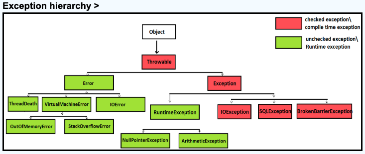

# java의 Exception 종류들



https://www.javamadesoeasy.com/2015/05/exception-handling-exception-hierarchy.html

사진에서 확인 할 수 있는 checked, unchecked exception이 있다.

checked는 컴파일 타임에 체크되는 exception,

unchecked는 체크되지 않는 런타임에 발생 가능한 exception이다.

checked는 컴파일 타임에 체크되기 때문에 컴파일러가 예외 처리를 강제한다.

당연하게 unchecked는 예외 처리를 강제하지 않는다.

## RuntimeException

1. NullPointerException

null값을 참조하려고 할 때

1. Array(or String)IndexOutOfBoundsException

   선언한 array의 범위밖에 접근할 때

2. NumberFormatException

   Integer.parseInt(”abcde”) 처럼 숫자로 변환 불가한 문자열이 오는경우

3. ClassCastException

   Type casting은 상위 클래스와 하위 클래스 혹은 구현 클래스와 인터페이스 간에 발생한다.

   이러한 관계가 아닌데 억지로 타입변환 시도하는 경우

4. IllegalStateException

   객체의 내부 상태와 메서드 호출 순서가 논리적으로 맞지 않을 때 발생

    ```java
    public class Example1 {
        public static void main(String[] args) {
            Scanner sc = new Scanner(System.in);
            sc.close();  
            System.out.println(sc.nextLine());
        }
    }
    ```

   (예시) scanner 객체가 닫힌 후 sc.nextLint()으로 해당 객체를 사용하는 상황


1. ArithmeticException

   divied by zero 와 같은 잘못된 수학 연산에서 발생

2. IllegalArgumentException

   메서드에 부적절한 인자 값을 넣으면 발생.

   프로그래머가 명시적으로 던지는 경우가 많고, validation과 밀접


## CompiletimeException

1. IOException

   파일/네트워크/스트림 등 입출력 과정에서 발생하는 최상위 예외.

    ```java
    BufferedReader reader = new BufferedReader(new FileReader("test.txt"));
    ```

   위 코드에서 new FileReader(””) 부분이 FileNotFoundException을 발생시킬 수 있기 때문에 BufferReader 생성코드가 IOException을 던질 수 있는 코드가 된다.

2. FileNotFoundException

   IOException의 하위 예외로 파일이 존재하지 않을 때 발생.

    ```java
    new FileInputStream("missing.txt"); 
    ```

3. SQLException

   DB와 통신할 때 발생하는 모든 예외

    ```java
    Connection conn = DriverManager.getConnection(url);
    ```

   JDBC의 거의 모든 메서드가 이 예외를 던진다.

   JDBC에서 가장 중요한 핵심 코드중 하나로 DB에 연결하는 코드이다.

4. ClassNotFoundException

   JVM이 클래스 파일을 찾을 수 없을 때 발생.

    ```java
    Class.forName("com.mysql.jdbc.Driver");
    ```

   문자열로 적힌 클래스 이름을 JVM이 동적으로 로딩하는 코드로 클래스를 해당 path에서 못 찾으면 Exception 발생

--- 
# @Valid

## @Valid annotation이란?

데이터 유효성 검사를 위해 사용되는 annotation으로 Controller 메서드의 파라미터나 DTO 객체에 설정된 다양한 제약 조건들을 자동으로 검사해주는 트리거 역할

## 많이 사용하는 제약조건

- @NotNull
- @Min()
- @Email
- @Size(min=2, max=10)

```java
public class SignUpRequest {

    @NotNull (message = "필수 입력 값")
    @Email(message = "유효하지 않은 이메일 형식")
    private String email;

    @NotBlank
    private String password;

    @Size(min = 2, max = 10,
    message = "2자 이상 10자 이하로 입력해야 합니다")
    private String nickname;
}
```

위 코드처럼 DTO나 컨트롤러 메서드의 파라미터에 간단하게 제약조건을 설정할 수 있고 message를 포함한 exception이 던져진다.

## 워크북에서 배운 커스텀 검증 annotation 생성 복습

워크북에서 배운 커스텀 검증 annotation 생성 순서와 방법을 이해한대로 요약해보자면

```java
@Documented
@Constraint(validatedBy = FoodExistValidator.class)
@Target( { ElementType.METHOD, ElementType.FIELD, ElementType.PARAMETER })
@Retention(RetentionPolicy.RUNTIME)
public @interface ExistFoods {
    String message() default "해당 음식이 존재하지 않습니다.";  
    Class<?>[] groups() default {};
    Class<? extends Payload>[] payload() default {};
}
```

위 코드는 워크북에 설명된 코드이다.

interface를 통해 먼저 ExistFoods 라는 annotation을 생성한다.

이 때 constraint ( validateBy )에 설정한 클래스를 생성하고 해당 클래스에 검증 로직을 추가한다.

```java
@Component
@RequiredArgsConstructor
public class FoodExistValidator implements ConstraintValidator<ExistFoods, List<Long>> {

    private final FoodRepository foodRepository;
    
    @Override
    public boolean isValid(List<Long> values, ConstraintValidatorContext context) {
        boolean isValid = values.stream()
                .allMatch(value -> foodRepository.existsById(value));

        if (!isValid) {
            context.disableDefaultConstraintViolation();
            context.buildConstraintViolationWithTemplate(FoodErrorCode.NOT_FOUND.getMessage()).addConstraintViolation();
        }

        return isValid;

    }
}
```

위 코드 또한 워크북에서 가져온 코드로

FoodExistValidator를 구현한 클래스이다. 따라서 위에서 생성한ExistFoods annotation이 붙은 필드에 대해서 위 클래스가 isValid 검증을 진행한다.

즉 annotation 생성, 그리고 해당 annotation의 검증 로직이 어디에 있는지 명시하면

annotation이 붙은 필드를 만났을 때 명시된 클래스의 검증 로직이 수행된다.

검증 로직에 문제가 생기는 경우 Exception이 발생한다. 문제가 없는 경우 정상 수행된다.

## Initialize

validator에는 isValid 즉 검증 로직 이외에 initialize를 구현할 수 있음을 워크북을 통해서 알게 되었다.

따라서 초기화는 언제 어떻게 쓰이는지 알아보았다.

1. annotation의 속성(필드값)을 읽어서 validator 내부 변수에 저장

   (예시) 비밀번호 최소길이와 특수문자 수 validation

    ```java
    public @interface PasswordStrength {
        // 아래의 값들을 검증 로직에 사용하고 싶다.
        int minDigits() default 1;
        int minSpecialChars() default 1;
        String message() default "비밀번호 강도 요구 사항 미충족";
    }
    ```

    ```java
    public class PasswordStrengthValidator implements ConstraintValidator<PasswordStrength, String> {
    
        private int requiredDigits;
        private int requiredSpecialChars;
    
        @Override
        public void initialize(PasswordStrength constraintAnnotation) {
            this.requiredDigits = constraintAnnotation.minDigits();
            this.requiredSpecialChars = constraintAnnotation.minSpecialChars();
        }
    }
    ```

   코드를 한번 읽어보면 알 수 있지만 비밀번호 검증 로직에 최소 n자리의 비밀번호, 특수문자 최소 n개 등의 제한사항을 넣으려고 할 떄 이 값들을 annotation에 설정해두고

   validator에서 해당 값을 받아와 초기화를 진행

   isValid에서 해당 값을 이용한 검증절차 수행

   위의 동작방식처럼 사용할 수 있다.

   이외에도 아래와 같은 상황에서 사용할 수 있다고 한다!

2. 성능 최적화를 위한 pre-computation
3. 여러 필드의 조건을 한번에 계산

## 동작방식

커스텀 annotation생성과 검증 로직이 구현된 상황

1. Controller 메서드 호출 및 @valid 또는 @validated 발견
2. Spring은 Bean Validation 통합 모듈에 유효성 검사 위임
3. Bean Validation 구현체인 Hibernate Validator는 DTO 클래스의 필드에 붙어있는 모든 제약조건 annotation을 메타데이터로 조회
4. 조회된 메타데이터를 기반으로 isValid() 메서드 호출
5. 검증 로직이 검증 결과를 반환하면 spring이 이후 처리
6. isValid 결과 확인해서 모두 true이면 성공으로 정상 실행 하나라도 실패이면 검증실패
7. 실패시 Exception이 발생하고 해당 exception에 message를 포함하는 BindingResult 객체가 포함
8. 전역예외처리 @ControllerAdvice 클래스의 @ExceptionHandler에 의해 처리

## 궁금했던 점

DTO에 valid를 붙였다고 가정할 떄 각 필드에 대해 검증을 진행할텐데 해당 검증 중 먼저 선언된 필드가 먼저 검증이 진행된다면 위쪽에서 exception이 먼저 터지게 되고 그러면 아직 검증 로직이 돌아가지 않은 필드에 대해서는 exception이 터지지 않는가?

- 우선 기본적으로는 모든 필드에 대해 검증 로직이 수행된다. isValid가 False인 경우에도 나머지 필드들에 대한 검증 로직이 모두 수행되고 한번에 결과를 반환
- 만약 하나라도 실패하는 경우 나머지 검증 로직을 수행하지 않고 빠르게 수행을 멈추고 싶다면 Bean Validation의 구현체인 Hibernate Validator의 설정을 변경하면 첫 번쨰 필드에서 @NotNull 검증이 실패한다면 그 즉시 나머지 필드에 대한 검증이 수행되지 않고 Exception이 던져진다.

일반적으로 Fail Fast 모드는 사용되지 않지만 다음의 경우에 사용되는데

- 대규모 요청 처리하는 경우 성능 최적화 및 리소스 절약을 위해 사용
- 순차적 검증이 필요한 경우 즉 A필드가 유효할 때 B필드의 검증이 의미가 있는 경우에 사용된다.