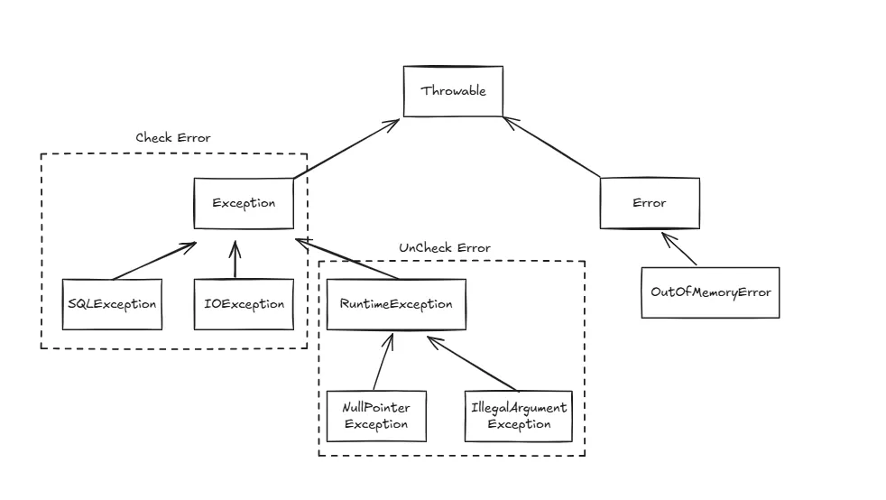

# 자바 예외 알아보기

## 전체 구조

## Checked Exception (컴파일 단계에서 확인되는 예외)

- 반드시 **try-catch** 또는 **throws** 선언 필요
- 주로 **외부 환경 문제** 발생 시
- 개발자가 복구 가능한 상황

### 대표적인 Checked Exception

| 예외 | 설명 |
| --- | --- |
| **IOException** | 파일/입출력 오류 |
| **FileNotFoundException** | 파일이 없는 경우 |
| **SQLException** | DB 접근 시 오류 |
| **ClassNotFoundException** | 클래스를 찾지 못한 경우 |
| **InterruptedException** | 스레드 인터럽트 발생 |
| **NoSuchMethodException** | 리플렉션에서 메서드를 못 찾음 |

## Unchecked Exception (= Runtime Exception)

- **컴파일 시점에서 체크되지 않음**
- 주로 **프로그래머 실수**로 발생
- 런타임에서 발생하며 복구가 어렵거나 불필요한 경우가 많음

### 대표적인 RuntimeException

| 예외 | 설명 |
| --- | --- |
| **NullPointerException** | null 객체 접근 |
| **IllegalArgumentException** | 잘못된 인자 전달 |
| **IndexOutOfBoundsException** | 배열/리스트 인덱스 초과 |
| **ArithmeticException** | 0으로 나누기 |
| **ClassCastException** | 잘못된 타입 캐스팅 |
| **NumberFormatException** | 숫자 변환 실패 |
| **IllegalStateException** | 객체 상태가 잘못됨 |

## Error (시스템/VM 레벨 문제)

- **개발자가 처리하면 안 되는 문제**
- 메모리 부족, 스택 오버플로우 등 시스템 오류
- try-catch로 잡을 수 있긴 하지만 **복구 불가능**

### 대표적인 Error

| Error | 설명 |
| --- | --- |
| **OutOfMemoryError** | 힙 메모리 부족 |
| **StackOverflowError** | 재귀 호출 무한 반복 등 |
| **VirtualMachineError** | JVM 내부 오류 |
| **AssertionError** | assert 실패 |

---