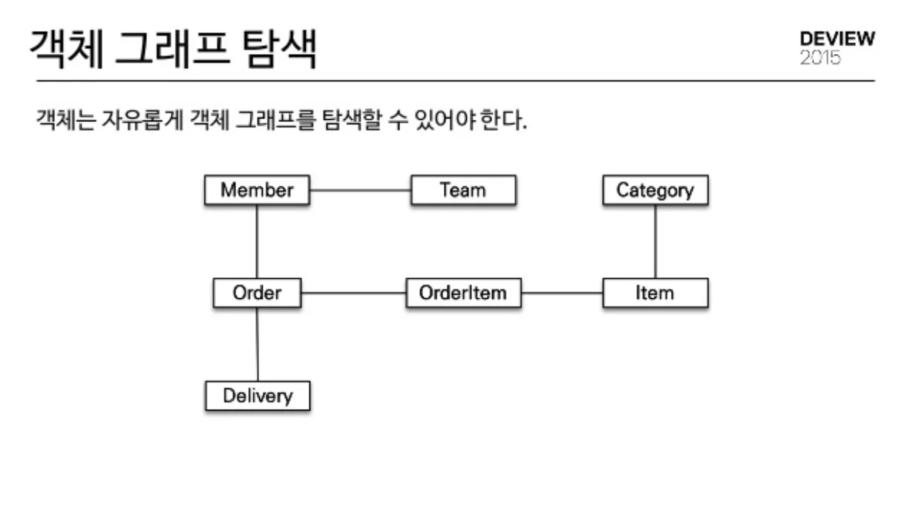

# 객체 그래프 탐색

## 간단한 개념

자바 객체에서 연관 객체를 따라 들어가는 것

Store가 필드로 Review를 가지고

Review가 필드로 User를 가진다고 가정

```java
Store store = ;
store.review.user.getName();
```

위 코드와 같이 dot(.)을 이용해서 연관 객체를 따라 들어가는 것을 의미 store → review → user 순서

[https://velog.io/@agugu95/자바-ORM-표준-JPA-프로그래밍-1장](https://velog.io/@agugu95/%EC%9E%90%EB%B0%94-ORM-%ED%91%9C%EC%A4%80-JPA-%ED%94%84%EB%A1%9C%EA%B7%B8%EB%9E%98%EB%B0%8D-1%EC%9E%A5)

위 구조에서 연관 관계만 맺어져 있으면 Member → Order → OrderItem → Item → Category 접근 가능

## OOP, 객체 그래프 탐색

- 객체 모델은 상속 지원, RDB는 이를 직접적으로 지원하지 않음
- 객체 모델은 연관관계를 직접 참조로 표현, RDB는 FK를 사용해 연관관계 표현
- 객체는 참조 동등성을 사용, DB는 기본 키를 사용하여 row 동등성 판단

이러한 이유들로 인해 객체 그래프 탐색이 불가능하고 객체 지향 프로그래밍의 걸림돌이 된다.

→ JPA가 이를 해결해줌

## 어떻게 동작하는가

Store가 Review를 가지는 상황에서 실제로 Store는 Review의 PK만 저장한 프록시 객체를 들고있고 store.review.~를 통해 review의 특정 정보를 불러오려할 때 지연로딩을 통해 쿼리를 날려서 PK를 제외한 나머지 정보를 가져올 수 있다.

## 발생가능한 문제

- N+1
- 무한루프
- null
- LazyInitializationException

위의 문제들은 이미 기존에 공부한 문제들이다.

이는 양방향 매핑관계를 설정함으로 인해 발생하거나,

객체 그래프 탐색 과정에서 JPA의 지연 로딩(LAZY)과 프록시 동작을 제대로 이해하지 못한 채 엔티티를 다룰 때 쉽게 발생할 수 있다.


# return Page <T.>

상황마다 paging의 여부가 달라진다면

그 상황에 맞게 여러개의 메서드를 만들어서 어떤 상황에서는 페이징을 사용하지 않는 메서드를 호출하고 또 어떤 상황에서는 페이징을 사용하는 메서드를 호출하나? → 똑같은 로직을 두 번 구현해야 할 것 같음

Controller

```java
@GetMapping("/{storeId}/reviews")
public ApiResponse<ReviewResDto.ReviewPreViewListDTO> getReviews(
        @PathVariable Long storeId,
        @RequestParam(required = false) Integer page,
        @RequestParam(required = false) Integer size
){
    return ApiResponse.onSuccess(
        ReviewSuccessCode.FOUND,
        reviewService.findStoreReview(storeId, page, size)
    );
}
```

Service

```java
public ReviewResDto.ReviewPreViewListDTO findStoreReview(Long storeId, Integer page, Integer size) {

    Pageable pageable;

    if (page == null || size == null) {
        // 페이징을 사용하지 않는 경우 (전체 조회)
        pageable = Pageable.unpaged();
    } else {
        // 페이징 쓰는 경우
        pageable = PageRequest.of(page, size, Sort.by("createdAt").descending());
    }

    Page<Review> result = reviewRepository.findAllByStoreId(storeId, pageable);

    return ReviewConverter.toPreviewListDto(result);
}
```

코드처럼 Service를  항상 Page로 구현하고 페이징을 사용하지 않는 상황에는 page, size 값을 null로 명시해 전달하거나 하는 방식을 통해 Pagable.unpaged()를 사용하면 전체 조회를 수행

→ 메서드를 상황에 따라 두개 작성할 필요 없음

- 실제로 어떻게 처리하는지 궁금해서 찾아봤는데 위 코드처럼 Pageable 사용을 하는것 같기는 한데 실무에서도 위 방법으로 해결하는지는 모르겠음.

- 팀 내부에서 미리 정해서 분기 코드가 편하면 사용, 그렇지 않으면 Page조회랑 전체조회 나눠서 사용