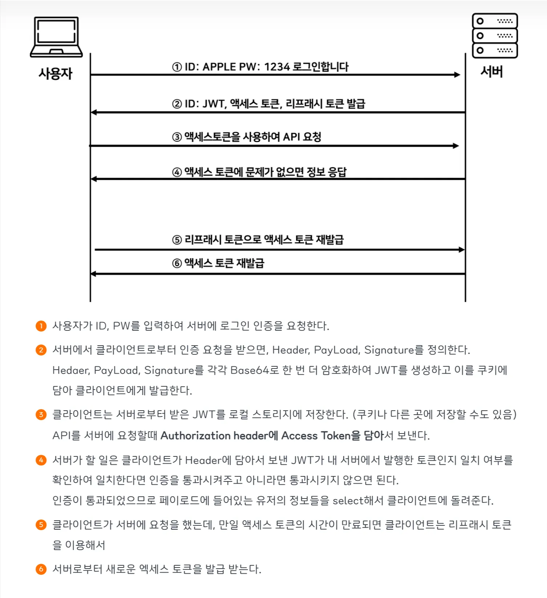

# Access Token & Refresh Token

토큰 기반 인증은 서버가 인증 상태를 저장하지 않고, 요청 하나에 인증 정보가 모두 담겨 전달되는 Stateless 방식이다. 이로 인해 토큰이 탈취될 경우, 토큰 자체에 포함된 사용자 ID나 권한 정보를 통해 공격자가 해당 사용자로 가장할 수 있다는 치명적인 문제가 존재한다.

> 즉, 유효한 토큰만 가지고 있다면 서버 입장에서는 정상 사용자와 공격자를 구분할 수 없다.
> 

반면 세션 기반 인증에서는 클라이언트와 서버 간에 오고 가는 값이 단순한 `sessionId`이기 때문에, 요청·응답 과정에서 사용자 정보가 직접 노출되지 않는다.

실제 인증 정보와 권한 정보는 모두 서버 내부의 `HttpSession`에 저장되어 있으며, 클라이언트는 이를 식별하기 위한 키만을 전달한다.

### 세션 ID 강탈 당하면 해당 사용자 인 척 하면 되지 않나?
---

세션 ID가 탈취될 경우 공격자가 해당 사용자로 가장할 수 있다는 점에서 세션 역시 보안 위협이 존재한다.

그러나 세션 ID 자체에는 사용자 정보가 포함되어 있지 않으며, 실제 인증 상태는 서버에서 관리되기 때문에 서버 차원에서 해당 세션을 즉시 무효화하거나 강제 로그아웃 처리하는 것이 가능하다.

반면 토큰은 한 번 발급되어 클라이언트에 전달되는 순간 서버의 관리 영역을 벗어나며, 탈취 사실을 인지하더라도 만료 전까지 이를 즉시 차단하기 어렵다는 한계가 있다.

### 너무 위험한거 아닌가?
---

만약 JWT 토큰이 해커에게 탈취된다면, 해커는 해당 토큰의 실제 소유자인 것처럼 서비스를 이용할 수 있다.

이러한 위험을 줄이기 위해 JWT에는 일반적으로 **유효 기간(expiration time)** 을 설정하여, 한 번의 탈취로 장기간 악용되는 상황을 방지한다. 그러나 단순히 토큰의 유효 기간을 짧게 설정하면, 사용자는 인증을 반복적으로 수행해야 하는 불편함을 겪게 된다.

이러한 문제를 해결하기 위해 보통 JWT를 두 개로 분리하여 사용하는 방식, 즉 `AccessToken`과 `RefreshToken` 구조가 활용된다.

> `AccessToken`과 `RefreshToken`의 가장 큰 차이는 **유효 기간**이다.
> 

`AccessToken`은 상대적으로 짧은 유효 기간을 가지며, 일반적인 API 요청 시 사용된다. 반면 `RefreshToken`은 더 긴 유효 기간을 가지며, `AccessToken`이 만료되었을 때 이를 재발급받는 용도로만 사용된다. 이로 인해 `RefreshToken`은 사용 빈도가 낮아 상대적으로 노출 위험이 적다. 그럼에도 불구하고 `RefreshToken` 역시 탈취될 가능성을 완전히 배제할 수는 없다.

> 이를 보완하기 위해 OAuth에서는 **Refresh Token Rotation**이라는 전략을 제시한다.
> 

Refresh Token Rotation은 `AccessToken`을 재발급할 때마다 `RefreshToken` 또한 새로 발급하고, 기존의 `RefreshToken`을 즉시 무효화하는 방식이다. 이 방식에서는 설령 공격자가 이전 `RefreshToken`을 탈취하더라도, 이미 무효화된 토큰이기 때문에 더 이상 사용할 수 없게 된다.