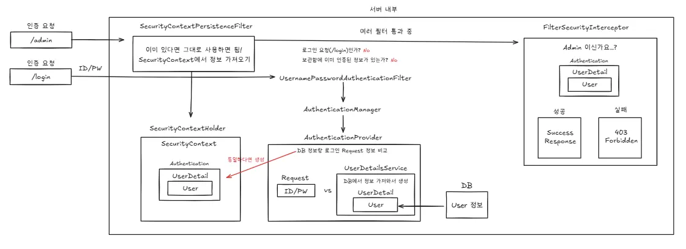

# Session & Token
Spring Security의 공통 인증 흐름에서는 인증이 완료되면 사용자 정보를 포함한 Authentication 객체를 생성하고, 이를 SecurityContext에 저장한다. 세션 기반 인증과 토큰 기반 인증의 핵심적인 차이는 이 `SecurityContext`를 **어떻게, 그리고 얼마나 유지하느냐**에 있다.



세션 기반 인증은 `SecurityContext`를 서버 내부의 `HttpSession`에 저장함으로써 다음 요청에서도 인증 상태를 재사용하는 Stateful 방식인 반면,

토큰 기반 인증은 요청 처리 과정에서만 `SecurityContext`를 생성하고 응답 이후에는 이를 제거하여 서버가 인증 상태를 저장하지 않는 Stateless 방식으로 동작한다.


## **1. 세션 기반 인증에서의 SecurityContext**

### **로그인 직후**

```
AuthenticationProvider 인증 성공
   ↓
Authentication 생성
   ↓
SecurityContext에 저장
   ↓
SecurityContext를 HttpSession에 저장
```

### 다음 요청에서는?

```
요청 + JSESSIONID
   ↓
SecurityContextPersistenceFilter
   ↓
세션에서 SecurityContext 꺼냄
```

**SecurityContext가 “세션에 보관”됨**

## **2. JWT(토큰) 기반 인증에서의 SecurityContext**

### 로그인 직후

```
AuthenticationProvider 인증 성공
   ↓
Authentication 생성
   ↓
SecurityContext에 잠깐 저장 (요청 동안)
   ↓
User 정보로 JWT 생성
   ↓
응답 후 SecurityContext 제거
```

**세션에 저장 안 함**

### 다음 요청에서는?

```
요청 + Authorization: Bearer JWT
   ↓
JWT Filter
   ↓
토큰 검증
   ↓
Authentication 재생성
   ↓
SecurityContext에 다시 저장 (요청 동안만)
```

요청 끝나면 **SecurityContext는 사라짐**


## 그래서 정리하자면

> 일반적으로 세션과 토큰의 차이는 상태를 서버에 저장하느냐에 있다.
> 
> 
> Spring Security 관점에서 세션 기반 인증은 인증 완료 후 `SecurityContext`를 `HttpSession`에 저장함으로써 서버가 사용자의 인증 상태를 기억하는 **Stateful 방식**이다.
> 
> 반면 토큰 기반 인증은 로그인 시 토큰을 발급하는 시점에만 서버가 개입하며, 이후 요청부터는 클라이언트가 전달한 토큰 자체가 인증과 인가를 대체하여 동작하는 **Stateless 방식**이다.
> 

| 구분 | 세션 | 토큰(JWT) |
| --- | --- | --- |
| 인증 상태 저장 | 서버 | 클라이언트 |
| 서버 상태 | 있음 (Stateful) | 없음 (Stateless) |
| 요청 간 의존 | 있음 | 없음 |
| 확장성 | 낮음 | 높음 |