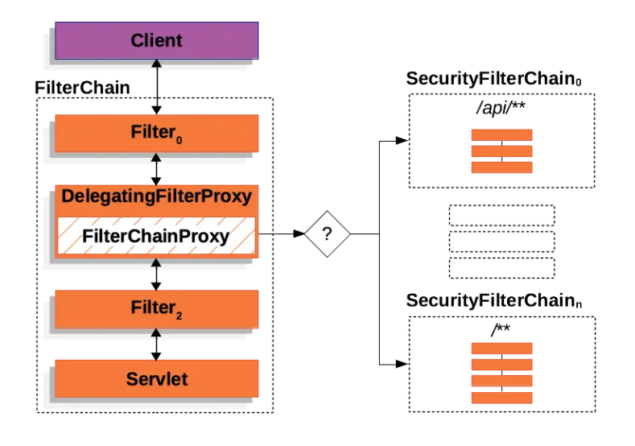

# Spring Security
**Spring Security**는 스프링 기반 애플리케이션의 **인증(Authentication), 인가(Authorization) 및 일반적인 공격에 대한 보호**를 담당하는 강력하고 커스터마이징 가능한 보안 프레임워크입니다.

쉽게 말해, 내 애플리케이션에 **"누가 들어올 수 있는지"** 를 확인하고, **“그 사람이 무엇을 할 수 있는지"** 를 통제하며, **"외부의 나쁜 공격"** 으로부터 서비스를 지키는 '보안 종합 세트'라고 이해하면 됩니다.


## 1. Spring Security의 3가지 핵심 역할

1. **인증 (Authentication)**
    - "이 사용자가 누구인가?"를 확인하는 과정입니다.
    - 아이디/비밀번호 로그인, 소셜 로그인(OAuth2), 생체 인증 등이 이에 해당합니다.
2. **인가 (Authorization)**
    - "인증된 사용자가 특정 리소스에 접근할 권한이 있는가?"를 결정합니다.
    - 예: 일반 유저는 '게시글 읽기'만 가능하고, 관리자는 '게시글 삭제'까지 가능한 권한 제어입니다.
3. **보안 공격 방어**
    - CSRF(사이트 간 요청 위조), 세션 고정(Session Fixation) 공격 등 웹 취약점으로부터 애플리케이션을 기본적으로 보호합니다.


## 2. Spring Security의 핵심 동작 원리: 필터 체인(Filter Chain)

Spring Security는 애플리케이션의 서블릿(Servlet) 앞에 **여러 개의 필터(Filter)**를 층층이 쌓아놓은 형태로 동작합니다. 사용자의 요청이 컨트롤러에 도달하기 전에 이 '필터 터널'을 무사히 통과해야 합니다.



Spring Security는 요청을 처리할 때 `SecurityFilterChain`(필터 체인)을 순서대로 통과시키는 구조이며, `SecurityConfig`에서 설정을 변경하면 이 체인에 포함되는 필터의 **활성화 여부**나 **추가되는 필터**, 그리고 **필터의 배치 순서**가 달라진다.

### **SecurityConfig Example**

```java
public SecurityFilterChain securityFilterChain(HttpSecurity http) throws Exception {
        http
                .authorizeHttpRequests(requests -> requests
                        .requestMatchers(allowUris).permitAll()
                        .requestMatchers("/admin/**").hasRole("ADMIN")
                        .anyRequest().authenticated()
                )
                .formLogin(AbstractHttpConfigurer::disable)
                .addFilterBefore(jwtAuthFilter(), UsernamePasswordAuthenticationFilter.class)
                .csrf(AbstractHttpConfigurer::disable)
                .logout(logout -> logout
                        .logoutUrl("/logout")
                        .logoutSuccessUrl("/login?logout")
                        .permitAll()
                )
                .exceptionHandling(exception -> exception.authenticationEntryPoint(authenticationEntryPoint()))

        ;

        return http.build();
    }
```

| **순서** | **필터 이름 (Filter Name)** | **역할 및 동작 설명** | **비고** |
| --- | --- | --- | --- |
| **1** | **`SecurityContextPersistenceFilter`** | **[복원]** 기존 세션이 있다면 인증 정보를 꺼내와서 `SecurityContextHolder`에 채워줌. | 모든 요청의 시작 |
| **2** | **`LogoutFilter`** | **[로그아웃]** 설정하신 `/logout` 경로로 요청이 오면 세션을 무효화하고 로그아웃 처리. | 코드 내 `.logout()` 설정 |
| **3** | **`JwtAuthFilter`** | **[커스텀 인증]** 헤더의 JWT를 검사해서 유효하면 유저 정보를 `SecurityContextHolder`에 저장. | **직접 추가한 필터** |
| **4** | `UsernamePasswordAuthenticationFilter` | **[기존 인증]** 원래는 폼 로그인을 처리하지만, `JwtAuthFilter` 뒤에 위치하며 사실상 하는 일 없음. | `.formLogin(disable)` |
| **5** | **`AnonymousAuthenticationFilter`** | **[익명 권한]** 앞선 필터들에서 인증이 안 됐다면 '익명 사용자' 권한을 부여함. | 필터 체인 기본 구성 |
| **6** | **`ExceptionTranslationFilter`** | **[예외 처리]** 뒤쪽 필터에서 터지는 인증/인가 에러를 잡아서 응답을 처리함. | `.exceptionHandling()` |
| **7** | **`FilterSecurityInterceptor`** | **[인가/최종]** 설정하신 `.requestMatchers()` 규칙에 따라 실제 접근 권한을 최종 판단. | **보안의 마지막 관문** |

결국 **Spring Security**는 거대한 **'필터의 사슬(Filter Chain)**'이고, 그 안에서 일어나는 **인증(Authentication)** 과 **인가(Authorization)** 도 특정 필터가 자기 차례가 왔을 때 **조건(요청 경로, 토큰 유무, 권한 등)에 따라 실행**하는 하나의 '작업'일 뿐이다.


## 3. Spring Security의 기본 보안 방어 구조

Spring Security는 웹 애플리케이션에서 빈번하게 발생하는 주요 보안 공격들을 **기본 설정**으로 방어해 주며,

개발자는 `SecurityConfig`를 통해 필터의 활성화 여부를 설정하여 이러한 보안 기능을 선택적으로 켜거나 끌 수 있다.

> 이러한 보안 필터들은 대부분 **인증 필터보다 앞쪽**에서 동작한다.
> 

이는 사용자의 신원을 확인하기 전에, **요청 자체가 안전한지 먼저 검증**해야 하기 때문이다.

Spring Security가 필터 단계에서 방어하는 대표적인 공격 유형은 다음과 같다.  

  

### CSRF (Cross-Site Request Forgery, 사이트 간 요청 위조)

---

사용자가 의도하지 않았음에도, 공격자가 심어놓은 요청을 통해 비밀번호 변경과 같은 민감한 작업이 수행되는 공격이다.

**방어 필터 :** `CsrfFilter`

**동작 방식**

서버는 클라이언트에 임의의 CSRF 토큰을 발급하고, 상태 변경 요청 시 해당 토큰이 함께 전달되는지를 검증하여 요청의 정당성을 확인한다.


JWT 기반의 REST API에서는 서버 세션을 사용하지 않기 때문에 CSRF 공격 가능성이 낮아, 성능 및 구조 단순화를 위해 `.csrf().disable()` 처리하는 경우가 많다.

### XSS (Cross-Site Scripting) 완화

---

게시글이나 입력 폼 등에 악성 스크립트를 삽입하여, 다른 사용자의 쿠키 탈취나 세션 하이재킹을 시도하는 공격이다.

**방어 필터 :** `HeaderWriterFilter`

**동작 방식**

Spring Security는 XSS 공격을 직접 차단하기보다는, 브라우저가 악성 스크립트를 실행하기 어렵도록 다음과 같은 **보안 헤더를 응답에 자동으로 추가**하여 공격을 완화한다.

- `Content-Security-Policy`
- `X-XSS-Protection`
- `X-Content-Type-Options`

### Clickjacking (클릭재킹)

---

정상 웹 페이지를 투명한 iframe으로 감싸고, 사용자가 의도하지 않은 버튼을 클릭하도록 유도하는 공격이다.

**방어 필터 :** `HeaderWriterFilter`

**동작 방식**

응답 헤더에 `X-Frame-Options: DENY` 또는 `SAMEORIGIN`을 설정하여해당 페이지가 다른 사이트의 `<iframe>` 내부에서 로드되지 않도록 차단한다.

### Session Fixation (세션 고정 공격)

---

공격자가 미리 발급받은 세션 ID를 사용자에게 주입한 뒤, 사용자가 로그인하면 동일한 세션을 탈취하는 공격이다.

**방어 필터 :** `SessionManagementFilter`

**동작 방식**

사용자가 로그인에 성공하는 순간 기존 세션을 폐기하고 새로운 세션 ID를 발급하여, 이전 세션 ID를 무효화한다.

---