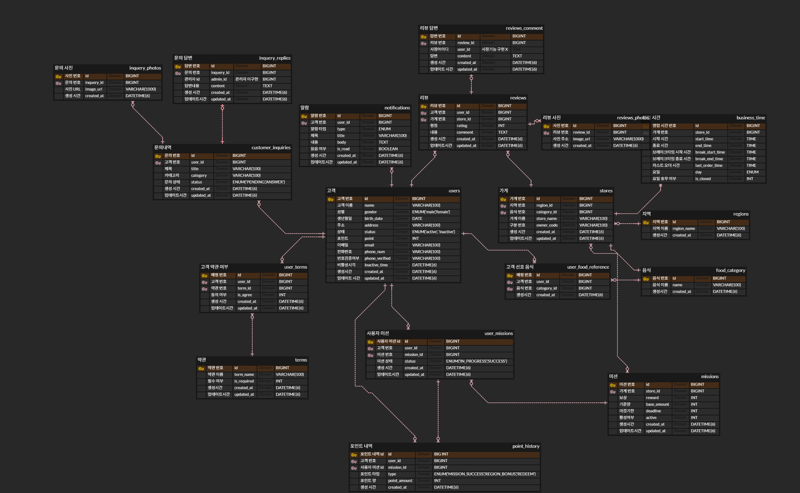

### 피드백 반영 erd 최종본 



1. **리뷰 작성하는 쿼리**

   리뷰를 작성했을 때 쓴 리뷰가 테이블에 들어가야하니 INSERT문이 필요하다.

   내가 설계한 reviews 테이블엔 id, user_id, store_id, rating, comment, created_at, updated_at이 있기에 이 데이터들을 차례대로 채워준다. 이때 id는 auto_increment이기에 생략한다.

   테이블을 생성할 때 CURRENT_TIMESTAMP를 사용해 created_at과 updated_at을 정의하기에 이 둘도 생략하여 현재 시간을 나타낼 수 있다.

    ```sql
    INSERT INTO reviews(user_id, store_id, rating, content)
    VALUES (1, 105, 4, '쫌 애매해요');
    ```

2. **마이페이지 화면 쿼리**

   화면만 봤을 때 사용자 이름, 이메일, 휴대폰번호, 휴대폰 번호 인증 여부, 현재 포인트가 필요해보인다.  이는 모두 users 테이블에서 가져올 수 있다.

    ```sql
    select u.id, u.name, u.email, u.phone_num, u.point, u.phone_verified 
    from users as u
    where u.id = '어떤 유저'
    ```

3. **진행중, 진행 완료한 미션 모아서 보는 쿼리(페이징 포함)**

   UI를 보면 미션 정보와 사용자가 어떤 미션을 하는지에 대한 정보가 담겨있기에 join이 반드시 쓰일 것이다.

   필요한 데이터만 추출해보자면 사용자id, 가게 이름, 가게 reward, 가게 기준 가격, 미션 status, 미션 id가 필요할 것이다.

   나는 erd 설계를 store와 mission을 나누었기에 가게 이름을 알아내려면 store의 join도 필요할것이다.

    ```sql
    select um.id, um.status, m.id, m.reward_points, m.base_amount
    	, s.id, s.store_name
    from user_missions as um
    join missions m on m.id = um.mission_id
    join stores s on s.id = m.store_id
    where um.user_id = '어떤 사용자'
    	and um.status = 'IN_PROGRESS' --완료 상태를 볼때는 여길 'SUCCESS'로 변경
    	and um.updated_at<? or (um.updated_at = ? and um.id<?) --최신페이지는 이거 삭제 
    order by um.updated_at desc, um.id desc
    limit 5; --5페이지씩 보겠다. 
    ```

4. **홈 화면 쿼리(현재 선택된 지역에서 도전 가능한 미션 목록, 페이징 포함)**

    1. **미션진행도**

       진행도를 나타내기 위해선 user_missions 테이블에서 SUCCESS 상태인 미션들을 찾아 count하면 된다.

       이때 주의해야 할 것은, 선택된 지역에서 달성된 개수라는 것이다. store과 mission의 조인도 필요하다.

        ```sql
        select mod(count(*),10)
        from user_missions um
        join missions m on m.id = um.mission_id
        join stores s on s.id = m.store_id
        where um.user_id = '어느사용자'
        and um.status = 'SUCCESS'
        and s.region = '어떤지역';
        ```

    2. **도전 가능한 미션 목록**

       UI를 봤을 때,user_id,  가게, 기준 가격, 마감 기한, 미션 상태, 지역 등이 필요해보인다. 페이징은 마감 기한을 기준으로 하고자 한다.

        ```sql
        select m.id, s.id, s.store_name, s.region_id, m.base_amount
        ,m.reward_points, m.deadline
        from mission m
        join stores s on s.id = m.store_id
        where s.region_id = "지역명"
        and m.active = 1
        and not exists (
        		select 1 
        		from user_missions as um
        		where um.user_id = '고객명'
        		and um.mission_id = m.id
        		and um.status IN ('IN_PROGRESS', 'SUCCESS')
        )
        -- 다음 페이지 
        and (
        	m.deadline > ? or(m.deadline = ? and m.id < ?)
        )
        order by m.deadline asc, m.id desc
        limit 5;
        ```