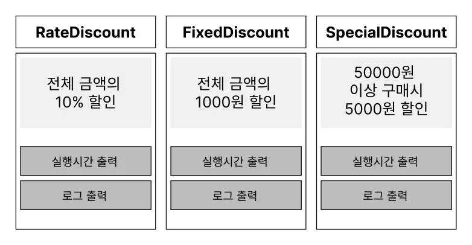
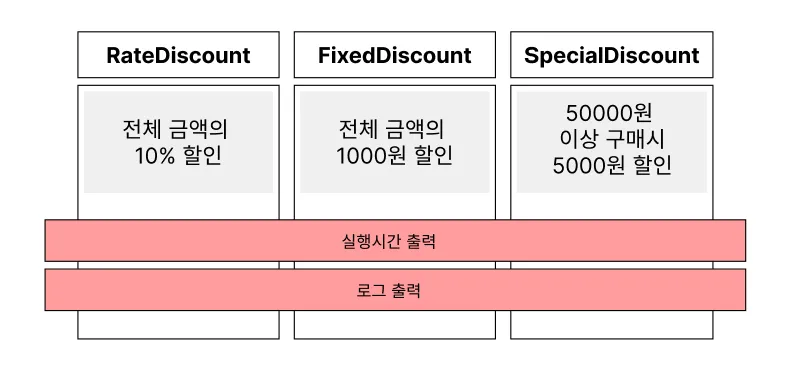

### AOP란?

Aspect Oriented Programming은 **횡단 관심사(Cross-Cutting Concern)의 분리**를 허용함으로써 **모듈성을 높이는 것을 목적으로 하는 프로그래밍 패러다임**입니다!

여러 객체에 공통적으로 적용되는 기능(예: 로깅, 보안, 트랜잭션 관리 등)을 핵심 로직에서 분리하여 별도의 모듈(Aspect)로 관리하게 되죠 이를 통해 개발자는 반복적인 공통 기능을 매번 구현할 필요가 없어지고, **핵심 비즈니스 로직 개발에 집중**할 수 있다.

여러 할인 정책이 있고, 오류 추적을 위해 로깅을 추가했다고 합시다.



처음엔 `FixedDiscountPolicy`에 단순히 `System.out.println`을 위·아래로 넣어 처리했다.

```java
public class FixedDiscountPolicy implements DiscountPolicy {
    @Override
    public int discount(int price) {
        System.out.println("[LOG] Fixed 할인 시작 price=" + price);
        int amount = 1000;
        System.out.println("[LOG] Fixed 할인 결과 amount=" + amount);
        return amount;
    }
}
```

하지만 새로운 정책(`RateDiscountPolicy`)이 생길 때마다 **또 로깅을 복붙**해야 한다.

```java
public class RateDiscountPolicy implements DiscountPolicy {
    @Override
    public int discount(int price) {
        System.out.println("[LOG] Rate 할인 시작 price=" + price);
        int amount = (int) (price * 0.1);
        System.out.println("[LOG] Rate 할인 결과 amount=" + amount);
        return amount;
    }
}
```

더 나아가 로그 포맷을 바꾸고 싶다면 **모든 구현체를 동시에 수정**해야 한다.

즉, **중복과 산재(Scattering)** 가 발생한다.

이 문제는 **프록시(데코레이터)** 로 해결할 수 있다.

핵심 정책은 **할인 계산만** 담당하고, 로깅은 **프록시 한 곳**에서 일괄 처리하는 것이다.

---

### 프록시란?

프록시는 **클라이언트가 사용하려는 실제 대상(Real Subject) 대신 요청을 받아주는 대리 객체**를 말한다. 겉보기에는 진짜 객체처럼 보이지만, 실제로는 **중간에서 요청을 가로채거나 추가적인 처리를 수행하는 가짜 객체**다.

이 프록시를 어떻게 이용하느냐에 따라 2가지 패턴으로 분류할 수 있다. 

>**프록시 패턴 (Proxy Pattern)**

클라이언트가 **타깃에 접근하는 방법 자체를 제어**하기 위한 프록시.

예: 데이터베이스 커넥션을 직접 만들지 않고 프록시를 통해 필요할 때만 생성.

>**데코레이터 패턴 (Decorator Pattern)**

클라이언트의 요청은 그대로 타깃에게 전달하지만, **추가 기능을 덧붙이는 목적**으로 사용하는 프록시.

예: 출력 기능에 “로깅”을 덧붙여 기록을 남김.

---

핵심 정책은 **할인 계산만** 담당하고, 로깅은 **프록시 한 곳**에서 일괄 처리한다.



```java
public class FixedDiscountPolicy implements DiscountPolicy {
    @Override
    public int discount(int price) {
        int amount = 1000;
        return amount;
    }
}

public class RateDiscountPolicy implements DiscountPolicy {
    @Override
    public int discount(int price) {
        int amount = (int) (price * 0.1);
        return amount;
    }
}

public class SpecialDiscountPolicy implements DiscountPolicy {
    @Override
    public int discount(int price) {
        return (price >= 50000) ? 5000 : 0; // 5만원 이상 5000원 할인
    }
}
```

```java
public class LoggingDiscountPolicyProxy implements DiscountPolicy {
    private final DiscountPolicy target;

		// DI: 생성자 주입
    public LoggingDiscountPolicyProxy(DiscountPolicy target) {
        this.target = target;
    }

    @Override
    public int discount(int price) {
        long start = System.currentTimeMillis();
        System.out.println("[LOG] " + target.getClass().getSimpleName() + " 시작 price=" + price);
        try {
            int amount = target.discount(price); //핵심 로직 실행
            System.out.println("[LOG] 결과 amount=" + amount);
            return amount;
        } finally {
            long end = System.currentTimeMillis();
            System.out.println("[LOG] 실행 시간=" + (end - start) + "ms");
        }
    }
}
```

클라이언트가 할인을 요청하면 **프록시**가 가장 먼저 요청을 받아 **시작 로그**를 남긴다.

그다음 **실제 할인 정책(핵심 로직)** 을 호출해 할인 금액을 계산하고, 다시 프록시가 제어를 넘겨받아 **종료 로그**를 남기며 **실행 시간**을 계산한다.

즉, **핵심 로직은 각 정책 구현체에서 수행**하고, 그 외의 **로그 출력과 실행 시간 계산은 프록시가 담당**한다. 이런 방식이 바로 앞에서 설명한 **AOP의 개념**이다.

---

### **OOP와 AOP의 차이점**

OOP는 우리가 흔히 사용하는 프로그래밍 패러다임으로, **설계의 중심을 객체에 두는 방식**이다.

코드는 전반적으로 객체를 중심으로 구성되며, 객체가 **무엇을 하고(행동)** **어떤 메시지·데이터를 주고받는지**를 기준으로 프로그래밍한다. 또한 객체 간의 관계를 정의하고, **상속·다형성** 같은 개념을 활용해 유연하고 재사용 가능한 구조를 만든다.

하지만 OOP만으로는 해결이 어려운 부분이 있다. 로깅, 보안, 트랜잭션 처리처럼 여러 객체에 공통으로 흩어지는 기능(= **횡단 관심사, Cross-Cutting Concern**)은 **코드 중복** 과 **산재(Scattering)** 를 유발한다. 그 결과 유지보수성이 떨어지고, 핵심 비즈니스 로직이 공통 코드에 묻혀 **가독성**이 저하된다.

>🙋‍♂️ **“그럼 공통 로깅을 함수로 빼면 되지 않나?”**

함수(메서드)로 추출해도 **각 지점에서 그 함수를 매번 직접 호출해야 한다**는 문제가 남는다. 즉, 호출 구문이 애플리케이션 전반에 흩어져 다시 **중복·산재**가 발생한다. 이 지점이 바로 OOP만으로는 한계가 드러나는 부분이며, 이런 반복 호출을 **자동화하고 중앙에서 관리**하기 위해 AOP가 필요해진다.

AOP는 객체가 **무슨 일을 하는지(행동)**, **어떤 영향을 받는지(관계, 상태)** 와 같은 객체 중심의 설계에는 크게 신경 쓰지 않는다.대신 **공통된 관심사**, 즉 **기능 자체**를 설계의 중심에 두고, 이를 모듈화하여 필요한 지점에 끼워 넣는 방식을 취한다.

예를 들어, “회원가입 기능” 같은 **핵심 로직**에는 집중하고, 로깅·보안·트랜잭션 같은 **횡단 관심사**는 별도의 Aspect로 관리한다. 이렇게 하면 핵심 로직은 오염되지 않고, 부가 기능은 자동으로 적용된다.

처음 AOP를 접했을 때는 *“그냥 함수 아니야?”* 라는 생각이 들었다. 결국 기능을 담은 함수니까 말이다.

하지만 중요한 차이점이 있다. **일반 함수는** 개발자가 **직접 호출**해야 실행된다. AOP는 미리 **상황과 대상(Join Point, Pointcut)** 을 정해두면, 스프링이 실행 흐름에 맞게 **자동으로 호출**해준다.

즉, AOP는 **“정해진 지점에 자동으로 삽입되는 함수”** 라고 이해할 수 있다.


## **AOP의 핵심 개념(Advice, JoinPoint, Pointcut, Aspect, Weaving)** 정리

| 개념 | 설명 | 키워드 |
| --- | --- | --- |
| **Advice** | 실제 실행할 부가 기능 코드 | *무엇을 할 것인가* |
| **Join Point** | Advice가 적용될 수 있는 실행 지점 | *어디에 끼어들 수 있는가* |
| **Pointcut** | 어떤 Join Point를 선택할지 지정 | *어디에 적용할 것인가* |
| **Aspect** | Advice + Pointcut 묶음 (모듈) | *관심사 단위* |
| **Weaving** | Aspect를 실제 코드에 삽입하는 과정 | *언제/어떻게 적용되는가* |


## AOP가 적용되는 **런타임 위빙 vs 컴파일 타임 위빙**의 차이점

AOP에서 부가 기능(Advice)을 핵심 로직에 결합(Weaving)하는 시점에 따라 다음과 같이 구분할 수 있다.

### 1. **컴파일 타임 위빙 (Compile-time Weaving)**

- 소스 코드를 컴파일할 때, **바이트코드에 부가 기능을 삽입**한다.
- 대표적으로 **AspectJ**가 이 방식을 지원한다.
- 장점: 실행 시 오버헤드가 적다.
- 단점: 컴파일러가 따로 필요하고, 빌드 과정이 복잡해질 수 있다.

### 2. **로드 타임 위빙 (Load-time Weaving)**

- 클래스가 JVM에 **로드되는 시점**에 클래스 로더가 바이트코드를 조작하여 부가 기능을 삽입한다.
- AspectJ LTW(Load-Time Weaving) 방식이 여기에 해당한다.
- 장점: 컴파일 타임보다 유연하다. (바이트코드 로딩 시점에 조작 가능)
- 단점: JVM 옵션 설정, 로더 설정이 필요해 상대적으로 설정이 번거롭다.

### 3. **런타임 위빙 (Runtime Weaving)**

- 애플리케이션 실행 중에 **프록시 객체를 생성**하여 부가 기능을 삽입한다.
- **Spring AOP**가 이 방식을 사용한다.
- 장점: 설정이 단순하고, Spring 빈으로 자동 관리 가능.
- 단점: 프록시 기반이라 **메서드 실행 지점(Join Point)** 만 지원한다. (생성자/필드 접근은 불가)

## Spring AOP

위에서 수동 프록시로 구현했던 AOP를 스프링으로 바꿔보자. 스프링을 사용하면 내가 직접 프록시 클래스를 만들고 그 프록시 인스턴스를 호출하지 않아도 된다. **`DiscountPolicy` 구현체(비즈니스 로직)**와 **AOP 설정(@Aspect, 포인트컷/어드바이스)**만 있으면, 스프링이 컨테이너 초기화 시점에 **프록시 객체**를 자동으로 생성해준다. 그래서 겉보기에는 `discountPolicy.discount(...)`를 호출한 것처럼 보이지만, 실제로는 **프록시가 먼저 실행되어 부가 기능(로그, 시간 측정 등)을 수행한 뒤** 실제 `DiscountPolicy`의 `discount(...)` 메서드를 호출한다.

호출 흐름은 이렇게 이해하면 된다.

- (수동 프록시) 클라이언트 → 내가 만든 Proxy → 실제 DiscountPolicy
- (스프링 AOP) 클라이언트 → 스프링이 만든 프록시 → 실제 DiscountPolicy

즉, **프록시 생성·적용을 스프링이 대신 처리**해주므로, 개발자는 비즈니스 로직은 `DiscountPolicy` 구현체에 집중하고, **횡단 관심사**는 `@Aspect`로 분리해 선언만 하면 된다.

```java
@Component
public class FixedDiscountPolicy implements DiscountPolicy {
    @Override public int discount(int price) { return 1000; }
}

@Component
public class RateDiscountPolicy implements DiscountPolicy {
    @Override public int discount(int price) { return (int)(price * 0.1); }
}

@Component
public class SpecialDiscountPolicy implements DiscountPolicy {
    @Override public int discount(int price) { return (price >= 50000) ? 5000 : 0; }
}
```

```java
@Aspect
@Component
public class DiscountLogAspect {

    // DiscountPolicy의 discount(..) 메서드에만 적용
    @Around("execution(int com.example..DiscountPolicy.discount(..))")
    public Object logDiscount(ProceedingJoinPoint pjp) throws Throwable {
        long start = System.currentTimeMillis();
        String target = pjp.getTarget().getClass().getSimpleName();
        Object[] args = pjp.getArgs();

        System.out.println("[LOG] " + target + " 시작 price=" + args[0]);
        try {
            Object result = pjp.proceed(); // 핵심 로직 실행
            System.out.println("[LOG] 결과 amount=" + result);
            return result;
        } finally {
            long end = System.currentTimeMillis();
            System.out.println("[LOG] 실행 시간=" + (end - start) + "ms");
        }
    }
}
```

기존 `LoggingDiscountPolicyProxy` 대신 `DiscountLogAspect`를 만들었다. 이 클래스를 통해 AOP 설정을 해봤는데, 우선 `@Aspect`를 통해 **이 클래스가 AOP 설정 클래스(애스펙트)**라는 것을 스프링에게 알려준다. 그리고 애스펙트도 결국 스프링 빈으로 관리되기 때문에 `@Component`를 붙여 빈으로 등록한다.

---

### Advice

그 다음 보이는 어노테이션은 `@Around`이다. 여기에는 **포인트컷**이 들어간다. 포인트컷은 말 그대로 **어떤 조인 포인트에 적용할지 선택하는 필터 조건**이다. 지금 예시에서는 반환 타입이 `int`이고, `com.example` 패키지 이하의 `DiscountPolicy` 구현체에서 `discount()` 메서드를 호출할 때 AOP가 적용된다는 뜻이다.

여기서 중요한 의문은 “포인트컷은 어떤 조인 포인트를 선택하는 것인데, 스프링은 애초에 조인 포인트를 어떻게 정의하느냐?”라는 것이다.

조인 포인트(Join Point)는 **부가 기능(Advice)이 적용될 수 있는 실행 지점**을 말한다. AspectJ 같은 완전한 AOP 프레임워크에서는 생성자 호출, 필드 접근, 예외 처리 등 다양한 조인 포인트를 지원한다. 하지만 **Spring AOP는 프록시 기반**으로 동작하기 때문에, 프록시로 가로챌 수 있는 지점만 조인 포인트로 인정한다.

따라서 **스프링 AOP에서 조인 포인트 = 스프링 컨테이너에 등록된 빈의 public 메서드 실행 시점**이다. 정리하면 스프링은 모든 빈을 관리하고 있으므로, 컨테이너 안의 빈 메서드 실행 자체를 조인 포인트로 간주하고, 그 중에서 포인트컷 표현식에 매칭되는 메서드에만 어드바이스(부가 기능)를 적용하는 것이다.

Spring AOP에서 어드바이스는 **조인 포인트(=메서드 실행 시점)**에 끼워 넣을 수 있는 “부가 기능”이다. 어떤 애노테이션을 쓰느냐에 따라 동작 시점과 구현 방식이 달라진다.

**`@Before`**

- 대상 메서드 실행 직전에 실행된다.
- 반환값을 바꾸거나 예외를 처리할 수는 없다.
- `proceed()` 같은 개념이 없으므로 흐름 제어는 불가능하다.
- 주로 **인자 검증, 접근 권한 확인, 사전 로깅**에 사용된다.

**`@AfterReturning`**

- 메서드가 정상적으로 **리턴된 후** 실행된다.
- 리턴 값을 파라미터로 받아서 추가 처리(가공, 로깅)가 가능하다.
- 예외가 발생하면 실행되지 않는다.

**`@AfterThrowing`**

- 대상 메서드 실행 중 **예외가 던져졌을 때만** 실행된다.
- 예외를 잡아 다른 예외로 바꿔 던지거나, 예외를 로깅하는 데 유용하다.

**`@After`**

- 정상/예외 구분 없이 **항상 마지막에 실행**된다.
- `finally` 블록처럼 정리 작업(리소스 해제, 로그 종료) 등에 주로 쓴다.

**`@Around`**

- 메서드 실행 전/후/정상/예외 모두 제어할 수 있는 가장 강력한 어드바이스다.
- `ProceedingJoinPoint.proceed()`를 호출해야 실제 대상 메서드가 실행된다.
- 호출 시점과 결과를 완전히 제어할 수 있어 **시간 측정, 트랜잭션 경계, 캐싱** 같은 복합적인 부가 기능에 사용된다.

---

### ProceedingJoinPoint

`@Around` 어드바이스에서만 사용 가능한 특별한 매개변수다.

**주요 기능**
- `proceed()` : 실제 대상 메서드를 실행한다. 호출하지 않으면 핵심 로직이 아예 실행되지 않는다.
- `getArgs()` : 현재 메서드에 넘어온 인자 배열을 가져온다.
- `getTarget()` : 실제 대상 객체(원본 빈).
- `getThis()` : 프록시 객체(스프링이 감싼 껍데기).
- `getSignature()` : 메서드 이름, 선언 정보, 반환 타입 등 시그니처 정보.

## 전체 흐름 보기
빈이 등록되는 순서는 다음과 같다. 

1. **빈 정의 읽기**
    - 컴포넌트 스캔이나 `@Bean` 메서드 등을 통해 빈 후보를 스캔한다.
2. **인스턴스 생성 (Instantiation)**
    - `new`를 호출해서 실제 객체를 만든다.
3. **의존성 주입 (Dependency Injection)**
    - 생성자 주입, 필드 주입, 세터 주입 등으로 필요한 빈을 넣어준다.
4. **빈 후처리기(BeanPostProcessor) 적용** 
5. **초기화 콜백 (afterPropertiesSet, @PostConstruct 등)**
    - 빈이 준비된 후 초기화 로직 실행.
6. **빈 사용 가능**
    - ApplicationContext에서 `getBean()` 하면 프록시(혹은 원본)가 반환된다.
7. **종료 시점**
    - `@PreDestroy`, `DisposableBean` 같은 종료 콜백 실행.

3번까지 진행되면 의존성 주입이 모두 끝난 상태다. 그 다음 빈 후처리기 단계에서 스프링은 `@Aspect`가 적용된 설정을 확인하고, AOP를 적용해야 한다고 판단하면 포인트컷 정보를 바탕으로 어떤 객체와 메서드에 부가기능을 적용할지 결정한다. 이때 원본 객체를 그대로 컨테이너에 올리는 것이 아니라, 프록시 객체를 새로 만들어 원본 대신 컨테이너에 등록한다. 이후 5번 과정(초기화 콜백)이 끝나면 모든 빈 등록이 완료된다. 따라서 우리가 컨테이너에서 빈을 꺼내 메서드를 호출할 때는 이미 프록시 객체가 들어가 있어서, 먼저 부가기능이 실행되고 그 다음에 실제 비즈니스 로직이 수행된다. 즉, 실행 시점에 교체되는 것이 아니라 **등록 시점에 이미 프록시로 교체된 상태**라는 점이 중요하다.

빈 등록이 끝난 후 실제 로직이 실행되는 과정은 다음과 같다.

```java
클라이언트 코드
    ↓
프록시 객체 (스프링이 만든 대리인)
    ↓
ReflectiveMethodInvocation (어드바이스 체인 실행)
    ↓
   [@Before 어드바이스 실행]
    ↓
   [@Around 어드바이스: proceed() 호출 전]
    ↓
   [실제 대상 메서드 실행: FixedDiscountPolicy.discount()]
    ↓
   [@Around 어드바이스: proceed() 호출 후]
    ↓
   [@AfterReturning / @AfterThrowing / @After 실행]
    ↓
결과 반환
```

즉, 클라이언트가 빈을 호출하면 원본 객체가 바로 실행되는 것이 아니라, 먼저 프록시 객체가 호출을 가로채고 내부의 **ReflectiveMethodInvocation**이 어드바이스 체인을 순서대로 실행한다. 그리고 우리가 어떤 어드바이스 애노테이션(`@Before`, `@Around`, `@AfterReturning`, `@AfterThrowing`, `@After`)을 정의했는지에 따라 실행 순서가 달라지며, 그 결과 핵심 로직과 부가 기능이 결합된 실행 흐름이 만들어진다.