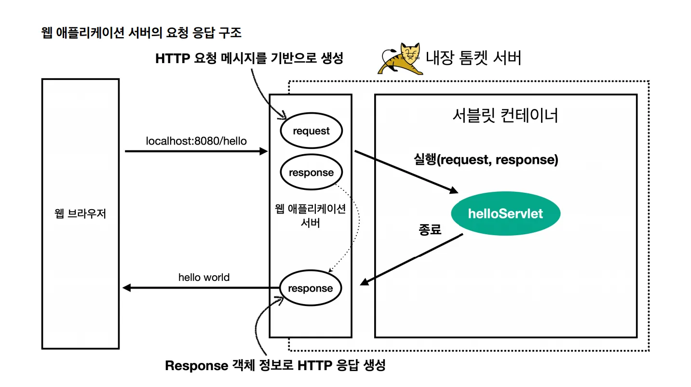
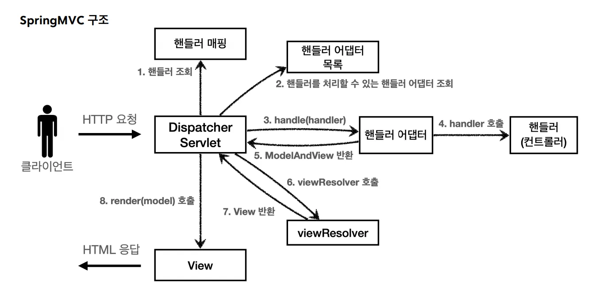

## 서블릿이란?

**서블릿(Servlet)은 자바로 만든 서버 프로그램으로, 클라이언트의 요청(HTTP Request)을 받아 처리하고 응답(HTTP Response)을 생성하는 서버 측 컴포넌트다.**

클라이언트와 서버는 HTTP 메시지로 소통한다. 사실 서버 입장에서는 이 메시지가 단순한 문자열일 뿐이다. 하지만 대부분의 서버 프레임워크는 객체지향 언어로 만들어져 있기 때문에, 문자열을 그대로 다루기보다는 객체로 변환해 두어야 추가 작업을 하기에 훨씬 용이하다.

문제는, 개발자가 매번 HTTP 요청 메시지를 직접 파싱하고 객체로 변환하는 건 너무 번거롭고 비효율적이라는 점이다. 서블릿은 이 불편함을 해결하기 위해 등장했다. 서블릿 컨테이너(WAS)는 요청 메시지를 대신 파싱해 `HttpServletRequest` 객체에 담아주고, 개발자는 이 객체를 사용해 편리하게 요청을 처리할 수 있다.

서블릿 컨테이너는 스프링에서만 존재하는 게 아니라, **WAS(Web Application Server)** 자체에서 제공하는 기능이다. 우리가 스프링 부트를 사용하면 내장 WAS가 자동으로 실행되는데, 흔히 말하는 **Tomcat**이 바로 그 예다.



클라이언트가 서버에 요청을 보내면, HTTP 메시지 형태로 전달된다. WAS는 이 요청을 받아서 **`HttpServletRequest` 객체로 변환**하고, 이를 서블릿 컨테이너로 넘긴다. 서블릿 컨테이너는 `HttpServletRequest` 안의 URL, 메서드 등의 정보를 확인해, 해당 요청을 처리할 서블릿을 찾아 매핑하고 실행한다.

## 자바에서 서블릿 사용하기

```java
@WebServlet(name = "requestHeaderServlet", urlPatterns = "/request-header")
public class RequestHeaderServlet extends HttpServlet {

    @Override
    protected void service(HttpServletRequest request, HttpServletResponse response)
            throws ServletException, IOException {

        printStartLine(request);   // 요청 라인 정보(GET, URL, 프로토콜 등)
        printHeaders(request);     // 헤더 전체 출력
        printHeaderUtils(request); // 헤더 편의 메서드 활용
        printEtc(request);         // 기타 정보 (로컬 주소, 세션 등)

        response.getWriter().write("ok"); // 응답 본문에 "ok" 반환
    }
}
```

### 서블릿 작성

자바에서 서블릿을 사용하려면, 우선 `HttpServlet`을 상속받은 클래스를 만들어야 한다. 그리고 그 안에서 `service()`, `doGet()`, `doPost()` 같은 메서드를 오버라이딩하여 요청을 처리하는 로직을 작성한다. 이 메서드의 파라미터로는 항상 `HttpServletRequest`와 `HttpServletResponse` 객체가 전달된다.

### 서블릿 등록

작성한 서블릿 클래스에는 `@WebServlet` 어노테이션을 붙여 URL 패턴(`urlPatterns`)과 이름(`name`)을 지정한다.

위에서 정리한 흐름을 적용해보자!

<aside>

1. 클라이언트가 요청을 보내면, WAS가 HTTP 메시지를 파싱해 `HttpServletRequest` 객체를 만든다.
2. 이 객체 안의 요청 URL을 확인했을 때 `/request-header` 을 확인
3. 서블릿 컨테이너는 미리 등록된 URL 패턴 매핑 테이블에서 `/request-header`를 처리할 서블릿을 찾는다.
4. 매핑된 서블릿은 `RequestHeaderServlet`이고, WAS는 그 안의 `service()` 메서드를 호출해 로직을 실행한다.
</aside>

### **HttpServlet 코드 보기**

맨 위의 예시에서는 `HttpServlet`을 상속받아 새로운 서블릿을 만들고, `service()` 메서드를 오버라이딩했다. `service()`는 해당 서블릿의 주소로 어떤 요청이 들어와도 가장 먼저 실행되는 메서드다. 즉, 클라이언트 요청이 들어오면 일단 `service()`가 호출되고, 이 메서드가 요청의 성격(HTTP 메서드 종류)에 따라 `doGet()`, `doPost()`와 같은 메서드로 분기하게 된다.

```java
protected void service(HttpServletRequest req, HttpServletResponse resp) throws ServletException, IOException {
        String method = req.getMethod();
        long lastModified;
        if (method.equals("GET")) {
            lastModified = this.getLastModified(req);
            if (lastModified == -1L) {
                this.doGet(req, resp);
            } else {
                long ifModifiedSince;
                try {
                    ifModifiedSince = req.getDateHeader("If-Modified-Since");
                } catch (IllegalArgumentException var9) {
                    ifModifiedSince = -1L;
                }

                if (ifModifiedSince < lastModified / 1000L * 1000L) {
                    this.maybeSetLastModified(resp, lastModified);
                    this.doGet(req, resp);
                } else {
                    resp.setStatus(304);
                }
            }
        } else if (method.equals("HEAD")) {
            lastModified = this.getLastModified(req);
            this.maybeSetLastModified(resp, lastModified);
            this.doHead(req, resp);
        } else if (method.equals("POST")) {
            this.doPost(req, resp);
        } else if (method.equals("PUT")) {
            this.doPut(req, resp);
        } else if (method.equals("DELETE")) {
            this.doDelete(req, resp);
        } else if (method.equals("OPTIONS")) {
            this.doOptions(req, resp);
        } else if (method.equals("TRACE")) {
            this.doTrace(req, resp);
        } else {
            String errMsg = lStrings.getString("http.method_not_implemented");
            Object[] errArgs = new Object[]{method};
            errMsg = MessageFormat.format(errMsg, errArgs);
            resp.sendError(501, errMsg);
        }

    }
```

`HttpServlet`의 원래 코드를 보면, HTTP 메서드에 따라 요청을 분기하는 것을 알 수 있다. 예를 들어, `POST` 요청이면 `doPost()`, `GET` 요청이면 `doGet()`이 호출된다.

정리하면, `service()`는 서블릿이 요청을 받으면 가장 먼저 실행되는 메서드이고, 여기서 `HttpServletRequest`에 담긴 HTTP 메서드 정보를 확인한 뒤 해당하는 메서드(`doGet()`, `doPost()` 등)를 실행한다. 개발자는 이 메서드 안에 비즈니스 로직을 작성함으로써 클라이언트의 요청을 처리할 수 있게 된다.

앞의 예시를 보면 얼핏 “`service()`에서 바로 로직을 작성하면 되지 않을까?”라는 생각이 들 수 있다. 하지만 실제로는 이런 방식은 잘 사용되지 않는다. `service()`는 서블릿에 들어온 요청의 **진입점이자 HTTP 메서드별로 분기해주는 역할**을 담당하기 때문이다. 따라서 실질적인 로직은 `doPost()`, `doGet()` 같은 메서드를 오버라이딩해서 구현하는 것이 바람직하며, `service()` 자체는 건드리지 않는 것이 좋다.


## 스프링에서 서블릿

여기까지가 전통적인 서블릿 기반 개발에 대한 정리였다. 서블릿은 클라이언트와 WAS를 통한 로직 실현을 위해 필수적으로 들어가는 개념인데, 이것이 스프링에서는 어떻게 적용되는지 알아보자.

우선 **DispatcherServlet**이라는 것이 등장한다. DispatcherServlet은 스프링 MVC의 **프론트 컨트롤러(Front Controller)** 역할을 담당하며, HTTP 요청이 들어오면 가장 먼저 DispatcherServlet이 이를 받는다.



우리가 흔히 사용하는 `@Controller`가 붙은 클래스도 스프링 MVC에서는 **핸들러(Handler)** 라고 부른다. 클라이언트 요청이 들어오면 DispatcherServlet은 먼저 `HttpServletRequest`에 담긴 정보를 토대로 어떤 핸들러가 이 요청을 처리할지 찾는다.

그런데 문제는 핸들러의 형태가 항상 같지 않다는 점이다. 옛날에는 `Controller` 인터페이스 구현체를 쓰기도 했고, 지금은 `@Controller` + `@RequestMapping` 방식을 쓰기도 한다. 이렇게 **핸들러의 형식이 다를 수 있기 때문에**, DispatcherServlet이 직접 실행할 수는 없다.

여기서 등장하는 것이 **HandlerAdapter**다. DispatcherServlet은 핸들러를 찾은 다음, 그 핸들러를 실행할 수 있는 HandlerAdapter를 목록에서 선택한다. HandlerAdapter는 해당 핸들러를 실제로 호출할 수 있도록 변환/호환 역할을 하고, 그제서야 컨트롤러 로직이 실행된다.

컨트롤러 로직이 실행되면 보통 **서비스 계층(Service Layer) → 레포지토리(Repository Layer) → DB 서버**로 내려가는 전형적인 3계층 아키텍처 흐름을 따른다. 이렇게 하면 비즈니스 로직과 데이터 접근 로직을 깔끔하게 분리할 수 있다.

그런데 스프링 MVC 패턴에서는 이와 별도로 **View**라는 개념이 존재한다.

컨트롤러(핸들러)에서 처리한 결과 데이터를 `Model`에 담아 반환하면, 스프링이 **ViewResolver**를 통해 적절한 뷰(예: JSP, Thymeleaf 템플릿)를 찾아서 데이터를 그 뷰에 넣어주고, 최종적으로 웹 페이지(HTML)를 생성해 클라이언트에 전달한다.

즉, 스프링 MVC에서는 컨트롤러가 직접 HTML을 만드는 게 아니라, **컨트롤러는 데이터(Model)만 준비**하고 **View가 화면 렌더링을 담당**하는 방식으로 역할이 분리되어 있다.

---

### @Controller ( 핸들러 )를 어떻게 저장하는가?

**클래스패스 스캐닝 시작**

스프링 부트 실행 시 `@SpringBootApplication` 안에 포함된 `@ComponentScan`이 동작한다. 지정된 패키지(기본적으로 메인 클래스 하위 패키지)를 뒤지면서 특정 애노테이션이 붙은 클래스를 찾는다.

**애노테이션 탐색**

`@Controller`는 사실 `@Component`의 특수화(Stereotype) 애노테이션이다. 따라서 스프링은 `@Controller`를 만나면 "이 클래스도 스프링이 관리해야 할 Bean"이라고 판단한다.

```java
@Target(ElementType.TYPE)
@Retention(RetentionPolicy.RUNTIME)
@Documented
@Component   // ← 핵심: 결국 컴포넌트로 등록됨
public @interface Controller {
    ...
}
```

**Bean 등록**

스프링은 이렇게 탐색한 클래스를 ApplicationContext(IOC 컨테이너)에 Bean으로 등록한다.

**HandlerMapping에 매핑 정보 등록**

DispatcherServlet 초기화 과정에서 `RequestMappingHandlerMapping`이 동작한다. 이 과정에서 `@Controller`로 등록된 모든 빈을 리플렉션으로 조사한다. 클래스/메서드에 붙은 `@RequestMapping`, `@GetMapping`, `@PostMapping` 애노테이션을 발견하면, 그 정보를 수집해 **매핑 테이블(URL → 메서드)** 을 만든다.

---

### 핸들러 찾기

요청이 들어오면 DispatcherServlet은 가장 먼저 핸들러를 찾는다. 핸들러에 대한 정보는 위에서 설명했듯이 이미 애플리케이션 시작 시점에 준비된 핸들러 매핑 테이블 안에 들어 있다. 

```java
protected HandlerExecutionChain getHandler(HttpServletRequest request) throws Exception {
        if (this.handlerMappings != null) {
            Iterator var2 = this.handlerMappings.iterator();

            while(var2.hasNext()) {
                HandlerMapping mapping = (HandlerMapping)var2.next();
                HandlerExecutionChain handler = mapping.getHandler(request);
                if (handler != null) {
                    return handler;
                }
            }
        }

        return null;
    }
```

DispatcherServlet은 등록된 HandlerMapping들을 반복문으로 순회하면서 현재 들어온 `HttpServletRequest`를 전달한다. 그러면 각 HandlerMapping은 자신이 관리하는 매핑 정보와 요청을 비교해보고, 만약 해당 요청을 처리할 수 있다면 `HandlerExecutionChain`을 반환한다. 

이 `HandlerExecutionChain` 안에는 실제 실행될 핸들러 객체(예: @Controller의 특정 메서드)와 요청 처리 전후로 동작할 인터셉터 목록이 함께 들어 있다. 이렇게 해서 DispatcherServlet은 어떤 핸들러를 실행해야 할지 결정할 수 있게 된다.

### 인터셉터 처리

인터셉터는 `HandlerInterceptor` 인터페이스를 구현해서 만든다.

1. **preHandle()**
    - 핸들러 실행 전에 호출
    - 반환값이 `false`면 이후 체인을 끊고 더 이상 진행되지 않는다.
    - 예: 로그인 체크 → 실패 시 바로 응답 반환
    
2. **postHandle()**
    - 핸들러 실행 후, 뷰 렌더링 전에 호출
    - 컨트롤러가 반환한 `ModelAndView`를 조작할 수 있다.
    - 예: 공통 모델 데이터 추가
    
3. **afterCompletion()**
    - 뷰 렌더링까지 끝난 후 호출
    - 예외 발생 여부와 관계없이 실행된다.
    - 예: 리소스 정리, 실행 시간 로그

클라이언트 요청은 DispatcherServlet으로 들어오기 전에 반드시 Filter를 거친다. Filter와 인터셉터 모두 실행 흐름을 가로채서 제어권을 다른 곳으로 넘긴다는 점에서 유사하다. 그러나 두 개념은 동작하는 위치와 역할이 다르다. Filter는 서블릿 단위에서 동작하며 DispatcherServlet 자체로 요청이 들어가기 전에 동작하는 반면, 인터셉터는 DispatcherServlet 내부에서 동작하며 핸들러 실행 전후로 제어권을 가로챈다.

따라서 일반적으로 **요청 전체에 적용되는 공통 처리(예: 보안, 인코딩)** 는 필터에서 구현하고, **특정 컨트롤러 실행 전후에 필요한 처리(예: 인증 확인, 로깅)** 는 인터셉터에서 구현하는 것이 가장 적절하다.

---

### 핸들러 어댑터 찾기

DispatcherServlet은 핸들러를 찾은 다음, 그 핸들러를 직접 실행할 수는 없다. 왜냐하면 핸들러의 형태가 제각각이기 때문이다. 어떤 것은 단순히 Controller 인터페이스를 구현했을 수도 있고, 어떤 것은 `@Controller`와 `@RequestMapping` 기반의 메서드일 수도 있으며, 또 다른 것은 함수형 라우팅 방식일 수도 있다. 그래서 DispatcherServlet은 핸들러를 실제로 실행할 수 있는 적절한 **핸들러 어댑터(HandlerAdapter)** 를 찾아야 한다.

```java
protected HandlerAdapter getHandlerAdapter(Object handler) throws ServletException {
        if (this.handlerAdapters != null) {
            Iterator var2 = this.handlerAdapters.iterator();

            while(var2.hasNext()) {
                HandlerAdapter adapter = (HandlerAdapter)var2.next();
                if (adapter.supports(handler)) {
                    return adapter;
                }
            }
        }

        throw new ServletException("No adapter for handler [" + String.valueOf(handler) + "]: The DispatcherServlet configuration needs to include a HandlerAdapter that supports this handler");
    }
```

이때 사용하는 메서드가 `getHandlerAdapter()`이다. DispatcherServlet은 등록된 여러 HandlerAdapter 목록을 차례로 확인하면서 `supports(handler)` 메서드를 호출한다. 이 메서드는 “이 핸들러를 내가 실행할 수 있는지”를 판단하는 역할을 한다. 만약 특정 HandlerAdapter가 해당 핸들러를 지원한다면 그 어댑터를 반환하고, 이후 요청 처리를 이어간

---

### 핸들러 실행하기

핸들러 어댑터가 선택된 핸들러를 실행하면, 결국 컨트롤러 메서드가 호출된다. 이때 컨트롤러 메서드의 반환 타입에 따라 결과 처리가 달라진다. 예를 들어 반환값이 `String`이면 뷰 이름으로 간주되고, `ModelAndView`라면 모델과 뷰 정보를 함께 담고 있으며, `@ResponseBody`나 `@RestController`가 사용된 경우라면 JSON 같은 응답 본문이 직접 생성된다.

만약 뷰 이름이 반환되었다면 DispatcherServlet은 `ViewResolver`를 통해 해당 이름과 실제 뷰 파일을 매핑한다. 예를 들어 `"home"`이라는 이름이 반환되면 `home.jsp`나 `home.html` 같은 파일로 연결된다. 이후 뷰 객체가 모델 데이터를 받아 HTML을 생성하고, 이 결과가 클라이언트에 전송된다. 반대로 `@ResponseBody`나 `RestController`가 사용된 경우에는 `HttpMessageConverter`가 동작해 JSON이나 XML 데이터를 변환하고 이를 `HttpServletResponse`에 기록한다.

최종적으로 클라이언트는 HTML 페이지, JSON 데이터, 혹은 파일 다운로드와 같은 응답을 받게 되며, 이로써 요청–응답 사이클이 완전히 종료된다.

## Spring MVC가 왜 서블릿보다 편리한가?

Spring MVC는 전통적인 서블릿 방식보다 훨씬 **간결하고, 유연하며, 유지보수가 쉽다.**

서블릿에서는 요청 파싱부터 응답 생성까지 모든 과정을 개발자가 직접 구현해야 하지만, Spring MVC는 **프론트 컨트롤러(DispatcherServlet) 구조**를 통해 공통 기능을 프레임워크 차원에서 처리한다. 덕분에 개발자는 비즈니스 로직에만 집중할 수 있다.

### 코드 작성 방식의 차이

<aside>

- **전통 서블릿**
    - `HttpServlet`을 상속받아 `doGet()`, `doPost()` 같은 메서드를 직접 구현해야 한다.
    - URL마다 새로운 서블릿 클래스를 만들어야 하므로 유지보수가 어렵다.
    - 요청 파라미터는 `HttpServletRequest`에서 일일이 꺼내야 하고, 응답은 `HttpServletResponse`에 문자열을 직접 작성해야 한다.
- **Spring MVC**
    - `@Controller`와 `@RequestMapping`만 붙이면 간단히 요청을 매핑할 수 있다.
    - 파라미터는 `@RequestParam`, `@PathVariable`, `@RequestBody` 등으로 자동 바인딩된다.
    - 반환값은 뷰 이름(String), `ModelAndView`, 혹은 JSON(@ResponseBody) 등 다양한 형식을 지원한다.
</aside>

### 공통 처리의 편리함

<aside>

- 전통 서블릿에서는 인증, 로깅, 예외 처리 같은 공통 로직을 매번 직접 작성하거나, 필터/서블릿 체인을 복잡하게 구성해야 했다.
- Spring MVC는 **DispatcherServlet + HandlerMapping + HandlerAdapter + Interceptor** 구조 덕분에 공통 로직을 깔끔하게 분리할 수 있다.
</aside>

### 뷰 처리의 자동화

<aside>

- 전통 서블릿에서는 JSP 같은 뷰를 직접 forward/include 해야 하고, HTML 응답도 직접 작성해야 했다.
- Spring MVC는 컨트롤러에서 `"home"` 같은 뷰 이름만 반환하면, ViewResolver가 이를 JSP, Thymeleaf 등과 자동으로 매핑해준다.
</aside>

### 확장성과 유연성

<aside>

- 전통 서블릿은 서블릿 API에만 의존하기 때문에 확장이 어렵다.
- Spring MVC는 HandlerMapping, HandlerAdapter, ViewResolver 등을 인터페이스 기반으로 설계해 필요하면 교체하거나 확장할 수 있다.
</aside>

### 생산성

<aside>

- 전통 서블릿: 요청-응답을 직접 다루어야 해서 코드가 장황하고 중복이 많다.
- Spring MVC: 애노테이션 기반 매핑과 자동 파라미터/응답 처리 덕분에 훨씬 간결하고 빠르게 개발할 수 있다.
</aside>