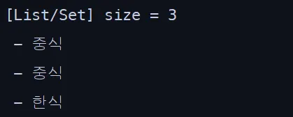

# List vs Set 알아보기
자바에서 `List`와 `Set`의 공통점과 차이점을 먼저 살펴보면,

두 컬렉션 모두 **여러 데이터를 묶어서 관리하는 데 사용되는 인터페이스**라는 공통점이 있다.

하지만 몇 가지 중요한 차이점이 있다.

`List`는 **중복된 값을 저장할 수 있고**, 데이터가 저장된 **순서를 기억**하여 인덱스로 접근할 수 있다.

반면 `Set`은 **중복된 값을 저장할 수 없으며**, 일반적으로 **저장 순서를 보장하지 않는다.**

내부적으로 해시코드를 기반으로 원소를 저장하기 때문에, **추가된 순서와 실제 저장 순서가 다를 수 있다.**

이 점이 **`@OneToMany` 컬렉션을 조회할 때 어떻게 다른지 살펴보자**

예를 들어 `Member`가 선호하는 음식을 여러 개 가지고 있다고 가정하자.
그런데 실제로는 이런 중복이 있을 일은 거의 없지만, `중식`이 두 번, `한식`이 한 번 들어가 있다고 가정해보자
그리고 우리는 중복된 `중식` 데이터는 의미가 없으니, 하나만 나오기를 원한다. 

아래는 테스트 코드이다.

```java
@Test
    void CountResult() {
        Long memberId = 1L; // 중복 데이터가 들어있는 멤버
        Member m = memberRepository.findWithFoodsById(memberId).orElseThrow();

        int size = m.getFoods().size();

        System.out.println("[List/Set] size = " + size);
        m.getFoods().forEach(mf -> System.out.println(" - " + mf.getFood().getName()));

    }
```

먼저 `List`로 매핑했을 때를 보면 

```java
@OneToMany(mappedBy = "member", cascade = CascadeType.ALL, orphanRemoval = true)
private List<MemberFood> foods = new ArrayList<>();
```


실행 결과는 예상대로 **중복된 데이터가 그대로 출력**되었다.
즉, DB에 중복된 `중식`이 두 번 들어있다면 그대로 두 번 조회된다.

다음으로 `Set`으로 매핑했을 때를 보자

```java
@OneToMany(mappedBy = "member", cascade = CascadeType.ALL, orphanRemoval = true)
private Set<MemberFood> foods = new HashSet<>();
```



중복이 제거되어 출력 됐어야 하지만 결과는 **List로 했을 때와 동일하게 중복이 그대로 출력**되었다.

이유를 찾아보았는데, 이는 **JPA가 객체를 생성하는 방식**과 **자바가 동일 객체를 판단하는 방식**이 서로 다르기 때문에 발생한 문제다. 

일반적으로 자바에서 `Set`을 사용할 때는 `equals()`와 `hashCode()`를 재정의하여 객체의 **동등성(equality)** 기준을 직접 지정할 수 있다. 하지만 이를 재정의하지 않으면, `Set`은 객체의 **메모리 주소**를 기준으로 동일 여부를 판단한다. 즉, **내용이 같더라도 서로 다른 메모리 주소를 가지면 다른 객체로 인식**한다는 뜻이다. 그런데 JPA는 SQL을 실행해 DB에서 조회한 결과의 각 **Row마다 새로운 엔티티 객체를 생성**한다. 

따라서 DB 데이터가 동일하더라도, 조회된 결과가 여러 Row에 걸쳐 있다면 JPA는 이를 각각 **별개의 `MemberFood` 인스턴스**로 만들어 버린다. 결국 `Set` 입장에서는 내용이 같더라도 전부 다른 객체로 판단하게 되어, **중복이 제거되지 않는 현상**이 발생하는 것이다. 

따라서 `Set`의 중복 제거 기능을 제대로 활용하려면
`MemberFood` 엔티티에서 `equals()`와 `hashCode()`를 재정의해야 한다.

```java
		@Override
    public boolean equals(Object o) {
        if (this == o) return true;
        if (o == null || getClass() != o.getClass()) return false;
        MemberFood that = (MemberFood) o;
        return this.id != null && Objects.equals(id, that.id);
    }

    @Override
    public int hashCode() {
        return getClass().hashCode();
    }
```

먼저, `this == o`를 비교해서 두 객체가 **같은 참조(메모리 주소)**를 가리키면 바로 `true`를 반환한다. 그다음, `o`가 `null`이거나 `MemberFood` 클래스가 아니면 `false`를 반환해서 다른 타입의 객체는 비교하지 않는다. 마지막으로, `id` 값이 `null`이 아니면서 두 객체의 `id`가 같으면 두 객체를 **동일한 엔티티로 간주**하고 `true`를 반환한다.

즉, **DB에서 같은 엔티티를 의미하는 동일한 PK(id)**를 가진다면 같은 객체로 본다는 의미다.

반면 `hashCode()`는 `equals()`와 일관성을 유지하기 위해 재정의된다.

이 구현에서는 클래스의 해시코드를 반환하여, `equals()`가 같은 결과를 낼 객체들은 동일한 해시코드를 가지도록 한다.


이를 적용한 후 다시 테스트를 실행해보면 

중복된 **`중식`** 이 하나로 합쳐지고, 결과는 **2개(중식, 한식)** 만 출력된다.

근데 이 과정에서 의문점은 

결국 JPA를 사용할 때 `List`든 `Set`이든 **DB에서 가져오는 데이터의 양은 동일한 것이 아닐까? 라는 것이다.**

그래서 직접 MemberFood 가 생성될 때마다 Log를 찍어보았는데, 


Member에 저장된 것은 중식, 한식 2개였지만, 실제 생성된 MemberFood는 총 3개로 동일했다.

두 경우 모두 동일한 SQL을 실행해 동일한 `MemberFood` 데이터를 조회하고, 엔티티 인스턴스 역시 동일하게 생성된다. 차이는 단지 **`Member` 내부 컬렉션에서 그 데이터를 어떻게 관리하느냐**의 문제일 뿐이었다.

정리하면 애플리케이션 레벨에서의 `List`는 중복을 그대로 유지하고, `Set`은 중복을 제거해 보관할 뿐, **DB에서 읽어오는 로우 수나 생성되는 객체 수는 동일한 것이다.**

따라서 DB 접근 측면에서의 성능 차이는 거의 없으며, 데이터 전송량을 줄이고 싶다면 `List`와 `Set` 중 어느 것을 선택하느냐보다 **쿼리 단계에서 중복을 제거하거나 조회 범위를 줄이는 것이 훨씬 효과적**이다.

다만 `Set`의 가장 큰 특징은 내부적으로 `hashCode()`를 사용한다는 점이다.

컬렉션에 원소를 추가할 때마다 `hashCode()` 연산이 수행되므로 삽입 시에는 약간의 비용이 들지만,

탐색이나 삭제 시에는 `hashCode()`를 통해 원하는 객체를 바로 찾을 수 있어 **O(1)** 시간에 처리된다.

반면 `List`는 탐색과 삭제 모두 순차 검색이 필요하므로 **O(n)** 시간이 걸린다.

이 점을 바탕으로 성능적인 면에서 생각해보면, 단순히 데이터를 조회해 순서대로 나열하는 경우, 예를 들어 `Member`의 미션 기록을 시간 순서대로 보여주는 기능처럼 **순서가 중요한 상황**에서는 `List`가 적합하다.

반대로, 컬렉션의 원소가 **자주 추가·삭제·탐색되는 경우**라면 `Set`이 더 효율적이다.