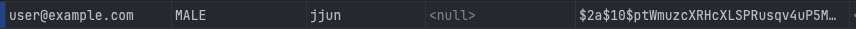
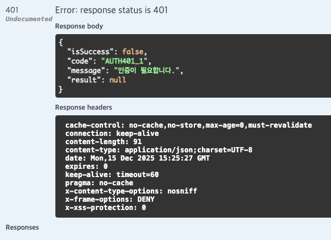
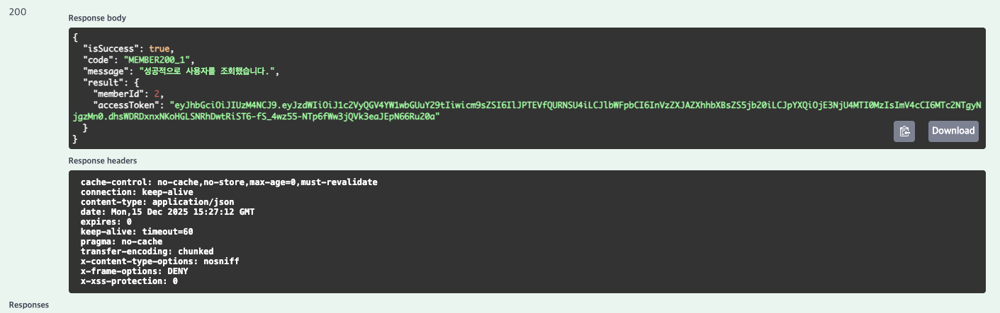
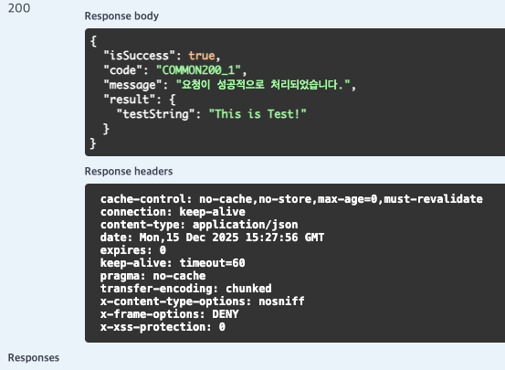
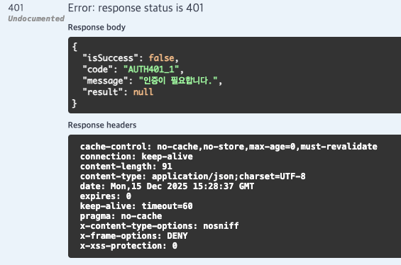

# 실습1 : Spring Security (Session 방식) 활용한 회원가입, 로그인, 로그아웃 구현


```java
@Override
    @Transactional
    public MemberResDTO.JoinDTO register(
            MemberReqDTO.JoinDTO dto
    ){
        Region region = regionRepository.findById(dto.regionId())
                .orElseThrow(() -> new MemberException(MemberErrorCode.REGION_NOT_FOUND));

        String salt = passwordEncoder.encode(dto.password());
        //멤버 생성 및 저장
        Member member = MemberConverter.toMember(region,dto,salt, Role.ROLE_USER);
        memberRepository.save(member);


        // 선호 음식 존재 여부 확인 및 매핑 테이블에 저장
        if (!dto.preferCategory().isEmpty()) {
            List<MemberCategory> memberCategoryList = new ArrayList<>();

            // 선호 음식 ID별 조회
            for (Long id : dto.preferCategory()) {

                // 음식 존재 여부 검증
                Category category = categoryRepository.getReferenceById(id);

                // MemberCategory 생성
                MemberCategory memberCategory = MemberCategory.builder()
                        .member(member)
                        .category(category)
                        .build();

                // 리스트에 추가
                memberCategoryList.add(memberCategory);
            }

            memberCategoryRepository.saveAll(memberCategoryList);

        }

        return MemberConverter.toJoinDTO(member);
    }
```
기존에 구현되어있던 register에서 password를 평문으로 저장하지 않고 암호화해서 저장할 수 있도록 수정
회원가입 요청이 들어오면 controller에서 service 호출 후 기존 로직에 따라 멤버 정보를 DB에 저장.
기존 과정에서 변경된 점은 passwordEncoder를 이용해 비밀번호를 암호화해서 저장.

```java

@EnableWebSecurity
@Configuration
public class SecurityConfig {

    private final String[] allowUris = {
              "/api/members/sign-up",
//            "/swagger-ui/**",
//            "/swagger-resources/**",
//            "/v3/api-docs/**",
    };

    @Bean
    public SecurityFilterChain securityFilterChain(HttpSecurity http) throws Exception {
        http
                .authorizeHttpRequests(requests -> requests
                        .requestMatchers(allowUris).permitAll()
                        .requestMatchers("/swagger-ui/index.html").hasRole("ADMIN")
                        .anyRequest().authenticated()
                )
                .formLogin(form -> form
                        .defaultSuccessUrl("/", true)
                        .permitAll()
                )
                .csrf(AbstractHttpConfigurer::disable)
                .logout(logout -> logout
                        .logoutUrl("/logout")
                        .logoutSuccessUrl("/login?logout")
                        .permitAll()
                );

        return http.build();
    }

    @Bean
    public PasswordEncoder passwordEncoder() {
        return new BCryptPasswordEncoder();
    }
}
```
위에서 설명한 회원가입이 정상적으로 동작하기 위해서 sign-up은 로그인되지 않은 사용자에게도 접근할 수 있도록 설정 되어야 함.

로그인 시 Security Filter Chain으로 진입. <br>
UsernamePasswordAuthenticationFilter가 요청을 가로챈다.<br>
임시로(미인증 상태) Authentication 객체를 생성 <br>
객체를 AuthenticationManager에게 위임 <br>
ProviderManager 내부에서 처리가능한 provider 찾고 <br>
DaoAuthenticationProvider 인증 수행 (여기서 실제 멤버를 email로 조회, 멤버의 비밀번호와 입력된 비밀번호 매치되는지 확인) <br>
인증 완료된 Authentication 생성 + SecurityContext에 저장<br>

추가로 위 코드에서 logout에 대해 요청 Url을 설정해두었기 때문에 /logout으로 요청을 통해 로그아웃을 진행할 수 있다.

```java


@Service
@RequiredArgsConstructor
public class CustomUserDetailsService implements UserDetailsService {

    private final MemberRepository memberRepository;

    @Override
    public UserDetails loadUserByUsername(
            String username
    ) throws UsernameNotFoundException {
        // 검증할 Member 조회
        Member member = memberRepository.findByEmail(username)
                .orElseThrow(() -> new MemberException(MemberErrorCode.MEMBER_NOT_FOUND));
        // CustomUserDetails 반환
        return new CustomUserDetails(member);
    }
}

```
위 설명에서 처리 가능한 provider를 찾고 provider 내부에서 인증을 수행하는 과정이 위와같이 이루어진다.


DB에는 다음과 같이 비밀번호가 암호화되어 저장되고 로그인 요청시에는 입력된 비밀번호를 동일 로직으로 변환했을 때 DB에 저장된 값과 동일하면 인증에 성공한다.


# 실습2 : Spring Security (JWT 방식) 활용한 회원가입, 로그인 구현

회원가입 단계는 기존과 동일하게 Controller + Service를 통해 기존에 구현되어 있던 방식으로 동작하며 PasswordEncoder를 통해 암호화 한다는 점은 세션과 동일

```java
@EnableWebSecurity
@Configuration
@RequiredArgsConstructor
public class SecurityConfig {

    private final JwtUtil jwtUtil;
    private final CustomUserDetailsService customUserDetailsService;

    private final String[] allowUris = {
            "/api/members/login",
            "/api/members/sign-up",
            "/swagger-ui/**",
            "/swagger-resources/**",
            "/v3/api-docs/**",
    };

    @Bean
    public SecurityFilterChain securityFilterChain(HttpSecurity http) throws Exception {
        http
                .authorizeHttpRequests(requests -> requests
                        .requestMatchers(allowUris).permitAll()
                        .requestMatchers("/admin/**").hasRole("ADMIN")
                        .anyRequest().authenticated()
                )
                // 폼로그인 비활성화
                .formLogin(AbstractHttpConfigurer::disable)
                // JwtAuthFilter를 UsernamePasswordAuthenticationFilter 앞에 추가
                .addFilterBefore(jwtAuthFilter(), UsernamePasswordAuthenticationFilter.class)
                .csrf(AbstractHttpConfigurer::disable)
                .logout(logout -> logout
                        .logoutUrl("/logout")
                        .logoutSuccessUrl("/login?logout")
                        .permitAll()
                )
                .exceptionHandling(exception ->exception.authenticationEntryPoint(new AuthenticationEntryPointImpl()));

        return http.build();
    }

    @Bean
    public JwtAuthFilter jwtAuthFilter() {
        return new JwtAuthFilter(jwtUtil, customUserDetailsService);
    }

    @Bean
    public PasswordEncoder passwordEncoder() {
        return new BCryptPasswordEncoder();
    }

    @Bean
    public AuthenticationEntryPoint authenticationEntryPoint() {
        return new AuthenticationEntryPointImpl();
    }
}
```
로그인 요청하면 permitAll을 통해 controller까지 요청이 도달하고 controller에서는 직접 구현한 login을 호출
```java
@Override
    public MemberResDTO.LoginDTO login(
            MemberReqDTO.@Valid LoginDTO dto
    ) {

        // Member 조회
        Member member = memberRepository.findByEmail(dto.email())
                .orElseThrow(() -> new MemberException(MemberErrorCode.MEMBER_NOT_FOUND));

        // 비밀번호 검증
        if (!encoder.matches(dto.password(), member.getPassword())){
            throw new MemberException(MemberErrorCode.MEMBER_NOT_FOUND);
        }

        // JWT 토큰 발급용 UserDetails
        CustomUserDetails userDetails = new CustomUserDetails(member);

        // 엑세스 토큰 발급
        String accessToken = jwtUtil.createAccessToken(userDetails);

        // DTO 조립
        return MemberConverter.toLoginDTO(member, accessToken);
    }
```
여기서는 멤버를 조회, 검증 단계를 거쳐 통과시 토큰을 발급하는 전체 과정을 담당함.
토큰에는 유저의 정보가 들어가기 때문에 CustomUserDetails 객체를 하나 생성하고 멤버의 정보를 담아 accessToken 생성에 이용하기 위해
인자로 넘겨주게 됨.

```java
@Component
public class JwtUtil {

    private final SecretKey secretKey;
    private final Duration accessExpiration;

    public JwtUtil(
            @Value("${jwt.token.secretKey}") String secret,
            @Value("${jwt.token.expiration.access}") Long accessExpiration
    ) {
        this.secretKey = Keys.hmacShaKeyFor(secret.getBytes(StandardCharsets.UTF_8));
        this.accessExpiration = Duration.ofMillis(accessExpiration);
    }

    // AccessToken 생성
    public String createAccessToken(CustomUserDetails user) {
        return createToken(user, accessExpiration);
    }

    /** 토큰에서 이메일 가져오기
     *
     * @param token 유저 정보를 추출할 토큰
     * @return 유저 이메일을 토큰에서 추출합니다
     */
    public String getEmail(String token) {
        try {
            return getClaims(token).getPayload().getSubject(); // Parsing해서 Subject 가져오기
        } catch (JwtException e) {
            return null;
        }
    }

    /** 토큰 유효성 확인
     *
     * @param token 유효한지 확인할 토큰
     * @return True, False 반환합니다
     */
    public boolean isValid(String token) {
        try {
            getClaims(token);
            return true;
        } catch (JwtException e) {
            return false;
        }
    }

    // 토큰 생성
    private String createToken(CustomUserDetails user, Duration expiration) {
        Instant now = Instant.now();

        // 인가 정보
        String authorities = user.getAuthorities().stream()
                .map(GrantedAuthority::getAuthority)
                .collect(Collectors.joining(","));

        return Jwts.builder()
                .subject(user.getUsername()) // User 이메일을 Subject로
                .claim("role", authorities)
                .claim("email", user.getUsername())
                .issuedAt(Date.from(now)) // 언제 발급한지
                .expiration(Date.from(now.plus(expiration))) // 언제까지 유효한지
                .signWith(secretKey) // sign할 Key
                .compact();
    }

    // 토큰 정보 가져오기
    private Jws<Claims> getClaims(String token) throws JwtException {
        return Jwts.parser()
                .verifyWith(secretKey)
                .clockSkewSeconds(60)
                .build()
                .parseSignedClaims(token);
    }
}

```
JwtUtil에서는 전달받은 member의 정보가 담긴 CustomUserDetails 객체를 통해 토큰을 생성하고 이 토큰이 사용자에게 전달되어 저장됨

<br>

이후 사용자는 토큰을 헤더에 넣고 요청을 수행하게 됨

해당 요청은 security filter chain에서 기존처럼 permitAll이 아닌 인증이 필요한 상태의 요청이 될것이고
코드의 .addFilterBefore()에서 jwtAuthFilter를 UsernamePasswordAuthenticationFilter.class보다 앞에 추가했기 떄문에
해당 요청은 jwtAuthFilter가 처리하게 됨 

```java
@RequiredArgsConstructor
public class JwtAuthFilter extends OncePerRequestFilter {

    private final JwtUtil jwtUtil;
    private final CustomUserDetailsService customUserDetailsService;

    @Override
    protected void doFilterInternal(
            @NonNull HttpServletRequest request,
            @NonNull HttpServletResponse response,
            @NonNull FilterChain filterChain
    ) throws ServletException, IOException {

        //try {
            // 토큰 가져오기
            String token = request.getHeader("Authorization");
            // token이 없거나 Bearer가 아니면 넘기기
            if (token == null || !token.startsWith("Bearer ")) {
                filterChain.doFilter(request, response);
                return;
            }
            // Bearer이면 추출
            token = token.replace("Bearer ", "");
            // AccessToken 검증하기: 올바른 토큰이면
            if (jwtUtil.isValid(token)) {
                // 토큰에서 이메일 추출
                String email = jwtUtil.getEmail(token);
                // 인증 객체 생성: 이메일로 찾아온 뒤, 인증 객체 생성
                UserDetails user = customUserDetailsService.loadUserByUsername(email);
                Authentication auth = new UsernamePasswordAuthenticationToken(
                        user,
                        null,
                        user.getAuthorities()
                );
                // 인증 완료 후 SecurityContextHolder에 넣기
                SecurityContextHolder.getContext().setAuthentication(auth);
            }
            filterChain.doFilter(request, response);
        //}
        /*
        catch (Exception e) {
            response.setContentType("application/json;charset=UTF-8");
            response.setStatus(HttpServletResponse.SC_UNAUTHORIZED);

            ApiResponse<Void> errorResponse = ApiResponse.onFailure(
                    GeneralErrorCode.UNAUTHORIZED,
                    null
            );

            ObjectMapper mapper = new ObjectMapper();
            mapper.writeValue(response.getOutputStream(), errorResponse);
        }

         */
    }

```
JwtAuthFilter는 토큰을 검증하고 토큰에서 사용자 정보를 추출<br>
여기까지의 과정에서 토큰에 대한 검증과 사용자 정보까지 문제가 없는 데이터임을 확인할 수 있기 때문에<br>
사용자를 조회해서 Authentication 객체를 직접 생성함<br>

이후 contextHolder에 저장 후 다음 필터 즉 controller에 진입하게 되고 비즈니스 로직을 수행하게 됨.

요청이 종료되면 security context는 폐기됨.

---

ㄴ토큰 없이 요청 시 response


ㄴ로그인으로 토큰 발급


ㄴ발급받은 토큰을 이용해 조회


ㄴ잘못된 토큰을 이용해 조회
