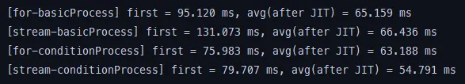
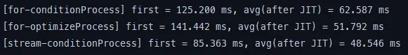

# For과 Stream 비교하기

for과 stream의 작동 방식을 본격적으로 분석하기 전에, 먼저 어떤 방식이 더 빠르게 동작하는지 감을 잡기 위해 간단한 실험용 예제를 만들어봤다. 예제 상황은 여러 명의 유저가 존재할 때, 이 유저들을 특정 기준에 맞춰 정렬하고 필터링하는 경우를 가정했다.

# 상황 설정

우선 아래와 같은 User 엔티티가 있다고 해보자.

여기에는 사용자 ID, 이름, 나이, 활동 여부 같은 기본적인 정보가 포함되어 있다.

```java
public class User {
    private final long id;
    private final String name;
    private final int age;
    private final boolean active;

    public User(long id, String name, int age, boolean active) {
        this.id = id;
        this.name = name;
        this.age = age;
        this.active = active;
    }

    public long getId() { return id; }
    public String getName() { return name; }
    public int getAge() { return age; }
    public boolean isActive() { return active; }
}
```

이 실험에서는 단순 정렬이 아니라 **특정 조건 필터링 → 정렬 → DTO 변환** 과 같은 조금 더 현실적인 데이터 처리 흐름에서 for와 stream의 성능 차이를 보고자 한다. 

그래서 아래 두 가지 상황을 설정했다.

<aside>

**기본 정렬만 하는 경우 (조건 X)**

- 활동 여부 체크 없음
- 나이 체크 없음
- 단순히 **이름순 정렬**
</aside>

<aside>

**여러 조건을 포함한 경우**

- active == true인지
- age ≥ 20인지
- 위 조건을 모두 통과한 사용자만 **이름순 정렬**
</aside>


# 코드로 살펴보기

## 1) 기본 정렬만 하는 경우

먼저 아무 조건 없이 **유저 리스트를 이름 기준으로 정렬한 뒤, DTO로 변환해서 반환하는 가장 단순한 처리 흐름**을 비교해보자. 

### For 이름 정렬 후 DTO 반환

```java
public static List<UserDTO> basicProcess(List<User> users) {

        List<User> filtered = new ArrayList<>();
        List<UserDTO> result = new ArrayList<>();

        filtered.addAll(users);
        filtered.sort(Comparator.comparing(User::getName));

        for (User u : filtered) {
            result.add(new UserDTO(u.getId(), u.getName()));
        }

        return result;
    }
```

For 방식은 크게 세 단계로 진행된다.

1. **새 리스트 생성 후 원본을 그대로 복사한다.**
    
    `filtered.addAll(users);`
    
    이 과정은 정렬 시 원본 리스트를 변형하지 않기 위해 복사본을 만드는 작업이다.
    
2. **복사한 리스트를 Comparator로 정렬한다.**
    
    `filtered.sort(Comparator.comparing(User::getName));`
    
    이름을 기준으로 오름차순 정렬한다. 이 부분은 stream에서도 동일하게 수행된다.
    
3. **정렬된 User 리스트를 순회하면서 DTO로 직접 변환한다.**
    
    `result.add(new UserDTO(u.getId(), u.getName()));`
    
    여기서 for문을 통해 하나씩 꺼내 DTO를 만드는 전통적인 방식이 사용된다.
    

정리하면, for 방식은 “리스트 복사 → 정렬 → 반복문으로 DTO 변환"이라는 **명령형 프로그래밍 구조**를 따른다.

### Stream 이름 정렬 후 DTO 반환

```java
public static List<UserDTO> basicProcess(List<User> users) {
        return users.stream()
                .sorted(Comparator.comparing(User::getName))
                .map(u -> new UserDTO(u.getId(), u.getName()))
                .collect(Collectors.toList());
    }
```

Stream 방식은 같은 작업을 훨씬 **선언적이고 직관적인 흐름**으로 표현한다.

1. **stream()을 통해 사용자 리스트를 스트림 파이프라인에 흘려보낸다.**
2. **sorted() 중간 연산에서 이름 기준 정렬을 수행한다.**
    
    내부적으로는 for 방식과 동일하게 Comparator 기반 정렬이 이루어진다.
    
3. **map()을 통해 User 객체를 UserDTO로 변환한다.**
    
    이 부분은 for문에서의 `new UserDTO(...)` 생성과 동일하지만,
    
    스트림에서는 “변환 규칙”만 선언해주는 형태가 된다.
    
4. **collect(toList())로 최종 결과를 리스트로 모은다.**
    
    스트림의 마지막 단계이며, 실제 DTO 리스트가 여기서 만들어진다.
    

## 2) 여러 조건을 포함한 경우

다음은 여러 조건을 걸어 줬다. 단순히 이름만 정렬하던 이전 예제와 달리, 이번에는 “활동 중인 사용자”인지, 그리고 “나이가 20세 이상인지” 같은 추가적인 필터 조건을 적용한 뒤 정렬과 DTO 변환을 수행한다. 

### For 조건 적용 후 정렬하여 DTO 반환

For 방식에서는 조건이 늘어날수록 그에 맞게 **중간 리스트를 직접 만들어가며** 연산을 진행한다.

```java
public static List<UserDTO> conditionProcess(List<User> users) {
        // 1) 필터: active == true
        List<User> filtered1 = new ArrayList<>();
        for (User u : users) {
            if (u.isActive()) {
                filtered1.add(u);
            }
        }

        // 2) 필터: age >= 20
        List<User> filtered2 = new ArrayList<>();
        for (User u : filtered1) {
            if (u.getAge() >= 20) {
                filtered2.add(u);
            }
        }

        // 3) 정렬: 이름순
        filtered2.sort(Comparator.comparing(User::getName));

        // 4) User → UserDTO
        List<UserDTO> result = new ArrayList<>();
        for (User u : filtered2) {
            result.add(new UserDTO(u.getId(), u.getName()));
        }

        return result;
    }
```

먼저 `filtered1`이라는 리스트를 만들어 `active == true`인 사용자만 담고,

그다음 `filtered2`라는 새로운 리스트를 생성해 20세 이상인 사용자만 다시 선별한다.

즉, 필터 조건을 하나 처리할 때마다 새로운 리스트를 만들고 그 안에 다시 값을 채워 넣는 구조다.

필터링이 끝난 후에는 `filtered2.sort(...)`를 통해 이름 기준으로 정렬하고,

마지막으로 for문을 돌면서 User 객체를 UserDTO로 변환해 결과 리스트에 담아 반환한다.

### Stream  조건 적용 후 정렬하여 DTO 반환

```java
public static List<UserDTO> conditionProcess(List<User> users) {
        return users.stream()
                .filter(User::isActive)
                .filter(u -> u.getAge() >= 20)
                .sorted(Comparator.comparing(User::getName))
                .map(u -> new UserDTO(u.getId(), u.getName()))
                .collect(Collectors.toList());
    }
```

Stream 방식에서는 여러 조건이 들어가도 굳이 중간 리스트를 만들지 않고, 각각의 조건을 **filter 체인**으로 차례대로 연결하여 처리한다. 먼저 `filter(User::isActive)`로 활동 중인 사용자만 남기고, 이어서 `filter(u -> u.getAge() >= 20)`로 나이가 20세 이상인 사용자만 다시 걸러낸다. 이렇게 두 조건을 연속으로 적용해도 리스트가 두 번 만들어지는 것이 아니라, 데이터가 파이프라인을 통과하면서 순차적으로 필터링될 뿐이다.

필터링 이후에는 `sorted(Comparator.comparing(User::getName))`을 통해 이름 기준으로 정렬한다. 이는 For 방식에서의 정렬과 동일한 작업을 수행하지만, 파이프라인 내에서 자연스럽게 이어진다는 점이 다르다. 마지막으로 `map()` 연산을 사용하여 각 User 객체를 UserDTO로 변환하고, `collect(Collectors.toList())`로 최종 리스트를 만들어 반환한다.


# 결과 정리

이전에 for문과 stream의 실제 처리 속도를 비교해보기 위해 약 100만 명의 User 데이터를 대상으로 실험 코드를 작성했고, 각 처리 방식의 **첫 실행(first)** 과 **JIT 최적화 이후 평균(avg)** 을 측정했다.

측정 결과는 다음과 같다.



`for-basicProcess`는 첫 실행이 약 95ms, 평균은 약 65ms였고, `stream-basicProcess`는 첫 실행이 약 131ms, 평균은 약 66ms였다. 즉, 단순한 정렬만 하는 기본 처리에서는 stream이 첫 실행에서 더 느리지만, 최적화가 된 이후에는 사실상 for와 거의 비슷한 성능을 보였다.

조건이 포함된 처리 과정에서도 비슷한 패턴이 나타났다. `for-conditionProcess`는 첫 실행이 약 75ms, 평균은 약 63ms였고, `stream-conditionProcess`는 첫 실행이 약 79ms, 평균은 약 54ms로 측정되었다. 여기서는 오히려 stream이 최적화된 이후 더 좋은 성능을 보였다. 


## 왜 첫 실행은 Stream이 더 느린가?

결론부터 말하면

> Stream은 처음 한 번 쓸 때 “준비 작업”이 훨씬 많다. 이 준비 비용이 첫 실행 시간을 확 끌어올린다.
> 

### 1. 스트림을 한 번도 안 쓰다가 처음 쓰는 순간: 클래스 로딩 폭탄

`users.stream()`이 처음 실행되는 시점에서 JVM은 스트림 처리에 필요한 여러 클래스를 **처음으로 로딩하고 초기화해야 한다**.

예를 들면 다음과 같은 클래스들이 포함된다.

- `java.util.stream` 패키지 내부 클래스들
    
    (`StreamSupport`, `ReferencePipeline`, `SortedOps`, `SliceOps` 등)
    
- 스트림 내부에서 사용되는 `Spliterator` 및 다양한 구현체들
- `Collectors` 관련 유틸리티 클래스들

이런 클래스들은 스트림이 처음 사용될 때 한 번에 로딩되기 때문에, **초기 실행 시에는 스트림 쪽의 준비 비용이 훨씬 크다**.

반대로 for문은 다음과 같다.

```java
for (User u : users) { ... }
```

이미 JVM이 기본적으로 최적화해놓은 매우 단순한 반복 구조이며, 추가로 로딩해야 할 특별한 라이브러리나 구조가 없다. 따라서 **클래스 로딩 및 초기화 비용 측면에서는 for문이 훨씬 유리하다**.

결국 이러한 구조적인 차이 때문에 **스트림은 첫 실행에서 불리할 수밖에 없다**.

스트림 파이프라인이 동작하기 위한 준비 작업이 많고, JVM이 필요한 클래스를 모두 읽어오는 과정 자체가 시간을 끌기 때문이다.

---

### 2. 람다식 때문에 생기는 invokedynamic 셋업 비용

Stream 코드에서는 보통 다음과 같은 형태로 람다식을 사용한다.

```java
users.stream()
    .sorted(Comparator.comparing(User::getName))
    .map(u -> new UserDTO(u.getId(), u.getName()))
    .filter(u -> u.getAge() >= 20)
    ...
```

여기에서 사용되는 `User::getName`, `u -> new UserDTO(...)`, `u -> u.getAge() >= 20` 같은 표현들은 모두 **람다식**이다. 람다가 처음 실행되는 시점에서 JVM은 단순한 메서드 호출을 수행하는 것이 아니라, 다음과 같은 과정을 거쳐야 한다.

> `invokedynamic` 바이트코드를 통해 `LambdaMetafactory`를 호출하고, 실제로 실행될 함수 객체(메서드 핸들 또는 synthetic 클래스)를 생성한 뒤 이후부터 그 객체를 재사용한다.
> 

즉, 람다가 처음 등장할 때 JVM은 이를 위해 **추가적인 셋업 비용을 지불해야 한다**. 

이 초기 비용이 바로 스트림의 첫 실행 시간을 크게 만드는 원인 중 하나이다.

반면 for문에서는 다음과 같은 단순한 구조를 가진다.

```java
for (User u : users) {
    result.add(new UserDTO(u.getId(), u.getName()));
}
```

여기서는 단순한 메서드 호출과 객체 생성만 이루어지며,
invokedynamic이나 LambdaMetafactory와 같은 별도의 초기화 작업이 없다.

그 결과 첫 실행 시점에서는 **스트림**이 **람다식을 처리**하기 위한 **초기 준비 작업**을 수행해야 하므로 상대적으로 시간이 더 걸린다. 반면 **for문**은 JVM이 이미 오래전부터 최적화해온 단순한 반복 구조이기 때문에 별도의 준비 과정 없이 바로 실행되며, **초기 비용이 거의 없다**. 

이는 스트림 자체가 비효율적이라서 발생하는 문제가 아니라, 스트림을 더 편리하게 사용하기 위해 JVM이 내부적으로 추가적인 세팅을 수행한 데서 비롯되는 자연스러운 초기 오버헤드라고 보는 것이 적절하다.

---

### 3. Stream 파이프라인은 메서드 체인이 길어서, JIT 없는 상태에서 더 불리하다

스트림은 내부적으로 다음과 비슷한 방식으로 여러 단계를 거치는 파이프라인을 구성한다. 

```java
Stream<User> s1 = users.stream();                   // 소스 단계
Stream<User> s2 = s1.filter(...);                   // stage 1
Stream<User> s3 = s2.filter(...);                   // stage 2
Stream<User> s4 = s3.sorted(...);                   // stage 3
Stream<UserDTO> s5 = s4.map(...);                   // stage 4
List<UserDTO> result = s5.collect(toList());        // 터미널
```

물론 실제 구현에서는 여러 최적화가 적용되기 때문에 매번 새로운 리스트를 생성하는 방식으로 동작하지는 않는다. 하지만 개념적으로 보면 각 stage마다 람다, 메서드 호출, 파이프라인 객체가 결합되며 하나의 연산 흐름을 이루게 된다.

문제는 JIT 최적화(인라이닝, 루프 최적화 등)가 아직 적용되지 않은 **첫 실행 시점**이다. 이때는 다음과 같은 이유로 스트림이 불리하다.

각 stage마다 개별적인 메서드 호출이 발생하고, 파이프라인 대부분이 인터페이스·추상 클래스를 기반으로 구성되어 있어 가상 호출이 많으며 람다를 거쳐 메서드를 호출하는 과정도 여러 계층을 타고 들어가야 한다.

즉, 한 번 스트림을 실행할 때 거쳐야 하는 **호출 레이어(call stack)가 for문에 비해 훨씬 깊고 복잡**하다.

반면 for문은 다음과 같이 단순한 구조로 동작한다.

```java
for (User u : users) {
    if (...) { ... }
}
```

루프 하나, 조건문 하나, 객체 생성 하나 정도로 구성된 매우 직접적인 코드이며 호출 스택도 얕아서 오버헤드가 거의 없다. 

이런 차이 때문에 **JIT 최적화가 이루어지지 않은 초기 실행 구간에서는 스트림이 구조적으로 손해를 볼 수밖에 없다**. 스트림의 설계 철학 자체가 여러 연산을 조합해 선언적으로 작성하기 위한 것이므로, 초기에는 이러한 파이프라인 구성 비용이 추가적으로 발생하게 된다.


## 왜 조건이 있는 경우 Stream이 더 빠른가?

조건이 여러 개 들어가는 상황에서는 Stream이 구조적으로 유리해지는 지점이 있다. For 방식은 조건마다 중간 리스트를 새로 만들고, 각 리스트에 대해 별도의 루프를 돌려야 한다. 예를 들어 `active` 필터용 리스트, `age` 필터용 리스트, 정렬 전 리스트, DTO 변환용 리스트 등이 생기며, 그만큼 루프와 add 호출도 여러 번 발생한다. 조건이 많아질수록 “리스트 생성 + 루프 반복” 단계가 계속 늘어나기 때문에 전체 비용이 커진다.

반면 Stream은 `filter → filter → sorted → map`과 같은 파이프라인 구조로 여러 조건을 한 흐름 안에서 처리한다. 필터를 통과하지 못하는 요소는 다음 단계로 넘어가지 않기 때문에, 불필요한 객체를 중간 리스트에 담았다가 다시 꺼내는 과정이 없다. JIT 최적화가 어느 정도 진행된 이후에는 이러한 파이프라인이 하나의 큰 루프처럼 인라이닝되면서, 중간 리스트를 여러 번 만드는 For 방식보다 더 적은 오버헤드로 조건 필터링·정렬·매핑을 처리할 수 있게 된다. 이 때문에 조건이 하나일 때는 큰 차이가 없지만, 조건이 여러 개로 늘어나는 경우에는 Stream이 평균 실행 시간에서 더 좋은 결과를 보일 수 있다.

### 사실 그냥 For 문 최적화가 안되어있긴하다!

생각해보면 이런 중간 과정도 for 문에서는 충분히 없앨 수 있다. 애초에 `active == true`인지 한 번 보고, 이어서 `age >= 20`인지만 추가로 확인하면 되기 때문에, 굳이 조건마다 리스트를 새로 만들고 다시 도는 구조일 필요는 없다. 

```java
public static List<UserDTO> optimizeProcess(List<U
ser> users) {
        List<User> filtered = new ArrayList<>();

        for (User u : users) {
            if (u.isActive() && u.getAge() >= 20) {
                filtered.add(u);
            }
        }

        filtered.sort(Comparator.comparing(User::getName));

        List<UserDTO> result = new ArrayList<>(filtered.size());
        for (User u : filtered) {
            result.add(new UserDTO(u.getId(), u.getName()));
        }

        return result;
    }
```

기존에는 `filtered1`, `filtered2`처럼 조건마다 리스트를 따로 만들고, 그때마다 다시 루프를 돌면서 add를 수행했기 때문에 루프 수도 많고, 중간 객체 수도 많았다. 반면 최적화된 버전에서는 `u.isActive() && u.getAge() >= 20` 두 조건을 한 번에 검사해서 바로 `filtered`에 넣어주기 때문에, 필터링 단계는 **루프 1번 + 리스트 1개 생성**으로 끝난다. 이후에는 정렬을 한 번 수행하고, 정렬된 리스트를 DTO로 변환하는 루프를 한 번 더 돌면서 결과를 만든다. 구조적으로 보면 “필터링 1번 + 정렬 1번 + DTO 변환 1번”으로 최대한 단순하게 정리한 셈이다.



실제로 측정 결과를 보면, 이렇게 For 문을 정리해 줬을 때 **처리 시간이 눈에 띄게 줄어드는 것**을 확인할 수 있다. 불필요한 중간 리스트와 루프를 제거했기 때문에, 처음에 비해 For 버전의 비효율이 상당 부분 사라진 것이다. 다만 그럼에도 불구하고 여전히 Stream 버전보다는 조금 느리게 나온다.

이것은 For 문이 나쁘다기보다, **Stream 쪽이 JIT 최적화와 파이프라인 구조 덕분에 이미 꽤 잘 튜닝되는 방식이라는 반증**으로 보는 편이 더 맞다. For 문을 최대한 깔끔하게 정리해도, Stream은 여러 필터·정렬·매핑 단계가 하나의 흐름으로 인라이닝되면서 비슷하거나 더 나은 수준의 성능을 낸다는 의미이기도 하다. 

정리하자면, “처음에 작성한 For 코드는 Stream보다 느릴 수 있지만, For도 구조를 잘 다듬어 주면 충분히 경쟁력 있는 수준까지 올라온다. 그럼에도 조건이 여러 개일 때 평균 속도에서는 Stream이 약간 더 유리한 지점이 있다” 정도로 해석하면 된다.


# for, stream 각각 적용 시 장단점

## for 문의 장단점

### 장점

1. **구조가 단순하고 직관적이다.**

    루프 + if + add 정도의 패턴이라, 자바를 조금만 해도 바로 이해할 수 있다.

2. **초기 실행 속도가 빠른 편이다.**

    추가적인 클래스 로딩이나 람다 셋업 없이 바로 실행되기 때문에, 짧게 한두 번 돌리는 코드에서는 유리하다.

3. **디버깅이 쉽다.**
    루프 안에 바로 `System.out.println()`을 넣거나, 디버거로 한 줄씩 따라가기가 편하다.

4. **JVM이 오래전부터 최적화해 온 패턴이다.**
    단순 반복 + 조건문 조합은 이미 JIT 최적화가 매우 잘 되어 있는 구조이다.

### 단점

1. **조건/단계가 많아지면 코드가 금방 지저분해진다.**
    필터용 리스트, 정렬 전 리스트, 변환 후 리스트 등 중간 리스트가 계속 늘어난다.

2. **중간 리스트를 직접 관리해야 한다.**
    필터를 여러 번 적용하면 리스트를 그때마다 새로 만들고 add해야 해서, 코드 양과 메모리 사용량이 늘어난다.

3. **의도가 한 눈에 안 들어올 수 있다.**
    “무엇을 하고 싶은지”보다 “어떻게 돌리는지(for, if, add)”가 먼저 보인다.


## Stream 의 장단점

### 장점

1. **여러 단계를 “파이프라인”으로 자연스럽게 표현할 수 있다.**
    `filter → filter → sorted → map → collect`처럼, 처리 흐름이 코드에 그대로 드러난다.

2. **조건이 많을수록 코드가 오히려 정리된다.**

    필터가 두 개든 세 개든 `filter()` 체인만 추가하면 되기 때문에, 중간 리스트가 필요 없다.

3. **JIT 최적화가 잘 먹으면 성능도 충분히 좋다.**

    조건이 여러 개 있는 경우에는 for보다 stream이 평균 속도에서 더 나은 결과를 보이기도 한다.

4. **parallelStream으로 병렬 처리 확장이 쉽다.**

    단순히 `.stream()`을 `.parallelStream()`으로 바꾸는 것만으로, 멀티코어를 활용하는 실험도 가능하다

### 단점

1. **첫 실행이 확실히 느리다.**

    스트림 관련 클래스 로딩, 람다 invokedynamic 셋업 등 초기 비용이 들어가기 때문에, 작은 작업을 한두 번만 할 때는 손해를 본다.

2. **람다/스트림에 익숙하지 않으면 읽기 어렵다.**

    초급자 입장에서는 for보다 오히려 가독성이 떨어질 수 있다.

3. **디버깅이 상대적으로 불편하다.**

    중간 단계 값 확인을 위해서는 `peek()`를 넣거나, 스트림을 끊어서 변수에 할당하는 등의 추가 작업이 필요하다.

4. **복잡한 상태 변경 로직과는 잘 안 맞는다.**

    스트림은 기본적으로 “데이터 변환”에 적합하고, 외부 상태 변경(side effect)와 섞이면 코드가 지저분해진다.


# 언제 적용하면 좋을 지 파악해보자

## for 를 쓰면 좋은 상황은?

for 문은 처리 흐름이 단순하고 동작 방식이 명확하기 때문에, 로직 자체가 복잡하지 않은 경우에 특히 잘 어울린다. 예를 들어 값의 합을 구하거나 카운팅을 하는 등 단순 반복 작업에서는 조건도 많지 않고, 코드 구조도 간단해서 for 문이 가장 직관적이다. 또한 성능에 민감한 핵심 루프나 고빈도 반복이 일어나는 코드에서는 불필요한 객체 생성 없이 직접 반복을 제어할 수 있기 때문에 for 문이 더 유리하다.

팀 구성원들이 Stream에 익숙하지 않은 상황이라면, 우선 for 문으로 로직을 명확하게 이해시키고 필요할 때 Stream 으로 리팩토링하는 방식이 협업에도 도움이 된다. 그리고 루프 중간마다 상태를 바꾸거나 여러 단계에서 로그를 찍어가며 디버깅해야 하는 코드라면 for 문이 훨씬 편하다. 스트림은 가독성은 좋지만 중간 상태를 확인하는 것이 까다롭기 때문에, 복잡한 상태 변경이 포함된 시나리오에서는 여전히 for 문이 더 실용적인 선택이 된다.

## Stream 을 쓰면 좋은 상황은?

Stream을 쓰면 좋은 상황은 주로 필터링이나 정렬, 매핑처럼 여러 단계가 이어지는 데이터 가공 로직을 다룰 때다. 예를 들어 이번처럼 “활성 유저 → 20세 이상 → 이름순 정렬 → DTO 변환” 같은 흐름이 있을 경우, 스트림을 사용하면 각 단계를 파이프라인 형태로 자연스럽게 이어서 표현할 수 있다. 그래서 로직이 한눈에 들어오고, “어떻게”보다는 “무엇을 하고 싶은지”가 코드에 더 잘 드러난다.

특히 컬렉션을 입력에서 출력 형태로 바꿔야 하는 작업이라면 스트림이 훨씬 깔끔하게 작성된다. 비즈니스 로직에서 데이터 가공 처리 과정이 자주 바뀌거나 여러 사람이 함께 읽어야 하는 경우에는, 가독성 측면에서 스트림이 유리한 편이다. 복잡한 조건이 많아질수록 for 문은 단계가 길어지고 중간 리스트가 늘어나기 쉬운데, 스트림은 같은 흐름을 짧고 선언적으로 표현할 수 있기 때문이다.

그리고 필터 조건이 여러 개 있고 컬렉션 크기도 어느 정도 된다면, 스트림이 구조적으로 더 유리한 상황이 많다. 한 번만 잠깐 실행되는 코드가 아니라 일정 주기로 반복 호출되는 코드라면, 초기 오버헤드를 지나고 나서 JIT 최적화가 적용된 이후의 성능도 충분히 잘 나오는 편이다. 이런 이유들 때문에 복잡한 데이터 변환 로직에서는 스트림이 적합한 선택이라고 할 수 있다.